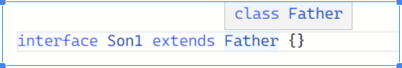

本文记录了 TypeScript 学习过程中的重要知识点，涵盖了类型系统、泛型、高级类型操作等核心概念。

## 1. 顶层类型和底层类型

### 类型层级关系

- **顶层类型 (Top Type)**：所有其他类型的超类型
  - `any`：任意类型，关闭类型检查
  - `unknown`：类型安全的 any 类型，需要类型窄化

- **底层类型 (Bottom Type)**：从未出现的类型
  - `never`：不会有值的类型，用于总会抛出错误的函数或从来不会有返回值的函数

### 重要特性

- 所有可以赋值给 `any` 类型的变量，都可以赋值给 `unknown` 类型的变量（类型安全的 any 类型）
- 声明为 `void` 类型的变量，只能赋予 `undefined` 和 `null`
- `unknown` 类型需要进行类型窄化才能使用

## 2. extends 和 implements

### extends 继承

`extends` 用于继承，类和接口都能继承。在条件类型中，`extends` 不一定要强制满足继承关系，也可以是检查是否满足结构兼容性。

**条件类型语法**：`T extends U ? X : Y` 表示若 T 能够赋值给 U，那么类型是 X，否则为 Y。

**注意**：class 不能 extends interface

### implements 实现

`implements` 用于实现，只有类能实现。`A implements B` 表示 A 上要有 B 对应的属性和方法。

**类和类之间的关系**：

**类和接口之间的关系**：

## 3. TypeScript 的核心优势

### 1. TS 的本质

### 2. TS 更加可靠

### 3. 面向接口编程

### 4. TS 正成为主流

## 4. 模块系统

### 模块导入导出

## 5. 索引签名

### 基本概念

索引签名允许我们定义对象可以有任意数量的属性，其中键和值都有特定的类型。

key 值是 number，value 值也是 number：

### 索引签名的坑 - 结合 keyof 关键字

#### 重要规则

**默认（一般）情况下，索引签名的 key 是 string 的时候，keyof 的返回值是 `string | number`（联合类型）**

这与 value 的类型无关，取 number / string / any 都不影响 keyof 的返回值是 `string | number`。

#### 配置选项影响

当在 tsconfig 中开启了 `keyofStringsOnly` 的时候：

结果就变成了 string：

#### 解决方案

或者在不开启 `keyofStringsOnly` 的情况下，使用高级类型（工具类）限制：

索引签名 key 为 number 就走正常的类型约束了：

#### 数组的 keyof

`keyof []` 也是有 number 值的（因为一系列方法最后的显示结果都是比如 'slice' 的字符串形式，所以可以理解为是 string 的话就有多一个 number 的选项了）：

## 6. type 和 interface

### type 类型别名

### type 和 interface 的区别

#### 相同点

1. 都用来定义对象或函数（本质也是对象）
2. 都可以继承

#### 不同点

**1. 写法不一样**

- `type` 是类似赋值（type + 名字 + = + 值）
- `interface` 是名字直接接对象，然后对象里面声明字段

**2. 继承写法不一样**

- `type` 使用 `&`
- `interface` 使用 `extends`

**3. 重复声明**

- `interface` 可以重复声明（会合并声明）
- `type` 不行（会报错）

**4. type 的特殊用法**

`type` 可以定义基本类型 / 联合类型 / 元组类型 / typeof + 数据类型

### 使用 Record 工具类型

## 7. 泛型变量

### 泛型基础

泛型使用 `< >` 指定泛型变量约束：

### 泛型命名约定

- **K (Key)**：表示对象中键的类型
- **V (Value)**：表示对象中值的类型
- **E (Element)**：表示元素类型
- **R (Result)**：表示结果类型
- **U**：单纯只是因为跟 T 挨的比较近（T、U、V...）

## 8. 高级类型操作符

### 1. keyof 关键字

`keyof` 操作符获取某种类型的所有键，返回类型是联合类型，可以操作接口 / 类 / 基本类型。

`keyof any` 结果就是 `string | number | symbol`：

**结果总结**：

### 2. typeof 关键字

`typeof` 操作符获取变量的类型，返回：变量什么类型，就返回什么类型，用于操作变量。

### 3. infer 关键字

`infer` 关键字和 `extends` 一起使用，用于推断，声明一个类型变量，并且对它进行使用（在调用的时候传递的）。

#### 类型提取

可以从泛型和函数中提取类型。

**1. 提取泛型的类型**：

### 4. ReturnType 关键字

`ReturnType` 获取方法的返回类型，用于操作方法。

## 9. 函数的剩余参数和展开参数

## 总结

TypeScript 作为 JavaScript 的超集，提供了强大的类型系统和丰富的高级特性：

1. **类型安全**：通过静态类型检查，在编译时发现错误
2. **类型推断**：智能的类型推断减少了显式类型注解的需要
3. **高级类型**：条件类型、映射类型、工具类型等提供了强大的类型操作能力
4. **泛型系统**：提供了类型参数化的能力，增强了代码的复用性
5. **模块系统**：完善的模块导入导出机制
6. **面向接口编程**：通过接口和类型别名实现更好的代码组织
