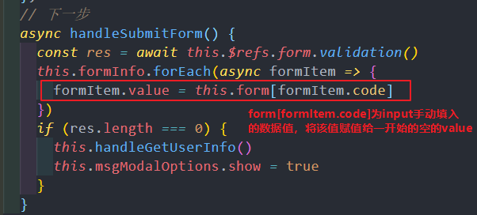
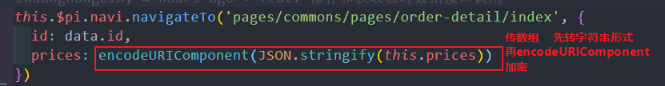

JavaScript 是基于原型（对象）的语言 - 面向对象的 JavaScript（OOJS）

**JavaScript 中的面向对象：数据属性 + 访问器（getter/setter）属性**

## 1. !! 强制转为布尔值


## 2. 让 (a == 1 && a == 2 && a == 3) 返回 true（== 存在隐式类型转换）


### 一、js 中的 toString 方法

**(1)、返回 [表示对象] 的 [字符串]**


**(2)、检测对象的类型**


**(3)、返回 数字 对应进制 的 字符串**


### 二、== 的隐式类型转换

（类型不同的前提下才会转，像同类型的 '' == '0' 结果就是 false）

1、**有 NaN 的，返回 false**（NaN 表示一个范围 不是具体的值/数字）A不是一个数字 B不是一个数字 但 A不一定就等于B涅 所以 NaN == NaN 返回值是 false


2、有 字符串/布尔，字符串/布尔转数字（false转0，true转1）

3、null == undefined 返回 true

4、有对象（数组/对象/函数...），先调用 valueOf()方法 (转数字) 比较（如果不等），再调用 toString() 方法(转字符) 进行比较（Date 对象 相反）

[**Symbol**.toPrimitive]（内置的 [[ToPrimitive]] 函数）> valueOf > toString


通过重写 对象的 valueOf / toString 方法，就可以比较了 a==1 && a == 2 && a== 3 .....

**++i**：变量自加1，表达式返回变量值（+在前，就先加1）

**i++**：表达式返回原值，变量自加1

## 3. 考验js基础

nodeList 类数组

打开淘宝网，怎么在console中获取当前网页最多的3个标签是啥，并且打印出来

思路：先统计所有的标签，把类数组转数组，再遍历对象中的3个出现次数最多的标签


优化版：


**常见的类数组**（有数组索引从0开始 / 有 length 属性 / 无数组内置方法 push、pop 等）：

**字符串**、**arguments**、**NodeList**、**类数组对象**（{length: 2}）

## 4. 多个 await 异步请求可能不会按顺序执行

要在触发时进行调用，防止获取不到数据

### 1. 并发执行 - Promise.all()

如果你想让请求并发执行（同时开始），可以这样：

```javascript
async function concurrent() {
  // 所有请求同时开始
  const [result1, result2, result3] = await Promise.all([
    fetch('/api/1'),
    fetch('/api/2'),
    fetch('/api/3')
  ])
  // 等待所有请求完成后继续, 先返回哪一个fetch的结果不确定
}
```

### 2. 不使用 await - 创建 Promise 后再等待

```javascript
async function partialConcurrent() {
  // 先创建所有 Promise（请求立即开始）
  const promise1 = fetch('/api/1')
  const promise2 = fetch('/api/2')
  const promise3 = fetch('/api/3')

  // 然后按需等待（但请求已经在并发执行）
  const result1 = await promise1
  const result2 = await promise2
  const result3 = await promise3
}
```

### 插入：数值方法

1）、toFixed(n) 方法：将 数字 转为 字符串


## 5. 数组转对象

(1) Object.assign({}, [1, 2, 3])

(2) {...['a', 'b', 'c']}

(3) Array.reduce()

```javascript
const arr = ['a', 'b', 'c']
const obj = arr.reduce((acc, val, index) => {
  acc[index] = val
  return acc
}, {})
// 结果: {0: 'a', 1: 'b', 2: 'c'}
```

(4) Object.fromEntries()

```javascript
// 配合 map 使用
const arr = ['a', 'b', 'c']
const obj = Object.fromEntries(arr.map((val, i) => [i, val]))
// 结果: {0: 'a', 1: 'b', 2: 'c'}

// 或者用于键值对数组
const pairs = [['name', 'John'], ['age', 30]]
const obj2 = Object.fromEntries(pairs)
// 结果: {name: 'John', age: 30}
```

(5) forEach 循环

```javascript
const arr = ['a', 'b', 'c']
const obj = {}
arr.forEach((val, index) => {
  obj[index] = val
})
// 结果: {0: 'a', 1: 'b', 2: 'c'}
```

(6) for...of 循环

```javascript
const arr = ['a', 'b', 'c']
const obj = {}
for (const [index, value] of arr.entries()) {
  obj[index] = value
}
// 结果: {0: 'a', 1: 'b', 2: 'c'}
```

## 6. 对象转数组

(1) 对象 for...in + 数组 push（for...of... 遍历数组！！）


两数之和优化：


```javascript
let a = []
let o = { 1: '淦', 2: '鈤' }

for (let i in o) {
  a.push(o[i])
}

console.log(a) // ['淦', '鈤']
```

(2) Object.keys() / Object.values() / Object.entries() / Object.getOwnPropertyNames(obj) **包括 enumerable 对象** => 返回数组

(3) Array.from() 浅拷贝 伪数组（有length属性，索引）/ 可迭代（Set / Map 等）为 数组

(1) 转 String 为 数组

```javascript
Array.from('foo')
// ['f', 'o', 'o']
```

(2) new Set 去重

```javascript
const set = new Set(['foo', 'bar', 'baz', 'foo'])
Array.from(set)
// ["foo", "bar", "baz"]
```

### Array.from() 非数组对象转数组

构造 100 个 0 的数组

```javascript
Array.from({ length: 100 }, () => 0)
Array.from({ length: 100 }).fill(0)
Array.from({ length: 100 }).fill(0)
```


(4) Array.of() 用中括号 [] 将目标对象（可以是{} / [] / '' / number / boolean .... 很多都可）包裹起来 转为 数组


**Array.of() 主要是 填补 new Array() 创建数组的缺陷（new Array(3) 创建的是一个 [empty, empty, empty]，不能创建长度为1的数组 [3]，Array.of(3) 创建的就是 [3]）**

所以 创建数组 就可以有 4种 方法了：字面量([])、new 关键字(new Array())、Array.of()、Array.from()

## 7. 数组外面只能拿循环内数组最后一项的解决

直接声明成数组，然后push到数组中，再将数组转字符串即可

```javascript
let arr = [1, 2, 3]
let newArr = []

arr.forEach((item) => {
  newArr.push(item)
})

newArr = newArr.join(' ')
console.log(newArr) // 1 2 3
```

数组转字符串：join() / toString() / toLocalString()

## 8. TS中使用lodash中的防抖函数debounce

（知道原理，自己实现）


小程序中使用防抖函数，注意不要用箭头函数形式，不然会报错 this指向问题找不到this 防抖节流函数 不使用 箭头函数 使用 function() {}


### 插入：Date 对象

1）、Date.prototype.toLocaleDateString()


字符串形式：


2）、转换为ISO 8601格式

Date.prototype.toISOString()


UTC 是时间标准；ISO-8601 是表示时间的一种标准格式


3）、常见方法：

getTime() // 返回时间按戳


setTime() // 返回时间戳


// UTC格式


UTC 转 ISO-8601 存在一定的时间差 ！


## 9. delete（js方法）vs Vue.delete（vue方法）

**delete（js方法）**：删除对象的某个元素，被删除元素变成 empty / undefined，其余元素键值不变， 数组的长度不变

**Vue.delete（vue方法）**： 直接删除数组元素，改变数组的键值， 改变数组的长度


1、删数组


2、删对象


Vue.delete(target, key)

target: 要删除的对象/数组/字符串..

key: 被删除对象的键/数组的下标/字符串的index


### 页面刷新监听事件

```javascript
// 页面创建时绑定 监听页面刷新的事件
window.addEventListener('beforeunload', this.beforeunloadFunc)
```

设置addEventListener监听 beforeunload 事件不生效


```javascript
// 页面实例销毁 在 destroyed 钩子中卸载 监听页面刷新的事件
private destroyed() {
  window.removeEventListener('beforeunload', this.beforeunloadFunc)
}
```


```javascript
// 页面刷新触发 beforeunload 事件，对应的方法
private beforeunloadFunc() {
  delete this.form.date
}
```

window.addEventListener(ele, event, boolean)

document.addEventListener(ele, event, boolean)

[EventTarget.addEventListener()](https://developer.mozilla.org/en-US/docs/Web/API/EventTarget/addEventListener)

```javascript
const img = document.querySelector('img')
img.addEventListener('mousedown', start)

function start(e) {
  consoel.log(121212)
}
```

最后一个参数表示是 **捕获阶段（true）** 还是 **冒泡阶段（false）**，默认是冒泡阶段（false）

捕获阶段（从上到下）：window 的先触发

冒泡阶段（从下到上）： document 的先触发

默认是先出发document，再触发window的

### '优雅'的删除对象中的元素


**方法1：JSON.stringify**

```javascript
// 用JSON.stringify，看着还算优雅。
let d = JSON.parse(JSON.stringify(data, (key, value) => {
  if (key == 'created_at' || key == 'deleted_at' || key == 'updated_at') {
    return undefined
  }
  else {
    return value
  }
}))
```

**方法2：Lodash 的 omit 方法**

要优雅的话，使用 [Lodash 的 omit 方法](https://lodash.com/docs/4.17.5#omit)移除不要的属性：

```javascript
const object = { a: 1, b: '2', c: 3 }

const result = _.omit(object, ['a', 'c'])
// => { 'b': '2' }
```

或者用 [pick 方法](https://lodash.com/docs/4.17.5#pick)只留下需要的属性：

```javascript
const object = { a: 1, b: '2', c: 3 }

const result = _.pick(object, ['a', 'c'])
// => { 'a': 1, 'c': 3 }
```

**方法3：自己实现 omit**

```javascript
// 投机取巧式
function omit(obj, uselessKeys) {
  return uselessKeys.reduce((acc, key) => {
    return { ...acc, [key]: undefined }
  }, obj)
}
```

**方法4：特别粗暴的方法**

```javascript
delete obj.created_at
delete obj.deleted_at
delete obj.updated_at
```

**方法5：Vue.delete 方法**


## 10. params 和 query 路由传参

**params传参要跟 name** 参数不会显示在url上，即跳转页面或刷新页面参数会丢失（放在请求体中）


参数接收：


**query传参要跟 path** （也可以跟 name） 参数直接拼接在url上，刷新页面参数依然存在


参数接收：


url上显示拼接过来的id


## 11. 数组每次push后要清除

数组每次push后要清除，不然每次循环都会push一次，每次点击都会循环显示多一次

## 12. 调接口刷新数据

调接口刷新数据，不用也不能强制刷新浏览器来实现刷新。如果中间有啥卡壳的，那就是方法或者其他地方的问题，（不是刷新数据就可以解决的问题），把关注点放在其他地方。

## 13. 兼容小程序

兼容小程序： 用$consts.get('AUDIT_STATUS').REJECT 不用 $consts.AUDIT_STATUS.REJECT

## 14. 点击取消按钮报错处理

点击取消按钮报错 Error in v-on handler (Promise/async): "cancel" found in


**解决**： 使用 async 和 await 异步请求接口数据，需要进行错误捕获 使用.catch 方法即可

直接return err 代表删除


console.log()试讲错误信息打印输出


## 15. template中使用插件的方法


ts中：


## 16. vuex刷新页面数据会丢失

vuex刷新页面数据会丢失（可以存sessionStorage或者localStorage中），通过组件通信父传子的话，子组件会拿不到父组件传递过去的数据，所以做法是要在子组件里面监听该props值的变化，而不能只是单纯做判断

### 1）子组件中单纯的打印this.details会取不到值


### 2）父组件中：


### 3）子组件中：


## 17. async/await 异步执行顺序

async/await 方法是异步的，无法保证在异步之后/之前 就 能够 按照想法 按顺序执行代码 所以要使用监听或者设置定时器进行延时。

## 18. 页面和组件的区别

页面和组件是不一样的 ！

## 19. HTML元素宽度继承特性

html元素宽度不具有继承特性。块级元素(block)的宽度会占据一整行，所以看似继承了，实则不是。

让一个元素的宽度根据内容撑开，只要设置其display不为块级元素，不设置宽度就可以了，比如float,inline,position为absolute,fixed等等等等(很多，不是块元素，不要设置宽度)

## 20. 箭头函数的this指向问题

指的是 往上的第一个普通 function 的上下文 （往上的箭头函数都不算）

**优先级**： new 构造函数 > call / bind / apply 绑定(this, ...) > obj.foo > foo


## 21. 参数传递方式

要么通过赋值 shareformid = ,要么通过 onLoad 参数传递

## 22. 小程序获取当前页面路由

小程序获取当前页面路由 不支持vue的 $route.path 方式


## 23. 小程序 piui 组件样式

小程序中用 piui 组件的话 样式都用 custom-style 来写，用 style / :style 的话小程序模拟器和真机会包多一层， 用view标签的话可以用style写样式，用 :style 的话 用 对象的形式来写方便些，或者可以用数组来写


## 24. 数组包含判断

```javascript
[1, 2, 3, 6].includes(2) === ([1, 2, 3, 6].includes(2))
```

## 25. 组件数据传递

计算属性 / data 中的数据 都可以 :属性名 传给子组件， 子组件props接收

组件里定义的 props，都是**单向数据流**，也就是只能通过父级修改，组件自己不能修改 props的值，只能修改定义在 data 里的数据。

修改只能通过自定义事件通知父级，由父级来修改。

方法 / 计算属性 / watch 等 中定义的东西， **不分先后顺序**，也就是说第一个定义的计算属性里的的变量是在第二个中才定义的，这时候放第二个上面或者下面都一样，不影响。。。 vue 会 处理，， 做好相互之间的依赖的。

## 26. 绑定取值


## 27. 小程序双向绑定

小程序用 :value + @change 代替 v-model


**动态校验：**

方法一： this.$set 或者

方法二： 直接赋值

## 28. this.$set （Vue.set）方法

**描述**： 给 对象 （是对象 或 数组）添加一个属性，但是没有更新到视图上，this.$set方法 确保 新添加的属性是响应式的，并且可以触发视图更新


```javascript
//  响应式更新数组 （[ { name: '', phone: '', sort: '', userId: '' } ]）
```


**用法**： this.$set(target, key, value)

- target：要更改的数据源 （可以是对象或者数组）
- key：要更改的数据
- value：重新赋的值


### （一） input 输入框

1）、


2）、


3）、


有效：


直接赋值 方法：（input输入框无效）， 得用 this.$set（上面写的方法）




无效：


### （二）、 picker 选择器

this.$set （Vue.set）方法：


选择点中有效：


直接赋值 方法：（picker选择器有效）


选择点中有效：


## 29. flex 布局宽高问题

使用 flex 布局时，会没有宽度 和 高度，内容自动撑开的宽度 和 高度 为默认宽度


结果就显示：


把框的样式去掉就好了：

```html
<pi-card
  v-for="cardItem in cardInfo"
  :key="cardItem.id"
  margin="0 16rpx 16rpx"
  :custom-style="{
    height: '180rpx',
    borderRadius: '24rpx'
  }"
>
  <template slot="body" class="pi-mg-top-12">
    <pi-list :border="false" hover-class="none">
      <pi-list-item :title="cardItem.text">
        <pi-img
          slot="left"
          width="100"
          height="100"
          :src="
            $consts.get('STATIC_IMG_URL') +
              (cardItem.id === 'parent' ? 'account_ic_parents.png' : 'face_ic_teacher.png')
          "
        />
      </pi-list-item>
    </pi-list>
  </template>
</pi-card>
```


## 30. uniapp的几个路由跳转

### 1）、普通跳转 uni.navigateTo( )

保留当前页面，跳转到应用内的某个页面，使用 uni.navigateBack 可以返回原页面


### 2）、无记录跳转 uni.reLaunch( )

关闭所有页面，打开到应用内的某个页面


### 3）、跳转 tabBar 页面 （首页） uni.switchTab( )

跳转到tabbar 页面，并关闭其他所有非 tabBar 页面


### 4）、返回上一页面或多级页面 uni.navigateBack( )

关闭当前页面，返回上一页面或多级页面。可通过 getCurrentPaes( ) 获取当前的页面栈，决定需要返回几层。


判断每次进入该页面设置的路由跳转都生效，要在 onShow ( ) 页面生命周期使用， 在 onLoad( ) 使用只有在第一次的时候生效 （相当于vue的导航守卫功能）


### 5）、关闭当前页，跳转指定页面 uni.redirectTo ( )


## 31. reduce 的几种用法

### 1. 数组求和（最基础的用法）

```javascript
const numbers = [1, 2, 3, 4, 5]
const sum = numbers.reduce((acc, cur) => acc + cur, 0)
// 结果: 15
```

### 2. 数组转对象（将数组转换为对象结构）

```javascript
const arr = ['a', 'b', 'c']
const obj = arr.reduce((acc, val, index) => {
  acc[index] = val
  return acc
}, {})
// 结果: {0: 'a', 1: 'b', 2: 'c'}
```

### 3. 统计数组元素出现次数（统计频率）

```javascript
const fruits = ['apple', 'banana', 'apple', 'orange', 'banana', 'apple']
const count = fruits.reduce((acc, fruit) => {
  acc[fruit] = (acc[fruit] || 0) + 1
  return acc
}, {})
// 结果: {apple: 3, banana: 2, orange: 1}
```

### 4. 数组扁平化（将嵌套数组展平）

```javascript
const nested = [[1, 2], [3, 4], [5, 6]]
const flat = nested.reduce((acc, val) => acc.concat(val), [])
// 结果: [1, 2, 3, 4, 5, 6]
```

### 5. 按条件分组（根据某个属性分组数据）

```javascript
const people = [
  { name: 'Alice', age: 25 },
  { name: 'Bob', age: 30 },
  { name: 'Charlie', age: 25 }
]
const grouped = people.reduce((acc, person) => {
  const key = person.age
  if (!acc[key]) {
    acc[key] = []
  }
  acc[key].push(person)
  return acc
}, {})
// 结果: {25: [{name: 'Alice', age: 25}, {name: 'Charlie', age: 25}], 30: [{name: 'Bob', age: 30}]}
```

### 6. 找出最大/最小值（在数组中查找极值）

```javascript
const numbers = [3, 7, 2, 9, 1]
const max = numbers.reduce((acc, cur) => cur > acc ? cur : acc)
// 结果: 9

const min = numbers.reduce((acc, cur) => cur < acc ? cur : acc)
// 结果: 1
```

### 7. 数组去重（移除重复元素）

```javascript
const arr = [1, 2, 2, 3, 3, 4]
const unique = arr.reduce((acc, cur) => {
  if (!acc.includes(cur)) {
    acc.push(cur)
  }
  return acc
}, [])
// 结果: [1, 2, 3, 4]
```

### 8. 构建查找表/映射（创建快速查找的映射表）

```javascript
const users = [
  { id: 1, name: 'Alice' },
  { id: 2, name: 'Bob' },
  { id: 3, name: 'Charlie' }
]
const userMap = users.reduce((acc, user) => {
  acc[user.id] = user
  return acc
}, {})
// 结果: {1: {id: 1, name: 'Alice'}, 2: {id: 2, name: 'Bob'}, 3: {id: 3, name: 'Charlie'}}
```

### 9. 管道操作/函数组合（链式处理数据）

```javascript
const pipeline = [
  x => x + 1,
  x => x * 2,
  x => x - 3
]
const result = pipeline.reduce((acc, fn) => fn(acc), 5)
// 5 -> 6 -> 12 -> 9
// 结果: 9
```

### 10. 复杂数据处理（嵌套reduce处理复杂结构）

```javascript
const orders = [
  { id: 1, items: [{ price: 10 }, { price: 20 }] },
  { id: 2, items: [{ price: 15 }, { price: 25 }] }
]
const totalRevenue = orders.reduce((acc, order) => {
  const orderTotal = order.items.reduce((sum, item) => sum + item.price, 0)
  return acc + orderTotal
}, 0)
// 结果: 70
```

## 32. 浏览器控制台cdn引入外部js文件

```html
<script src="https://cdn.jsdelivr.net/npm/sockjs-client@1/dist/sockjs.min.js"></script>
```

### （1）、 DOM 方法

在console中输入：

```javascript
let script = document.createElement('script')
script.src = 'https://cdn.jsdelivr.net/npm/sockjs-client@1/dist/sockjs.min.js'
document.getElementsByTagName('head')[0].appendChild(script)
```

则在控制台中引入sockjs.min.js文件成功


### （2）、console控制台插件方法


groupBy 只是 分组， 排序不准确的

肯定就是你写的代码的位置那里有问题，不用怀疑，就硬摁着那几行代码看和注释调试就好!

## 33. uni-app修改本地存储中key的单个值

```javascript
let _userInfo = uni.getStorageSync('userInfo')
_userInfo.nickName = res.data.nickName
uni.setStorageSync('userInfo', _userInfo)
```


## 34. Watch 只会监听一次


## 35. 数组方法对比

**find** 找到（返回）满足条件的第一项 循环中的该项是什么数据结构，就返回什么

**findIndex** 找到（返回）满足条件的第一项的下标 返回一个索引值

**some** 只要有一个存在（成立），那就返回 true，其余情况都返回fasle

**every** 所有条件都满足（每一种都为true）时返回 true，其余情况都范湖false

### 1）.map 映射

将一种数据类型转换为另外一种数据类型 （举例： 将字符串数组转为对象数组）


### 2）.forEach 遍历

无返回值 遍历数组，对元素做操作，改变元素的一些东西 （举例： 遍历对象数组，当满足条件时改变每一项对象元素的value值）


### 3）.filter 过滤

过滤出满足条件的元素，最终组合成一个数组返回 （举例： 筛选出数组中满足选中条件的元素的个数）


.filter 最终无论怎么变化 都是不可能会改变原数组的结构的，返回值都是在原数组中进行筛选符合条件的选项， 不可能会变成另外一种数据格式的

.map 就是改变数据结构 用的

join / Array.from


### 4）.reduce((pre, cur)) 自定义返回的数据类型

很灵活， pre值可以有 [ [ ], [ ], [ ] ] , [ 0, 0, 0 ] , 0, { } , [ ] ........

pre的默认值为空的话不会加入计算的，默认当没有

坏代码


优化 1 reduce 大法


优化 2 先塞个排序字段（要什么就自己往里塞什么） ，再排序


优化 3 可以直接在排序里面判断 （这个最简化 牛逼）


## 36. uniapp 页面跳转传参

### 1）、传单个 / 多个 参数


### 2）、传对象 / 数组



使用时 需要二次解密


## 37. 接口数据处理原则

接口数据处理尽量都写在js（<script>标签）中，html（template模板）中一般只做显示，这样便于阅读和维护


## 38. lodash 的几种排序方法

**groupBy** 会转数组为对象


groupBy 之前 ：


groupBy 之后 ：


**orderBy** 保留原来的数据结构


其他方法


## 39. vue父子组件渲染过程 和 uniapp 的页面声明周期比较

**加载渲染**： 子组件的生命周期在 父组件的 beforeMount 和 mounted 之间


## 40. pi-upload-img 的 img-field

不支持这样写


只能这样写


## 41. 字符串传参要解码


## 42. 循环理解 - findIndex vs find

**findIndex** 返回值是该项的索引值


**find** 返回值是 该项的数据结构


## 43. 路由判断的普适性

不要用这种路由写死的写法去判断，没有普适性（增加路由或者路由有所改动就会出问题）且 ios 不适用

接口没返回标识的，在页面跳转时自己直接加个状态值，去判断 就好了 ！


## 44. 读代码的方法

看代码的时候一定不要光看，要首先结合接口文档，根据返回的数据（格式），对着返回值参照代码写法，理解需求，知道其中的含义，

再去日志打印，再debugger调试，将组件/代码块 拆分开来看，首先把能看懂的先理解好，一定不要慌，都是那些东西，业务需求理解好了，就那样..

## 45. 数据结构设计

做功能前先把数据结构设计好，然后再按照需求，接口想要的格式进行开发


## 46. 样式调试

有时候样式不生效 调起来 比 写 逻辑 还 费劲 giao !!!!

## 47. 问题解决心态

遇到问题，先不要慌（无论见没见过，不管什么报错，）， 试着去分析， 将问题拆解开来， 一小步一小步得来，慢不要紧，能做出来就行。 要分析和拆解，然后问题拆开后就很简单了，最关键还是心态要好！ 问题不大，不要慌。

## 48. 排查问题方法

排查问题（注释代码，自己增加的代码后出现的问题，就注释掉嫌疑最大的部分，把所有增加的代码都注释到排查完，就找到问题了，暴力循环）


## 49. 过滤假值

```javascript
arr.filter(Boolean)
```


Boolean() 返回一个true/false 的布尔值 ！

## 50. computed 和 data 的执行时机

不要在data中赋值computed的值，因为computed在初始化的时候就会执行，而data是在mounted之后才执行，所以第一次会拿不到值


直接 watch 监测下就好了


