## 51. 兼容性注意事项

写代码要注意兼容性 h5和小程序和移动端的

## 52. 小程序 shadow-dom 处理

只有小程序才会有shadow-dom(shadow-root类似) 所以要加条件判断兼容不同平台

[条件编译](https://uniapp.dcloud.io/platform)


## 53. 修改列表项最后一个元素的样式

修改列表项（表单项）的最后一个元素的样式的写法：


用 标签名 拿到 该列表的最后一项， 然后该项中有个同标签名的类名，选中该项， 再将该项的伪元素选择器选中，然后对其样式进行处理！！！


## 54. 数组扁平化方法

数组扁平化？ 就不用.map再push了

Array.prototype.flat( )


## 55. npm install 报错处理

### 1）、权限问题


### 2）、网络问题


### 3）、依赖冲突


yarn add / cnpm install / npm install 各种切换 少的包一个一个装

yarn install 装全部 / yarn add 装单独

添加（升级/降级）依赖 yarn add xxx@latest（最新版本） / yarn add vue-router@3.2.0 （降低/指定版本） / yarn (global) upgrade xxx （ (全局)升级 xxx ）

移除（全局）依赖 yarn (global) remove xxx

## 56. 组件通信注意事项

子传父再传子， 要用 watch 不能直接在 mounted 里打印

## 57. GET 传参处理

get 传参 （ post 换 get ）

没 JSON.stringfy() 之前


不符合格式：


JSON.stringfy() 之后：

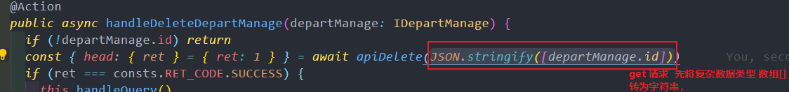


符合格式：


或者可以这么写 （不用JSON.stringify的话）


同样可以请求成功 :


## 58. 改变对象的key-value

改变对象的key - value（往对象添加字段）可以先转数组再使用 reduce

将下面该对象改编成 {
date': '2021-09-12,
menuList: {a: '你好啊'}
}

```javascript
let o = { '2021-09-12': { a: '你好啊' } }
```

### (1)、先转数组再拍平


### （2）、使用 reduce 进行对象格式转换


## 59. 数据格式转换


## 60. v-for 循环数字

v-for in 数字

```html
<div v-for="i in 5" :key="(i + 9).toString(36) + i"></div>
```

表示 i 为不为0的正整数开始 取值（1、2、3、4、5）共循环出 5 个值


## 61. 管理后台vue + ts 子组件绑定 v-model 值


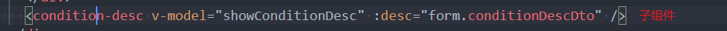


## 62. 对象数组排序


## 63. v-for undefined 问题

v-for undefined 会有问题，在请求接口拿到数据做处理的时候记得给默认值 [ ]


不然会报错 In order to be iterable, non-array objects must have a [Symbol.iterator]() method报错

## 64. git commit 规范

### 基本格式

```
<type>(<scope>): <subject>

<body>

<footer>
```

### 1. Type（提交类型）

| 类型     | 描述                                  | 示例                              |
| -------- | ------------------------------------- | --------------------------------- |
| feat     | 新功能（feature）                     | `feat: 添加用户登录功能`          |
| fix      | 修复 bug                              | `fix: 修复登录页面验证码错误`     |
| docs     | 文档修改                              | `docs: 更新 README 安装说明`      |
| style    | 代码格式修改（不影响代码运行的变动）  | `style: 格式化代码缩进`           |
| refactor | 重构（既不是新增功能，也不是修复bug） | `refactor: 重构用户模块代码结构`  |
| perf     | 性能优化                              | `perf: 优化首页加载速度`          |
| test     | 增加测试                              | `test: 添加用户注册单元测试`      |
| chore    | 构建过程或辅助工具的变动              | `chore: 更新 webpack 配置`        |
| revert   | 回退                                  | `revert: 回退 feat: 添加支付功能` |
| build    | 构建系统或外部依赖项的更改            | `build: 升级 vue 到 3.0`          |
| ci       | 对 CI 配置文件和脚本的更改            | `ci: 修改 GitHub Actions 配置`    |

### 2. Scope（影响范围）- 可选

用于说明 commit 影响的范围，比如：

- `feat(user): 添加用户头像上传功能`
- `fix(payment): 修复支付回调异常`
- `docs(api): 更新接口文档`

### 3. Subject（简短描述）

- 以动词开头，使用第一人称现在时
- 第一个字母小写
- 结尾不加句号（.）
- 限制在50个字符以内

### 4. Body（详细描述）- 可选

- 详细描述本次 commit 的内容
- 说明代码变动的动机以及与以前行为的对比

### 5. Footer（脚注）- 可选

用于关闭 Issue 或者关联 Issue：

```
Closes #123
Fixes #456
Refs #789
```

### 实际示例

#### 简单提交

```bash
git commit -m "feat: 添加用户登录功能"
git commit -m "fix: 修复购物车数量计算错误"
git commit -m "docs: 更新项目安装文档"
```

#### 详细提交

```bash
git commit -m "feat(user): 添加用户头像上传功能

- 支持 jpg、png、gif 格式
- 文件大小限制 2MB
- 自动压缩和裁剪
- 添加上传进度条

Closes #123"
```

#### 多行提交（使用编辑器）

```
feat(payment): 集成支付宝支付功能

添加支付宝 SDK 集成：
- 实现支付宝网页支付
- 添加支付状态回调处理
- 增加支付失败重试机制
- 完善支付日志记录

测试覆盖：
- 单元测试覆盖率 95%
- 集成测试通过
- 压力测试 1000 并发无异常

Breaking Changes:
- 移除旧的支付接口 `/api/old-pay`
- 更新支付状态字段名称

Closes #456
Refs #789
```

### 常用命令技巧

#### 1. 修改最后一次提交

```bash
# 修改提交信息
git commit --amend -m "新的提交信息"

# 添加文件到上次提交
git add .
git commit --amend --no-edit
```

#### 2. 查看提交历史

```bash
# 查看简洁的提交历史
git log --oneline

# 查看带图形的分支历史
git log --graph --oneline

# 按作者筛选
git log --author="用户名"

# 按时间筛选
git log --since="2023-01-01" --until="2023-12-31"
```

#### 3. 生成 CHANGELOG

```bash
# 查看两个版本之间的提交
git log v1.0.0..v2.0.0 --pretty=format:"- %s"

# 按类型分组显示
git log --pretty=format:"- %s" | grep "^- feat"
git log --pretty=format:"- %s" | grep "^- fix"
```

### 团队规范建议

1. **强制使用 commit 规范**：配置 git hooks 或 CI 检查
2. **提交频率**：小步快跑，频繁提交
3. **原子性**：每次提交只做一件事
4. **可回退性**：确保每次提交都是可工作的状态
5. **关联 Issue**：重要提交要关联对应的 Issue

### 工具推荐

- **Commitizen**：交互式生成规范的 commit 信息
- **commitlint**：检查 commit 信息是否符合规范
- **husky**：Git hooks 工具，在提交前检查代码质量

## 65. vw/vh 与 100% 的区别

### （1）、 vw/vh 是 相对于 视口 宽度/高度

（只与可视化窗口的宽高有关、与父级元素无关）

**100vh** 在 移动端 出现的问题 （移动端地址栏有时可见，有时隐藏。导致视口大小因此而变化）


解决： 使用 window.innerHeight 将高度正确设置为窗口的可见部分 。显示内容高度不受地址栏的影响

### （2）、100% 是 相对于 最近一级的父元素的宽高

## 66. 高度自适应问题

高度自适应引起的问题： 页面首次加载的时候会窄（缩一下）？

CDN 有缓存，图片没法及时更新

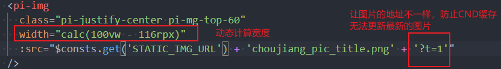

## 67. el-form 回车自动提交问题

el-form里面如果有且只有一个el-form-item里面是el-input的话

你在input里面输入完毕 按回车默认会自动提交 导致整个页面刷新

解决： 在 el-form 中加 @submit.native.prevent

```html
<el-form :inline="true" :model="form" @submit.native.prevent> </el-form>
```

## 68. el-radio 单选可取消

el-radio 单选可取消 自己写个组件呗。

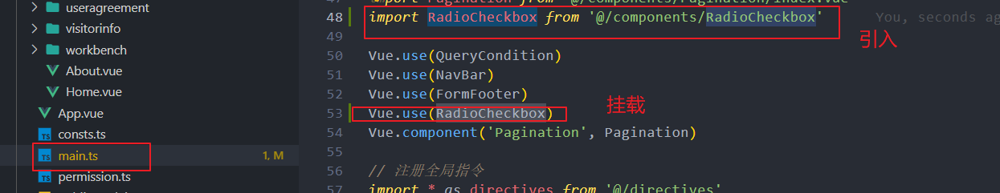


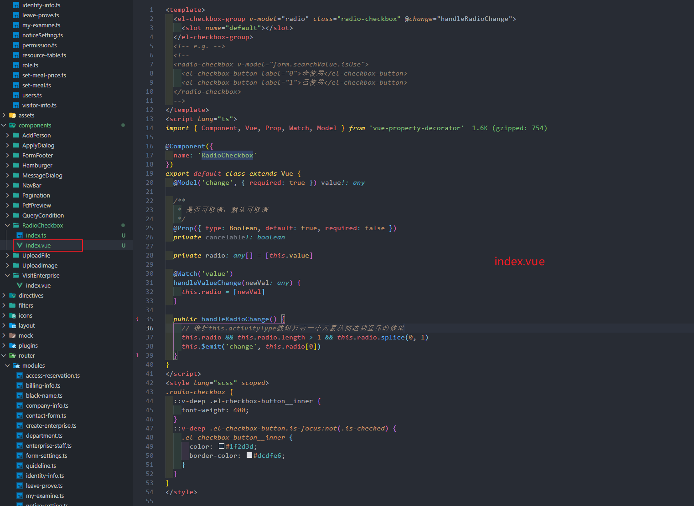


使用：

```html
<radio-checkbox>
  <el-checkbox-button> // </el-checkbox-button>
</radio-checkbox>
```


### 1)、单选

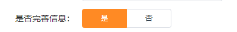


### 2）、可取消选中


## 69. 环境域名配置

更改正式/测试环境域名（包括静态服务器域名和api域名，小程序发版还涉及更换appid），管理后台和小程序

### 1）、管理后台发布命令

一般都是 npm run build + gulp upload:dev （测试环境）/ npm run build + gulp upload:release （正式环境）

或者直接在package.json中配置了发布命令 ，那就 直接 npm run fabu 就行了


### 2)、小程序发布命令

#### 2.1）、发布h5

跟管理后台一样，npm run build + gulp upload:release (upload:static)

#### 2.2）、发布微信小程序（上传微信公众平台）

npm run dev:mp-weixin / npm run build:mp-weixin ，分别会生成两个静态文件，如下


一般发版的话会选择用 build:mp-weixin 这个来 run， 然后再在开发工具中点上传


然后就能看到体验版和正式版了：


小程序改了api域名的话，在开发者工具中运行，相对应的appid也要对应的上，要改回去

### 环境配置对应关系

**（1）、sadaiscloud环境**：

- VUE_APP_BASE_API = 'https://api-canteen.sadaiscloud.com'
- WX_APPID: 'wxb31658291f32d474', // 微信APPID

**（2）、ipon-group环境**：

- VUE_APP_BASE_API = 'https://api-canteen.ipon-group.com'
- WX_APPID: 'wx6d830d0c4b543083', // 微信APPID


### 使用 HBuilder 打包 公众号 H5 步骤


## 70. 数组方法性能对比

### forEach vs for 循环性能

在大数据量处理时，传统的 for 循环性能通常比 forEach 更好，因为 forEach 需要调用回调函数。

```javascript
// 性能较好
for (let i = 0; i < arr.length; i++) {
  // 处理 arr[i]
}

// 性能稍差，但代码更简洁
arr.forEach((item) => {
  // 处理 item
})
```

### map vs forEach 使用场景

- **map**: 需要转换数组元素并返回新数组
- **forEach**: 只需要遍历数组，不需要返回值

```javascript
// 使用 map 转换数据
const doubled = numbers.map(n => n * 2)

// 使用 forEach 执行副作用
numbers.forEach(n => console.log(n))
```

## 71. 异步处理最佳实践

### Promise.all vs Promise.allSettled

```javascript
// Promise.all - 任何一个失败就全部失败
Promise.all([promise1, promise2, promise3])
  .then((results) => {
    // 所有都成功
  })
  .catch((error) => {
    // 任何一个失败
  })

// Promise.allSettled - 等待所有完成，不管成功失败
Promise.allSettled([promise1, promise2, promise3])
  .then((results) => {
    results.forEach((result) => {
      if (result.status === 'fulfilled') {
        // 成功的处理
      }
      else {
        // 失败的处理
      }
    })
  })
```

### async/await 错误处理

```javascript
// 推荐的错误处理方式
async function fetchData() {
  try {
    const response = await fetch('/api/data')
    const data = await response.json()
    return data
  }
  catch (error) {
    console.error('获取数据失败:', error)
    throw error // 重新抛出，让调用者处理
  }
}
```

## 72. Vue 响应式原理深入

### Vue 2.x 响应式限制

```javascript
// 这些操作不会触发响应式更新
vm.items[indexOfItem] = newValue // 数组索引赋值
vm.items.length = newLength // 修改数组长度

// 解决方案
Vue.set(vm.items, indexOfItem, newValue)
vm.$set(vm.items, indexOfItem, newValue)
vm.items.splice(indexOfItem, 1, newValue)
```

### 对象属性添加

```javascript
// 不会触发响应式
this.obj.newProperty = 'value'

// 正确方式
this.$set(this.obj, 'newProperty', 'value')
// 或者
this.obj = { ...this.obj, newProperty: 'value' }
```

## 73. CSS 性能优化技巧

### 避免昂贵的CSS选择器

```css
/* 性能差 - 避免使用 */
* {
}
[hidden='true'] {
}
.container > .item > .content > .text {
}

/* 性能好 */
.text {
}
.item-text {
}
```

### 使用 transform 和 opacity 进行动画

```css
/* 会触发重排重绘 - 性能差 */
.element {
  transition:
    left 0.3s,
    top 0.3s;
}

/* 只触发合成 - 性能好 */
.element {
  transition:
    transform 0.3s,
    opacity 0.3s;
}
```

## 74. 内存泄漏预防

### 事件监听器清理

```javascript
// 组件销毁时清理事件监听器
beforeDestroy() {
  window.removeEventListener('resize', this.handleResize)
  document.removeEventListener('click', this.handleClick)
}
```

### 定时器清理

```javascript
data() {
  return {
    timer: null
  }
},
mounted() {
  this.timer = setInterval(() => {
    // 定时任务
  }, 1000)
},
beforeDestroy() {
  if (this.timer) {
    clearInterval(this.timer)
    this.timer = null
  }
}
```

## 75. 前端安全最佳实践

### XSS 防护

```javascript
// 危险 - 直接插入HTML
element.innerHTML = userInput

// 安全 - 使用 textContent
element.textContent = userInput

// Vue 中使用 v-text 而不是 v-html
// <div v-text="userInput"></div>
```

### CSRF 防护

```javascript
// 在请求头中添加 CSRF token
axios.defaults.headers.common['X-CSRF-TOKEN'] = document.querySelector('meta[name="csrf-token"]').getAttribute('content')
```

## 76. 可选链操作符

**可选链** ?. \*\*(ES2020)代替 && 进行判空处理

使用规则：**?.** 只检查左边部分是否为 null/undefined，如果不是则继续运算

不会检查右边


[javascript info 可选链](https://zh.javascript.info/optional-chaining#bu-cun-zai-de-shu-xing-de-wen-ti)

```javascript
// 传统写法
if (user && user.address && user.address.street) {
  console.log(user.address.street)
}

// 可选链写法
console.log(user?.address?.street)

// 方法调用
user.method?.()

// 数组访问
user.hobbies?.[0]
```

## 77. Vue v-model 修饰符

使用 Vue v-model number 修饰符可以实现让输入框输入的内容，自动转换为 number 类型。

```html
<!-- 自动转换为数字类型 -->
<input v-model.number="age" type="number" />

<!-- 去除首尾空格 -->
<input v-model.trim="message" />

<!-- 在 change 事件而非 input 事件触发时更新 -->
<input v-model.lazy="message" />
```

## 78. 数组 splice 方法详解

记一下数组的 splice 的用法： **返回被删除的元素数组**

### 1）、删除

```javascript
let myFish = ['angel', 'clown', 'mandarin', 'sturgeon']
let removed = myFish.splice(2)

// 运算后的 myFish: ["angel", "clown"]
// 被删除的元素: ["mandarin", "sturgeon"]
```

```javascript
let myFish = ['angel', 'clown', 'drum', 'mandarin', 'sturgeon']
let removed = myFish.splice(3, 1)

// 运算后的 myFish: ["angel", "clown", "drum", "sturgeon"]
// 被删除的元素: ["mandarin"]
```

### 2）、替换

```javascript
let myFish = ['angel', 'clown', 'drum', 'sturgeon']
let removed = myFish.splice(2, 1, 'trumpet')

// 运算后的 myFish: ["angel", "clown", "trumpet", "sturgeon"]
// 被删除的元素: ["drum"]
```

### 3）、插入

```javascript
let myFish = ['angel', 'clown', 'mandarin', 'sturgeon']
let removed = myFish.splice(2, 0, 'drum', 'guitar')

// 运算后的 myFish: ["angel", "clown", "drum", "guitar", "mandarin", "sturgeon"]
// 被删除的元素: [], 没有元素被删除
```

## 79. 对象比较方法

### （1）判断对象是否为空

```javascript
// 方法1：Object.keys
Object.keys(obj).length === 0

// 方法2：JSON.stringify
JSON.stringify(obj) === '{}'

// 方法3：for...in 循环
function isEmpty(obj) {
  for (let key in obj) {
    return false
  }
  return true
}
```

### （2）判断对象是否相等

最好使用工具库，比较可靠和边界情况考虑比较完全

简单比较 ： 引用数据类型指向不同的内存地址，不可直接 == 或者 ===

```javascript
const a = { name: 'Hbin' }
const b = { name: 'Hbin' }

// （1），a == b /  a === b     ===>    结果都为 false
// （2），const c = a          c === a  true               c === b  false
```

### 浅比较实现

只做第一层数据的查询，跳过数组、对象、方法

利用es6的every函数做最优处理

```javascript
// 浅比较
function isObjShallowEqual(obj1, obj2) {
  const keys1 = Object.getOwnPropertyNames(obj1)
  const keys2 = Object.getOwnPropertyNames(obj2)
  if (keys1.length !== keys2.length) {
    return false
  }
  const flag = keys1.every((key) => {
    const type = typeof obj1[key]
    // do not check function, array, object
    if (['function', 'array', 'object'].includes(type)) {
      return type === typeof obj2[key]
    }
    // if unequal, return true
    if (obj1[key] !== obj2[key]) {
      return false
    }
    return true
  })
  // if found unequal, then return false, which means unequal
  return flag
}
```

## 80. 数组操作技巧

### （1）判断数组是否为空

```javascript
// 方法1：length 属性
array.length === 0

// 方法2：find 方法
let found = array.find(i => i)
if (!found)
  console.log('数组为空!')

// 方法3：findIndex 方法
let foundIndex = array.findIndex((i, idx) => idx > -1)
if (foundIndex === -1)
  console.log('数组为空!')
```

### （2）数组去重 12种方法

```javascript
// 方法1：Set + Array.from
Array.from(new Set(arr))

// 方法2：Set + 展开运算符
[...new Set(arr)]

// 方法3：filter + indexOf
arr.filter((item, index) => arr.indexOf(item) === index)

// 方法4：reduce
arr.reduce((acc, current) => {
  if (!acc.includes(current)) {
    acc.push(current)
  }
  return acc
}, [])
```

## 81. Array.prototype.sort() 用法详解

### 1）、基础排序

```javascript
// 数字 => 从小到大排序
// 字符串数字 => 按照unicode顺序排（字符大到小排序）
arr.sort()
```

### 2）、自定义排序函数

```javascript
// 从小到大
arr.sort((a, b) => a > b ? -1 : 1)
// -1: a在b前（从小到大排）  1: b在a前（从大到小排）

// 从大到小
arr.sort((a, b) => a > b ? 1 : -1)

// 或者：
arr.sort((a, b) => (a.auditStatus - b.auditStatus)) // 正序 从小到大排
arr.sort((a, b) => (b.auditStatus - a.auditStatus)) // 倒序 从大到小排
```

### 3）、时间排序示例

```javascript
let a = [
  { date: '2021-10-15', visitor: 'zs' },
  { date: '2021-08-25', visitor: 'ls' },
  { date: '2021-12-24', visitor: 'ww' }
]

// 按照时间降序排（利用dayjs工具库）
a.sort((a, b) => (this.$dayjs(a.date).isBefore(this.$dayjs(b.date)) ? -1 : 1))

// dayjs 获取时间戳
+ dayjs() // 或者 dayjs().valueOf()
```


## 82. Vue DOM 操作注意事项

vue 中 操作 DOM . **须在页面数据加载完成后对DOM进行操作 **

**！！！！！！！！！！！！ 须在 \*\***this.$nextTick()\***\* 回调函数中执行**

如何在页面渲染后操作dom, 而且只执行一次 ？

在接口请求成功的回调中使用！

可以在mounted中$nextTick, 也可以在计算函数中$nextTick.


```javascript
// 正确的DOM操作方式
mounted() {
  this.$nextTick(() => {
    // DOM 已经更新
    this.$refs.myElement.focus()
  })
}

// 在数据更新后操作DOM
updateData() {
  this.message = 'new message'
  this.$nextTick(() => {
    // DOM 已经根据新数据更新
    console.log(this.$refs.messageElement.textContent)
  })
}
```

## 83. Vue 性能优化建议

如果是 html 中 不会用到的属性， 可以不放到 data 或者 computed 中， 直接在 created 中 this.xxx 就可以了， 性能考虑？ （字符串 --> 对象 ）

data 监听 每个 {{ }} 对应一个watcher 监听器

一个组件 =》 一个 watcher

```javascript
// 不需要响应式的数据
created() {
  // 这些数据不会被 Vue 监听，性能更好
  this.staticData = {
    config: {},
    constants: []
  }
}
```

## 84. 移动端滚动容器选择

移动端（小程序/ APP）滚动容器选择


### （1）、纵向滚动 scroll-view (pi-scroll scroll-y)


### （2）、 swiper + 纵向滚动 swiper (pi-scroll)


### （3）、 mescroll-uni + 纵向滚动

(pi-scroll-container + pi-scroll + mescroll-uni 上拉刷新/下拉加载)


## 85. 浏览器缓存清除方法

js 清除浏览器缓存方法

### 1），用随机数

URL 参数后加上 "?ran=" + Math.random(); ?ran=Math.random()

### 2），用随机时间

在 URL 参数后加上 "?timestamp=" + new Date().getTime();

```javascript
// 示例
const url = `/api/data?timestamp=${new Date().getTime()}`
fetch(url)

// 或者
const randomUrl = `/api/data?ran=${Math.random()}`
fetch(randomUrl)
```

## 86. DOM 操作技巧

dom 获取 label for属性名对应的标签


```javascript
// 通过 for 属性获取对应的表单元素
const label = document.querySelector('label[for="username"]')
const input = document.getElementById(label.getAttribute('for'))
```

## 87. 性能优化策略

写代码不仅要考虑可读性， 还要考虑兼顾性能优化方面的问题 !!!! 减少重复代码的使用和出现

**性能优化 ：**

### 1、**懒加载**

在需要的时候加载，随载随用（路由、图片、滑动触发、虚拟列表）


异步组件、组件 import () => {} 动态引入、webpack splitChunk

```javascript
// 路由懒加载
const Home = () => import('./views/Home.vue')

// 组件懒加载
const LazyComponent = defineAsyncComponent(() => import('./LazyComponent.vue'))
```

### 2、**按需加载**

根据需要去加载资源（常用 UI 组件库）

```javascript
// Element UI 按需引入
import { Button, Select } from 'element-ui'
```

### 3、**不生成.map文件**

配置里productionSourceMap设置成为false，能差不多减少一半的体积。

```javascript
// vue.config.js
module.exports = {
  productionSourceMap: false
}
```

### 4、**通过cdn方式引入**


### 5、**图片压缩**

利用一些网站对大体积图片进行压缩，例如：[tinypng](https://tinypng.com/)

## 88. 组件事件处理

pi-checkbox 的 :value + @input @change 都没有 .stop 阻止冒泡事件 ，得 包多 一层 view 标签 ，用 tap 事件来 代替


```html
<!-- 解决方案 -->
<view @tap.stop="handleTap">
  <pi-checkbox :value="checked" @input="handleInput"> </pi-checkbox>
</view>
```

## 89. 数据导出注意事项

导出不调接口 分页数据 / 按照查询条件筛选的数据 无法查询 只能拿当前页面数据


## 90. 父子组件 v-model 通信

父组件传个boolean控制 子组件dialog弹窗 是否显示 用 v-model !!!!!!

### 父组件：


### 子组件:


常规的js - vue 是 定义在 model 上 的

```javascript
model: {
  prop: 'value',
  event: 'change'
}
```


**注意** ：

小程序中没有 v-model ，所以只能在管理后台使用，小程序 还是使用 :visible="visible" 和 this.$emit('val', val) 来代替了 ！

## 91. Element UI 表单注意事项

### 踩坑：el-input 同时设置 type 和 maxlength

el-input 同时设置 type 和 maxlength ， maxlength 不生效 ， 需自己改成 oninput


### el-form-item 使用限制

el-form-item 不可以离开 el-form 单独使用 ！

```html
<!-- 错误用法 -->
<el-form-item label="用户名">
  <el-input v-model="username"></el-input>
</el-form-item>

<!-- 正确用法 -->
<el-form>
  <el-form-item label="用户名">
    <el-input v-model="username"></el-input>
  </el-form-item>
</el-form>
```

## 92. reduce 高级用法

reduce 用法 ： 慢慢积累 可以返回你想要的东西 （自己来定义要返回什么东西）

删除数组对象中的指定对象 reduce（该对象元素的prop字段是 'tag_bodyAge'的时候不添加到该数组中， 也就是删除该元素的意思了）


```javascript
// 使用 reduce 删除特定元素
const filteredArray = originalArray.reduce((acc, item) => {
  if (item.prop !== 'tag_bodyAge') {
    acc.push(item)
  }
  return acc
}, [])

// 使用 reduce 进行数据转换
const transformed = data.reduce((acc, item) => {
  acc[item.id] = item.name
  return acc
}, {})
```

## 93. 路由监听注意事项

@Watch($route) 只能在外面（全局使用），在单独的页面内监听不生效 （页面内当前路由不会变）


```javascript
// 在组件内监听路由变化
watch: {
  '$route'(to, from) {
    // 响应路由变化
    console.log('路由变化:', to.path)
  }
}

// 或者使用 beforeRouteUpdate
beforeRouteUpdate(to, from, next) {
  // 在当前路由改变，但是该组件被复用时调用
  next()
}
```

## 94. 管理后台开发规范

管理后台 创建 和 保存 区别 ： 创建没传id， 保存需要传id （没 id 会新增一条 ------ 相当于创建了）

```javascript
// 创建操作
createItem(data) {
  return this.$http.post('/api/items', data)
}

// 更新操作
updateItem(id, data) {
  return this.$http.put(`/api/items/${id}`, data)
}

// 通用保存方法
saveItem(data) {
  if (data.id) {
    return this.updateItem(data.id, data)
  } else {
    return this.createItem(data)
  }
}
```

## 95. 异步代码顺序执行

顺序执行异步代码


```javascript
// 使用 async/await 顺序执行
async function executeInOrder() {
  try {
    const result1 = await asyncFunction1()
    const result2 = await asyncFunction2(result1)
    const result3 = await asyncFunction3(result2)
    return result3
  }
  catch (error) {
    console.error('执行失败:', error)
  }
}

// 使用 for...of 循环顺序执行
async function processArray(items) {
  for (const item of items) {
    await processItem(item)
  }
}
```

## 96. 开发最佳实践

每个公司都有自己的规范，熟悉完公共模块有哪些，项目蓝湖设计图看下来大概确定哪些组件是大概率会封装的，去项目里面components 里面找，现成的组件拿来就用，避免重复造轮子，和自己写的不全；

涉及到vuex的数据管理的，要清楚流程，确定好修改不会影响到其他的地方时才进行更改（一般新增不会大影响，都是修改和删除就要很注意）;

可以尝试自己从0搭建后台系统的框架（初始化项目），但是要按照规范来，避免出现本来就是模板化的东西的bug

## 97. 文件上传组件

后台管理系统 upload 组件 包括很多的类型，现在是 uploadImage 和 uploadFile 图片归一种，其他的文件格式都归 uploadFile,传对应的参数进行不同格式的类型的显示

```javascript
// 文件类型配置
const fileTypes = {
  image: ['jpg', 'jpeg', 'png', 'gif', 'webp'],
  document: ['pdf', 'doc', 'docx', 'xls', 'xlsx'],
  video: ['mp4', 'avi', 'mov', 'wmv'],
  audio: ['mp3', 'wav', 'flac']
}

// 根据文件扩展名判断类型
function getFileType(filename) {
  const ext = filename.split('.').pop().toLowerCase()
  for (const [type, extensions] of Object.entries(fileTypes)) {
    if (extensions.includes(ext)) {
      return type
    }
  }
  return 'other'
}
```

## 98. 空值合并运算符

### @1、空值合并运算符 ??

只有 左边为 undefined 或 null 时，返回右边

```javascript
0 ?? 24 // 0
null ?? 'youngG' // 'youngG'
undefined ?? 'default' // 'default'
```

### @2、逻辑或 ||

是左边为假（ false / null / undefined / 0 / '' / NaN ）时，返回右边

```javascript
0 || 24 // 24
null || 'youngG' // 'youngG'
false || 'default' // 'default'
```

### @3、逻辑空赋值 ??=

当 左边为 undefined 或 null 时， 为右边赋值

```javascript
const a = { duration: 300 }
a.duration ??= 50 // 300 (不变)
a.speed ??= 600 // 600 (新赋值)
```

## 99. Vue .sync 语法糖

**vue 中的 .sync 语法** 相当于不用在子组件中 this.$emit 就可以直接修改 子组件的值了， 相当于一个自动更新父组件属性的监听器

直接在子组件中直接修改 @PropSync 的值， 会自动更新到父组件中

### 父组件：


### 子组件：


'show' 是在父组件定义的传过来的要这么写， syncedShow 是子组件接收到'show'这个值后重新命名的（相当于syncedShow = show 赋值操作）


直接在子组件中直接修改 @PropSync 的值， 会自动更新到父组件中

相当于：

### 传统写法对比：

**父组件：**


**子组件：**


节省绕来绕去的代码 。。。

**@Prop传过来的值 不可直接修改**

**@PropSync 可以**

**@Model 不可以直接修改**

**@ModelSync 同理 可以**


'selectedNodes' 是在父组件定义的传过来的要这么写， syncedSelectedNodes 是子组件接收到'show'这个值后重新命名的（相当于syncedSelectedNodes = show 赋值操作）, 'change' 是 @Model装饰器 (绑定父组件的 v-model 值) 在子组件的写法，相当于值发生改变同步接收的意思

### 一、@Model装饰器

**父组件：**


**子组件：**

1、@Model 装饰器


2、监听值的变化：


3、最后还需要 $emit


### 二、@ModelSync 装饰器 （父组件 v-model + 子组件 ModelSync）

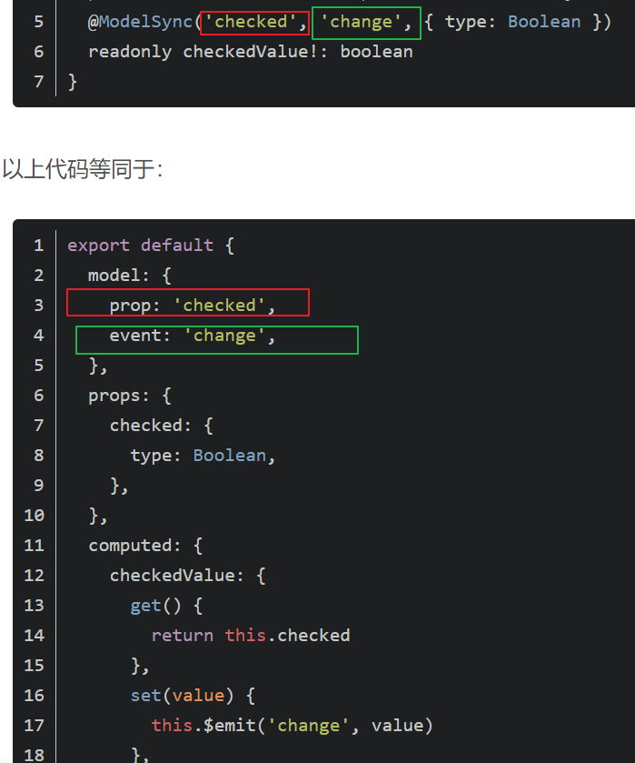

**父组件：**


**子组件：**

直接modelSync， 少去了 $emit 这一个步骤 （直接这样就行了）


## 100. 随机字符串生成

随机获取10位无序字符串 （可做 id 值 使用） guid

```javascript
Math.random()
  .toString(36)
  .substring(2, 12)
```


**原理解释：**

- Math.random() 返回 0-1（大于0 小于1） 的随机小数，一般是小数点后16位（偶尔17）
- Number.prototype.toString() 参数 radix 代表进制数，没写默认是0，参数 2-36 可选， 36进制 则是 数字 0-9（10个） 和 字母 a-z（26个）组成 同理 32进制 则是 0-9 + a-v 共 32个组成
- String.prototype.substring() 下标为2（从0开始算）起，取到下标为11 ，共 10个数

```javascript
// 更完善的 ID 生成函数
function generateId(length = 10) {
  return Math.random()
    .toString(36)
    .substring(2, 2 + length)
}

// UUID 生成
function generateUUID() {
  return 'xxxxxxxx-xxxx-4xxx-yxxx-xxxxxxxxxxxx'.replace(/[xy]/g, (c) => {
    const r = Math.random() * 16 | 0
    const v = c === 'x' ? r : (r & 0x3 | 0x8)
    return v.toString(16)
  })
}
```

## 101. 数据模型转换

数据模型转换

最终想要的格式 ： `[ { id1: '', text: '' }, { id2: '', text: '' }, { id3: '', text: '' } ]`

已知：

```javascript
let knowList = [
  { package: {}, partitionDto: { name: 'aaa', id: '111a' } },
  { package: {} },
  { package: {}, partitionDto: {} },
  { package: {}, partitionDto: { name: 'bbb', id: '222b' } },
  { package: {}, partitionDto: { name: 'ccc', id: '333c' } }
]
```

**求解如何得到想要的结果？**

过程： 先 过滤掉没有 partitionDto 的字段，然后自己组想要的格式，拿id作为唯一值

```javascript
let ids = ['id1', 'id2', 'id3']
// =====>
// [ { 'id1': { name: 111 } }, { 'id2': { name: 222 } }, { 'id3': { name: 333 } } ]

// 先构造个临时对象变量
let tempObj = { }

knowList.forEach((i) => {
  tempObj[i.partitionDto.id] = i.partitionDto
})

Object.keys(ids).map((i) => {
  return {
    id: i,
    text: tempObj[i].name
  }
})
```

自己 转换下数据格式 (构造出想要的格式) 就好了 =====> 要什么，就定义什么。

## 102. 事件冒泡处理

el-popover el-tooltip el-popconfirm 防止父元素冒泡： 直接在外层嵌套个 div， 然后 直接加 @click.stop


```html
<!-- 解决方案 -->
<div @click.stop>
  <el-popover>
    <template #reference>
      <el-button>点击</el-button>
    </template>
    <p>内容</p>
  </el-popover>
</div>
```

## 103. 函数参数作用域

**参数作用域**： 当函数的参数有默认值时，会形成一个新的作用域，这个作用域用于保存参数的值。

参数就是为函数服务的，首先会找到参数的值，没有参数再回去找函数中有没有声明


```javascript
// 示例1
function test(x = y, y = 2) {
  console.log(x, y)
}
test() // ReferenceError: Cannot access 'y' before initialization

// 示例2
let x = 1
function test(x = x) {
  console.log(x)
}
test() // ReferenceError: Cannot access 'x' before initialization

// 正确示例
let x = 1
function test(x = 2) {
  console.log(x)
}
test() // 2
```

## 104. 懒加载概念

懒加载 （动态加载） ： 点选的时候才调用接口加载数据，而不是 用 循环调用接口（递归 / 套娃）的方式 去 一次性调多次接口把数据一次性显示出来 ！！ （不然的话都可以直接让后端一次性把所有的数据都返回给你好了）

每点一次的时候才会 调用一次接口 获取（该层级level）的信息， 不会 一次性给你返回 ！！！！ （点击的时候才发起的请求 ！）

如 Tree 树形组件 Cascader 级联选择组件 ... 都有动态加载的模式 （传 node 和 data， 不用 按照默认模式的数据格式去展示 参数有 lazyLoad (node, resolve) ）...

**递归的比喻：**

目前我找到的对递归最恰当的比喻，就是查词典。

我们使用的词典，本身就是递归，为了解释一个词，需要使用更多的词。

当你查一个词，发现这个词的解释中某个词仍然不懂，于是你开始查这第二个词，可惜，第二个词里仍然有不懂的词，于是查第三个词，这样查下去，直到有一个词的解释是你完全能看懂的，那么递归走到了尽头，

然后你开始后退，逐个明白之前查过的每一个词，最终，你明白了最开始那个词的意思。


## 105. 字符串方法对比

关于 slice splice substr substring split replace concat

### spilce:


### slice:


### 详细对比：

- **slice** 下标为0开始， 到下标为几， 最后一个不取

  ```javascript
  let str = 'abcdefghij'
  str.slice(1, 4) // 从下标1开始，取3个     "bcd"
  ```

- **substr** （即将废弃的属性） begin 起始位置 也是从 0 开始 算起 第一个位置为0，取几个

  ```javascript
  let str = 'abcdefghij'
  str.substr(1, 4) // 从位置1开始，取4个    "bcde"
  ```

- **substring** start开始下标 也是从 0 开始 算起 第一个下标为0， 到下标为几的前一个
  ```javascript
  let str = 'abcdefghij'
  str.substring(1, 4) // 从下标1开始，到下标3（下标4的前一个） "bcd"
  ```


## 106. 组件生命周期问题

父组件请求接口返回数据后，赋值给data中的属性然后传给子组件，子组件 刷新页面，在 created 生命周期中打印就会获取不到，而在template模板中却可以获取的到！

与 父子组件生命周期的触发顺序 有关 又是要 watch ？

```javascript
// 解决方案
// 子组件中
watch: {
  propData: {
    handler(newVal) {
      if (newVal) {
        // 处理数据
        this.handleData(newVal)
      }
    },
    immediate: true
  }
}
```

## 107. Map 映射思维

既有 key ， 又有 value ， 只要有出现map/对象/{} 的地方，都要有敏感的反应用 map去映射 ！

```javascript
data: [{ name: '', label: { key: 'Back', val: '后退' } }]
```

`{ key: 'Back', val: '后退'  }` 页面只要 val, 而接口只要 key， 这部很明显 直接定义一个map 完事了吗

```javascript
KEY_VAL_MAP() {
   return {
     Back: '后退'
  }
}
```

页面取的时候直接 `KEY_VAL_MAP[xxx]` ， xxx 就是接口对应的变量了 !!!

## 108. 状态管理

状态值 boolean - true - false

当 **事件/内容** 有冲突/需要按条件显示 时，当找不到已知的存在的判断对象的时候，记得想起来 自己定义一个 状态值变量 进行判断 ！！！！

```javascript
// 示例
data() {
  return {
    isLoading: false,
    isEditing: false,
    showModal: false
  }
}
```

## 109. Array.prototype.fill()


```javascript
// 基本用法
Array.from({ length: 5 }).fill(0) // [0, 0, 0, 0, 0]

// 填充对象（注意引用问题）
Array.from({ length: 3 }).fill({}) // 所有元素指向同一个对象
Array.from({ length: 3 }).fill().map(() => ({})) // 每个元素都是新对象

// 指定范围填充
  [1, 2, 3, 4, 5].fill(0, 2, 4) // [1, 2, 0, 0, 5]
```

## 110. Vue.$set 使用场景

Vue.$set （ this.$set ） 的 使用场景 ？？？

### （1）、在 data 中 没有定义的初始化的字段

在 data 中 没有定义的初始化的字段，然后后面在 template 中直接用到 xxx.该字段 / 页面初始化 对该字段操作 / 页面保存对该字段操作 的时候，

响应式系统监测不到，这时候就要用 `this.$set(obj(object), targetProperty(string), value)` 将该字段加入响应式系统中。

### （2）、接口重新赋值导致字段丢失

在 data 中 定义了该字段， 但是初始化的时候将包含该字段的对象在请求接口后做了重新赋值，但是接口又没有该字段， 等于重新操作后原先包含该字段的对象现在又没有了该字段，

所以这个时候又要重新赋值给该字段对应的值， 所以这时候就要用 `this.$set(obj(object), targetProperty(string), value)` 将该字段加入响应式系统中。

```javascript
// 示例
// 动态添加属性
this.$set(this.user, 'age', 25)

// 数组索引赋值
this.$set(this.list, 0, newItem)
```

## 111. toLocaleString() 方法

toLocaleString() 返回特定语言环境下的字符串格式

### 保留千分符位数：


### new Date()使用 toLocaleString()


直接 toString()


```javascript
// 数字格式化
(123456.789).toLocaleString() // "123,456.789"
(123456.789).toLocaleString('zh-CN') // "123,456.789"

// 日期格式化
new Date().toLocaleString() // "2021/8/15 下午2:30:45"
new Date().toLocaleString('en-US') // "8/15/2021, 2:30:45 PM"

// 货币格式化
(123456.789).toLocaleString('zh-CN', {
  style: 'currency',
  currency: 'CNY'
}) // "¥123,456.79"
```

## 112. 深拷贝的缺点和解决方案

深拷贝 JSON.stringify() 的 缺点

### （1）、JSON.stringify 的 三个参数 （**数据，过滤，缩进**）

（**object, Array | function, number | string**）

第二个参数，过滤用 ：


是 function 时， 接收两个参数 `function (key, value) { }`

第三个参数，用于缩进（默认是4）。**字符串会以该字符向前填充，数值则按照tab键个数填充**

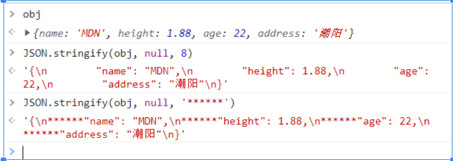

### （2）、JSON.parse（text, [reviver]）

第二个参数可以是函数，修改原数据。


### JSON.parse + JSON.stringify 实现深拷贝

```javascript
const origin = { name: 'MDN' }
const deepCopy = JSON.parse(JSON.stringify(origin))
deepCopy //  { name: 'MDN' }
```


**最好就是自己实现一个深拷贝（开销最小最安全） 深克隆 数组 / 对象 是 一样的 （相同的功能）**

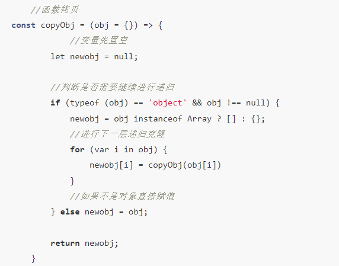


```javascript
// 完整的深拷贝实现
function deepClone(obj) {
  if (obj === null || typeof obj !== 'object')
    return obj
  if (obj instanceof Date)
    return new Date(obj)
  if (Array.isArray(obj))
    return obj.map(item => deepClone(item))
  if (typeof obj === 'object') {
    const clonedObj = {}
    for (let key in obj) {
      if (obj.hasOwnProperty(key)) {
        clonedObj[key] = deepClone(obj[key])
      }
    }
    return clonedObj
  }
}
```

## 113. computed vs watch 使用场景

用 computed 而不是 watch ？

父组件传给子组件的props，子组件中显示该 props 变化前后的值 （变化前即是 默认传过来的 default 值， 变化后即是 父组件中改变了该值），

如果直接 watch （newVal, OldVal） 该 props 然后 子组件中直接赋值 data 中的 xxx 为 OldVal ，则无法达到预期效果 （因为watch无缓存，

当父组件传的值变化时， 子组件中直接watch到的该props中的newVal 是 === OldVal的），所以要在 computed 中 先缓存默认传过来的props，

然后 watch 的是 对应的 computed 值，这样的话 OldVal、newVal 就都拿得到了。

### 子组件 ：


watch 的 deep 属性 在 对象 嵌套 的层级 很深 的情况下 就需要 开启 （深度监听）了

```javascript
// 正确的使用方式
computed: {
  cachedProp() {
    return this.propFromParent
  }
},
watch: {
  cachedProp(newVal, oldVal) {
    // 现在可以正确获取到 oldVal 和 newVal
    console.log('变化前:', oldVal)
    console.log('变化后:', newVal)
  }
}
```

## 114. 过滤器使用注意

过滤器不能直接用 ||

这样不行的话 ：


那就换种写法：


```javascript
// 正确的过滤器写法
filters: {
  formatText(value) {
    return value || '默认值'
  }
}

// 在模板中使用
{{ text | formatText }}
```

## 115. HTTP 状态码

HTTP 常用状态码 ： 200 300 400 500


- **2xx 成功**：200 OK, 201 Created, 204 No Content
- **3xx 重定向**：301 Moved Permanently, 302 Found, 304 Not Modified
- **4xx 客户端错误**：400 Bad Request, 401 Unauthorized, 403 Forbidden, 404 Not Found
- **5xx 服务器错误**：500 Internal Server Error, 502 Bad Gateway, 503 Service Unavailable

## 116. CSS 盒模型

标准盒模型 和 怪异盒模型 （IE盒模型）border-box

怪异的 content 包括 border + padding

标准的话 content 就是 content （不会包括其他的）

```css
box-sizing: border-box; /* 怪异盒模型 */
box-sizing: content-box; /* 标准盒模型 */
box-sizing: inherit; /* 继承父元素的 box-sizing */
```

## 117. 调试哲学

**越简单，改动越小，越是正确改bug的方式**

**越迷惑（感到难以解决）的问题，解决方式往往是 越简单 的！**

**是不需要去想那么复杂的。**

## 118. iframe 使用注意事项

el-dialog 中 使用** iframe** （内联标签）会因没有 设置固定的宽高而 整个iframe 元素变大 要有固定（写死）的宽高

正常使用 iframe 标签 ，直接 整个 src 和 frameborder="0" 就行了，然后就要么 iframe width 和 height 都 100% 继承 来自父元素（固定宽高）的宽和高。

### 跨域报错：


**X-Frame-Options** （[HTTP](https://developer.mozilla.org/zh-CN/docs/Web/HTTP) 响应头）用来告知浏览器该网页（iframe的src）是否可以放在 iframe 中

### 常见属性：

- **deny** --- 不允许
- **sameorigin** --- 可以在相同域名页面的 frame 中展示
- **allow-from xxx** ( 例如 https://www.baidu.com ) --- iframe 只能放在 www.baidu.com 这个域名下
- **allowall** --- 允许所有站点内嵌


常见的就是在 nginx 配置


### 解决方案：

把 el-dialog 单独放到父元素上面， 不要 抽成一个组件（页面），让其父元素的宽高固定， 就不会有那样的问题了 !


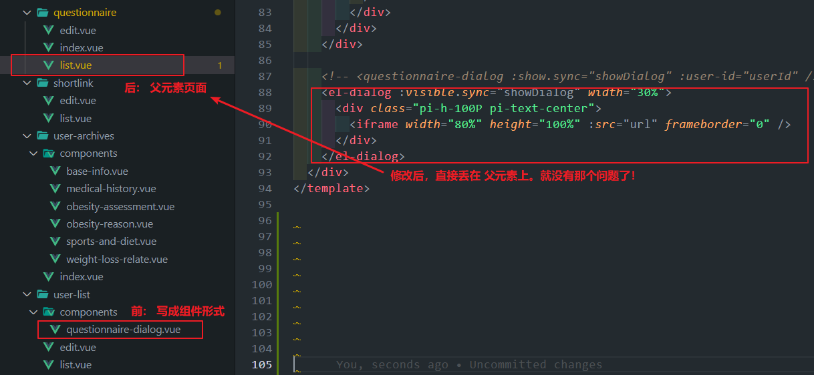


## 119. CSS 文字溢出处理

CSS 设置文字溢出省略号显示的固定搭配 ：

**条件**： 需要包含文字的盒子的宽高是已知（固定）的

### overflow: overlay 和 overflow: scroll 区别：


### 单行文字溢出：

```css
overflow: hidden;
text-overflow: ellipsis; /* 文字溢出省略号 */
white-space: nowrap; /* 不换行 */
```

### 多行文字溢出：

```css
overflow: hidden;
text-overflow: ellipsis;
display: -webkit-box; /* 必要搭配 */
-webkit-line-clamp: 2; /* 显示行数 */
-webkit-box-orient: vertical;
```

## 120. 总结

- **Vue.js 进阶技巧**：组件通信、生命周期、响应式原理
- **JavaScript 高级概念**：异步处理、数组方法、对象操作
- **小程序开发**：兼容性处理、性能优化、组件使用
- **工程化配置**：环境配置、构建优化、部署流程
- **开发最佳实践**：代码规范、调试技巧、性能优化
- **CSS 技巧**：布局、动画、响应式设计
- **前端安全**：XSS 防护、CSRF 防护、安全最佳实践

## 121. CSS 多行文字溢出

CSS 设置文字溢出省略号显示的固定搭配完整版：

**条件**： 需要包含文字的盒子的宽高是已知（固定）的

### 完整的多行文字溢出样式：

```css
overflow: hidden;
text-overflow: ellipsis; /* 文字溢出省略号 */
display: -webkit-box; /* 必要搭配 */
-webkit-line-clamp: 1; /* 显示的文本行数 */
-webkit-box-orient: vertical; /* 必要搭配 盒对象子元素排列方式 */
```


## 122. 异步接口连续调用

连续调两次接口，第一次达不到数据怎么解决？

用 async / await 异步处理

```javascript
// 正确的异步处理方式
async function fetchData() {
  try {
    const firstResult = await firstApi()
    // 确保第一个接口完成后再调用第二个
    const secondResult = await secondApi(firstResult)
    return secondResult
  }
  catch (error) {
    console.error('接口调用失败:', error)
  }
}
```

## 123. 数组连接方法

CONCAT concat 数组连接数组的方法 别给我拼错了 ！！！

```javascript
const arr1 = [1, 2, 3]
const arr2 = [4, 5, 6]
const result = arr1.concat(arr2) // [1, 2, 3, 4, 5, 6]

// 或者使用展开运算符
const result2 = [...arr1, ...arr2] // [1, 2, 3, 4, 5, 6]
```

## 124. 数据格式转换 2

### 1）、已知数据格式：

```javascript
const gradeList = [
  { grade1: '一年级' },
  { grade2: '二年级' },
  { grade3: '三年级' }
]

const studentList = [
  { grade1: ['小明', '小张', '小赵'] },
  { grade2: ['张三', '李四', '王五'] },
  { grade3: ['tom', 'lilei', 'mary'] }
]
```

### 2）、目标数据格式：

```javascript
students = [
  { name: '小明', grade: '一年级' },
  { name: '小张', grade: '一年级' },
  // ...
]
```

### 3）、格式处理 ：

封装个函数： 用到三层循环

```javascript
function students(gradeInfos, studentInfos) {
  let targets = []
  for (let i = 0; i < studentInfos.length; i++) {
    for (const j in gradeInfos[i]) { //  这里是重点 （找得到这点规律，基本就破解了）
      const mapList = studentInfos[i][j].forEach((item) => {
        targets.push({
          name: item,
          grade: gradeInfos[i][j]
        })
      })
    }
  }
  return targets
}

students(gradeList, studentList)
```


### 查找字符串中每个字符出现的次数 ：


```javascript
function countChars(str) {
  const result = {}
  for (let char of str) {
    result[char] = (result[char] || 0) + 1
  }
  return result
}
```

## 125. Element UI 日期选择器

el-date-picker 只支持 指定格式的字符串， 不在指定范围的话 是显示不出来 （或者显示错误的）

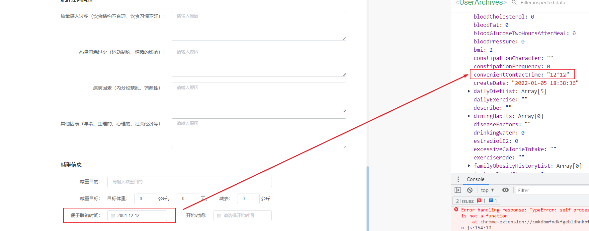

```javascript
// 正确的日期格式
const dateValue = '2021-08-15' // YYYY-MM-DD
const datetimeValue = '2021-08-15 14:30:00' // YYYY-MM-DD HH:mm:ss

// 格式化日期
function formatDate(date) {
  return date ? new Date(date).toISOString().split('T')[0] : ''
}
```

## 126. 图片格式检测

无后缀名 图片 查 后缀格式 ：


```javascript
// 通过文件头检测图片格式
function getImageType(file) {
  return new Promise((resolve) => {
    const reader = new FileReader()
    reader.onload = function (e) {
      const arr = new Uint8Array(e.target.result).subarray(0, 4)
      let header = ''
      for (let i = 0; i < arr.length; i++) {
        header += arr[i].toString(16)
      }

      let type = ''
      switch (header) {
        case '89504e47':
          type = 'png'
          break
        case 'ffd8ffe0':
        case 'ffd8ffe1':
        case 'ffd8ffe2':
          type = 'jpg'
          break
        case '47494638':
          type = 'gif'
          break
        default:
          type = 'unknown'
      }
      resolve(type)
    }
    reader.readAsArrayBuffer(file)
  })
}
```

## 127. Vue 更新视图方法

更新视图方法

```javascript
this.$set() // 添加响应式属性
this.$forceUpdate() // 强制更新
this.$nextTick() // 下次DOM更新后执行
setTimeout() // 异步更新
```

## 128. 数组操作技巧

两个数组中删除相同项目：


```javascript
// 方法1：filter + includes
const arr1 = [1, 2, 3, 4, 5]
const arr2 = [3, 4, 5, 6, 7]
const diff = arr1.filter(item => !arr2.includes(item)) // [1, 2]

// 方法2：使用 Set
const set2 = new Set(arr2)
const diff2 = arr1.filter(item => !set2.has(item)) // [1, 2]
```

## 129. Element UI 表单验证

饿了么 的 rules 属性 有 required 、 message 、 trigger 、 type ... 等

```javascript
rules: {
  username: [
    { required: true, message: '请输入用户名', trigger: 'blur' },
    { min: 3, max: 15, message: '长度在 3 到 15 个字符', trigger: 'blur' }
  ],
  email: [
    { required: true, message: '请输入邮箱地址', trigger: 'blur' },
    { type: 'email', message: '请输入正确的邮箱地址', trigger: ['blur', 'change'] }
  ]
}
```

## 130. CSS 布局方案

常见布局： 百分比（流式）布局 rem flex 响应式 双栏/三栏布局 双飞翼/圣杯 布局

百分比布局 + flex 可以很常见的适配 登录页 的布局 （px都用%进行替换 ！）

```css
/* 百分比布局 */
.container {
  width: 100%;
  height: 100vh;
}

.content {
  width: 80%;
  margin: 0 auto;
}

/* Flex 布局 */
.flex-container {
  display: flex;
  justify-content: center;
  align-items: center;
  height: 100vh;
}

/* 响应式布局 */
@media (max-width: 768px) {
  .content {
    width: 95%;
  }
}
```

## 131. 调试技巧

真相大白了！！！！！！！ 原因： 初始化的时候赋值有问题导致的报错


```javascript
// 调试技巧
console.log('变量值:', variable)
console.table(arrayData) // 表格形式显示数组
console.time('timer') // 开始计时
console.timeEnd('timer') // 结束计时

// 断点调试
debugger // 在代码中设置断点
```

## 132. 递归函数注意事项

套娃函数 自身调用不会执行 ！！


```javascript
// 正确的递归函数
function factorial(n) {
  if (n <= 1)
    return 1 // 递归终止条件
  return n * factorial(n - 1)
}

// 错误的递归（无终止条件）
function badRecursion(n) {
  return badRecursion(n) // 会导致栈溢出
}
```

## 133. Git 版本控制

版本回退，但是不能提交 (git push)


```bash
# 查看提交历史
git log --oneline

# 回退到指定版本（保留工作区修改）
git reset --soft HEAD~1

# 回退到指定版本（丢弃工作区修改）
git reset --hard HEAD~1

# 查看所有操作历史
git reflog
```

## 134. keep-alive 组件

keep-alive 组件


`<keep-alive>` （该组件主要使用 LRU 算法的缓存机制） 包裹动态组件时，会缓存不活动的组件实例，而不是销毁它们，防止重复渲染DOM。和 `<transition>` 相似，`<keep-alive>` 是一个抽象组件：它自身不会渲染一个 DOM 元素，也不会出现在组件的父组件链中。

当组件在 `<keep-alive>` 内被切换，它的 activated 和 deactivated 这两个生命周期钩子函数将会被对应执行。

在 2.2.0 及其更高版本中，activated 和 deactivated 将会在 `<keep-alive>` 树内的所有嵌套组件中触发。

主要用于保留组件状态或避免重新渲染。


### 生命周期执行顺序：

当组件第一次创建的时候 activated 方法是在 mounted 方法之后执行。

当页面被隐藏的时候会触发当前页面的 deactivated 方法

当前vnode 节点被销毁的时候，会判断当前节点是不是有 keepAlive 标记，有的话就不会直接调用组件的 destroyed 了，而是直接调用组件的 deactivated 方法。

### LRU 算法

LRU （ least recently used ） 最近最久未使用 --- 最近最少使用

是 常用的 页面置换算法 中的一种


### router-view 的 key 属性

keep-alive 包裹下的 router-view 中的 **key** 属性 （取值： $route.path ---- 只有 path 路径 / $route.fullPath ---- 带query内容）


（一般都是 transition ---> keep-alive ---> router-view 这三个组件连着 使用的）


**router-view 设置了 key 的缺点:**

加了路由的key值，Vue就会认为这不是同一个组件，update的时候会删除这个组件再重新加载一个新的组件，有严重的性能问题。

### Vue 的 key 属性

key 的 type 是 String | Number


```html
<!-- 正确使用 keep-alive -->
<keep-alive :include="['ComponentA', 'ComponentB']">
  <router-view />
</keep-alive>

<!-- 带过渡效果 -->
<transition name="fade">
  <keep-alive>
    <router-view :key="$route.fullPath" />
  </keep-alive>
</transition>
```

## 135. 项目模板创建

完整的后台模板，自己按照命令整一套

### 1）、引入piui不香吗，按规范来

```bash
vue create -p sadais-org/uni-preset-vue my-project
```

### 2）、管理后台模板 工程创建指令

```bash
vue create -p sadais-org/sadais-admin-preset-vue my-project
```

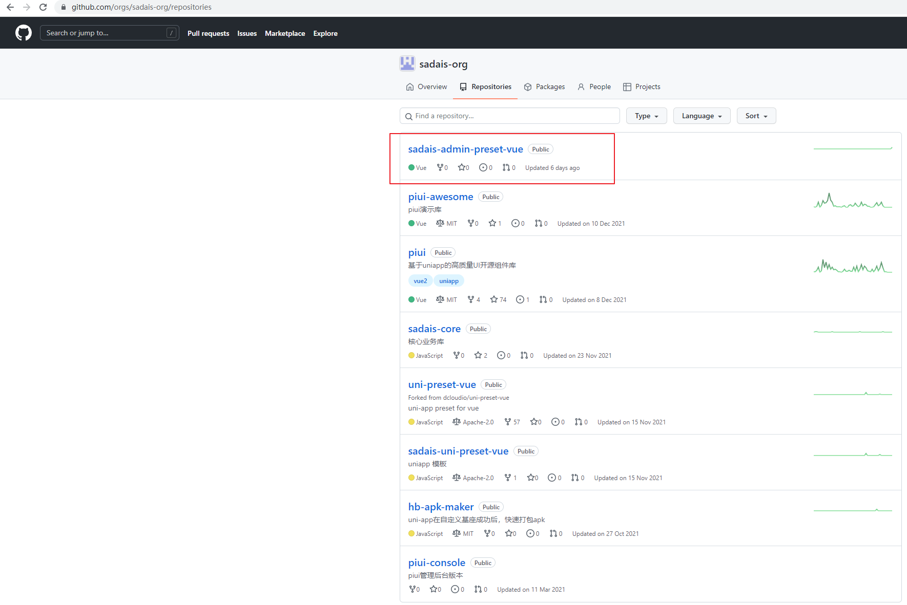

## 136. 权限管理系统

管理后台权限管理（系统设置）：

一般都是有 角色、用户（账号）、资源 这三部分组成


然后是 先给角色分配资源（权限），然后再给用户分配角色，资源控制路由菜单的显示内容及顺序


```javascript
// 权限管理示例
const permissions = {
  roles: ['admin', 'editor', 'viewer'],
  resources: [
    { id: 1, name: '用户管理', path: '/users' },
    { id: 2, name: '角色管理', path: '/roles' },
    { id: 3, name: '权限管理', path: '/permissions' }
  ],
  rolePermissions: {
    admin: [1, 2, 3],
    editor: [1],
    viewer: []
  }
}
```

## 137. Vue 路由守卫

beforeRouter 导航守卫中的 next() 回调函数属性

```javascript
next() // 直接放行，跳到下一个路由
next('/login') // 强制跳转到 login路由的页面
next({ path: '/login' }) // 对象形式跳转
```


```javascript
// 路由守卫示例
router.beforeEach((to, from, next) => {
  const token = localStorage.getItem('token')

  if (to.path === '/login') {
    next()
  }
  else if (!token) {
    next('/login')
  }
  else {
    next()
  }
})
```

## 138. Element UI 表格排序

el-table-column 的 sortable 属性 （**根据prop设置的字段进行排序的**）


```html
<el-table :data="tableData" @sort-change="handleSortChange">
  <el-table-column prop="name" label="姓名" sortable> </el-table-column>
  <el-table-column prop="age" label="年龄" sortable> </el-table-column>
</el-table>
```

```javascript
methods: {
  handleSortChange({ column, prop, order }) {
    // order: ascending, descending, null
    console.log('排序字段:', prop)
    console.log('排序方向:', order)
  }
}
```

## 139. Git 高级操作

git 代码回滚/撤销

revert ： 恢复/还原 reflog


git reflog 查看 commit 操作历史 ： reflog 查看所有分支 （包括被删除的commit 和 reset的操作）


fast-forward（快进）合并


git log: log 查看已有的提交记录 （被删除的查不出） 更详细

手动修改提交记录的信息和时间， git log 认你修改的那个记录， 但是远程仓库里应该还是你之前的那个提交。


```bash
# 常用 Git 命令
git reflog                    # 查看所有操作历史
git log --oneline            # 查看提交历史（简洁版）
git revert <commit-id>       # 撤销指定提交
git reset --hard <commit-id> # 重置到指定提交
git cherry-pick <commit-id>  # 挑选提交
```

## 140. 动态图片引用

图片地址 src地址 的 require 可 动态 .

用 原生 img 标签 :


```javascript
// 动态引用图片
const imageName = 'logo.png'
const imageUrl = require(`@/asse../../assets/images/${imageName}`)

// 在模板中使用
data() {
  return {
    dynamicImage: require('@/asse../../assets/images/logo.png')
  }
}
```

```html
<!-- 模板中使用 -->


<!-- 动态切换图片 -->

```

## 141. 浅拷贝深度理解

浅拷贝 ？？？ 操作 params 对象 不会影响 this.form 对象 ！ **（改变的是对象里面的对象里面的值，就有影响了）**

### 0）、改变了第二层（及以上）就会有影响


### 1）、第一层修改不影响原对象


### 2）、第二层修改会影响原对象


```javascript
// 浅拷贝示例
const original = {
  name: 'John',
  address: {
    city: 'Beijing',
    street: 'Main St'
  }
}

// 浅拷贝
const shallow = { ...original }

// 修改第一层 - 不影响原对象
shallow.name = 'Jane'
console.log(original.name) // 'John' (不变)

// 修改第二层 - 影响原对象
shallow.address.city = 'Shanghai'
console.log(original.address.city) // 'Shanghai' (被改变)

// 深拷贝解决方案
const deep = JSON.parse(JSON.stringify(original))
// 或者使用 lodash
const deep2 = _.cloneDeep(original)
```

## 142. 总结

### 🎯 **核心技术栈**：

- **JavaScript 基础与进阶**：类型转换、数组操作、异步处理、ES6+ 特性
- **Vue.js 全栈开发**：组件通信、生命周期、响应式原理、路由管理
- **小程序开发**：兼容性处理、组件使用、性能优化、发布流程

### 🛠️ **开发工具与工程化**：

- **构建工具**：Webpack、Vite、npm 脚本配置
- **版本控制**：Git 高级操作、分支管理、代码回滚
- **环境配置**：开发/测试/生产环境切换、域名配置

### 💡 **最佳实践**：

- **性能优化**：懒加载、按需加载、代码分割、缓存策略
- **代码质量**：调试技巧、错误处理、代码规范
- **用户体验**：响应式设计、交互优化、兼容性处理

### 🔒 **安全与稳定性**：

- **前端安全**：XSS 防护、CSRF 防护、输入验证
- **错误处理**：异常捕获、容错机制、用户友好提示
- **数据处理**：深浅拷贝、数据转换、状态管理
