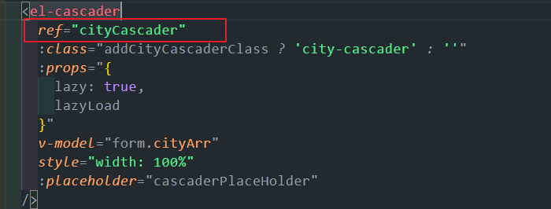
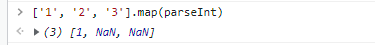

## 143. el-cascader 懒加载回显问题

关于 el-cascader 懒加载（动态加载） 编辑页回显时，有时会回显不出数据的问题，这通常与组件的即时更新机制有关。此问题在 el-tree、el-table、el-select 等组件中也可能出现。

动态加载方法本身没有问题：


### 解决方案

一种常见的解决方案是，在数据回显时，不直接依赖组件的内部懒加载逻辑，而是通过 `placeholder` 预先显示一个文本值。这种方法简单有效，避免了复杂的即时更新问题。



### placeholder 样式处理

自定义 `placeholder` 样式时，需要注意深度选择器的正确使用。

```css
/* 错误用法，::v-deep 位置不对 */
.el-cascader::v-deep .el-input__inner::placeholder {
  color: #999;
}

/* 正确用法 */
::v-deep .el-cascader .el-input__inner::placeholder {
  color: #999;
  font-style: italic;
}
```


## 144. 对象属性初始化问题

在 Vue 中，如果一个对象的属性在 `data` 中只定义而未赋初始值（如 `null` 或 `undefined`），那么在后续操作（如新增表单）中，该字段可能不会被包含在对象中，也不会成为响应式属性。


```javascript
// 错误示例
data() {
  return {
    form: {
      name: 'initial name'
      // description 属性未初始化
    }
  }
}

// 正确示例
data() {
  return {
    form: {
      name: 'initial name',
      description: null // 或 ''
    }
  }
}

// 或者在 created 钩子中使用 $set
created() {
  this.$set(this.form, 'description', null)
}
```

## 145. ES6 模块化：export vs export default

`export` 和 `export default` 是 ES6 模块中用于导出功能的两种方式，主要区别如下：

1.  **导出数量**：一个文件可以有多个 `export`，但只能有一个 `export default`。
2.  **导入语法**：`export` 导出的内容在导入时需要使用花括号 `{}` 且名称需匹配；`export default` 导出的内容则不需要，且可以任意命名。

### 示例

**导出 (`utils.js`)**

```javascript
// 命名导出
export const PI = 3.14
export function sum(a, b) {
  return a + b
}

// 默认导出
const multiply = (a, b) => a * b
export default multiply
```

**导入 (`main.js`)**

```javascript
// 导入默认导出，并任意命名
import customMultiply from './utils.js';

// 导入命名导出，名称需匹配
import { PI, sum } from './utils.js';

// 混合导入
import customMultiply, { PI, sum } from './utils.js';
```


## 146. el-upload 自定义上传

通过 `http-request` 属性可以覆盖 `el-upload` 的默认上传行为。将 `action` 属性置空，并提供一个自定义的上传方法。


```html
<el-upload :action="''" :http-request="handleUpload" :before-upload="beforeUpload">
  <el-button>点击上传</el-button>
</el-upload>
```

```javascript
methods: {
  handleUpload(options) {
    const { file } = options;
    const formData = new FormData();
    formData.append('file', file);

    // 调用自定义的上传接口
    myUploadApi(formData)
      .then(res => {
        options.onSuccess(res.data);
      })
      .catch(err => {
        options.onError(err);
      });
  },
  beforeUpload(file) {
    // 文件校验逻辑
    return true;
  }
}
```

## 147. 文件上传 SDK 方案

使用封装好的 SDK（如 `sadais-upload`）进行文件上传，可以简化流程并提高安全性。通常 SDK 会处理与多种云存储（OSS）的交互。

### 上传流程

1.  **获取凭证**：前端首先向应用后端请求上传凭证。后端集成了多种云存储的配置，返回一个临时的、安全的上传许可。
2.  **SDK上传**：SDK 内部使用获取到的凭证，通过 `XMLHttpRequest` 或 `uni.uploadFile` 等方式，直接将文件上传到指定的云存储服务。


### 优势

- **安全**：AccessKey 等敏感信息不暴露在前端。
- **便捷**：封装了复杂的上传逻辑，调用简单。
- **统一**：一套代码支持多种云服务商和多端环境。

最终，SDK 会返回上传成功后的文件访问 URL。


## 148. beforeDestroy 不生效问题

在 Vue 组件中，销毁前的生命周期钩子是 `beforeDestroy`。如果写错名字（如 `beforeDestory`），该钩子将不会被触发，导致内存泄漏。


```javascript
// 正确的写法
export default {
  // ...
  beforeDestroy() {
    // 在这里进行清理操作
    // 例如：清除定时器、解绑全局事件监听
    if (this.timer) {
      clearInterval(this.timer)
    }
    window.removeEventListener('resize', this.handleResize)
  }
}
```

**注意**：在 Vue 3 中，此钩子已重命名为 `beforeUnmount`。

## 149. JSON 异常处理

使用 `JSON.parse()` 或 `JSON.stringify()` 时，最好用 `try...catch` 包裹，以防止因非法格式或循环引用导致的程序崩溃。

```javascript
function safeJsonParse(str) {
  try {
    return JSON.parse(str)
  }
  catch (e) {
    console.error('JSON 解析失败:', e)
    // 如果解析失败，返回一个默认值，如 null 或 {}
    return null
  }
}
```

**注意**：如果 `JSON.parse()` 失败并抛出异常，`try` 块的后续代码不会执行，程序会直接进入 `catch` 块。


## 150. 数组筛选方法

`filter` 方法是数组筛选最常用的工具，可以结合 `indexOf`、`includes` 或 `some` 来实现不同场景的筛选。

```javascript
const arr1 = [1, 2, 3, 4]
const arr2 = [3, 4, 5, 6]

// 筛选出两个数组的交集
const intersection = arr1.filter(item => arr2.includes(item))
// -> [3, 4]

// 筛选出 arr1 中独有的元素
const difference = arr1.filter(item => !arr2.includes(item))
// -> [1, 2]
```

## 151. html2canvas 跨域问题解决

使用 `html2canvas` 插件生成包含跨域图片的截图时，会遇到安全限制。

### 解决方案

在 `html2canvas` 的配置对象中设置 `useCORS: true`，并确保图片服务器响应头中包含 `Access-Control-Allow-Origin`。


```javascript
import html2canvas from 'html2canvas'

async function capture() {
  const element = document.getElementById('capture-area')
  const canvas = await html2canvas(element, {
    useCORS: true // 允许加载跨域图片
  })
  // ... 后��操作
}
```

### 动态 ref 绑定问题

在 `v-for` 循环中，动态绑定 `ref` 会得到一个数组。如果需要操作单个 DOM 元素，最好使用 `id` 并通过 `document.getElementById` 获取。


## 152. el-input number 类型样式处理

`el-input` 设置 `type="number"` 时，浏览器会默认显示一个上下箭头（spinner）。可以使用 CSS 去除它。


```css
/* 在 <style scoped> 中使用深度选择器 */
::v-deep input::-webkit-outer-spin-button,
::v-deep input::-webkit-inner-spin-button {
  -webkit-appearance: none !important;
  margin: 0;
}

::v-deep input[type='number'] {
  -moz-appearance: textfield; /* Firefox */
}
```

## 153. JavaScript 正则校验中文字符

使用 Unicode 范围可以精确匹配中文字符。

```javascript
// 正则表达式，匹配一个或多个中文字符
const chineseCharRegex = /[\u4E00-\u9FA5]+/

function containsChinese(text) {
  return chineseCharRegex.test(text)
}

console.log(containsChinese('hello world')) // false
console.log(containsChinese('你好世界')) // true
console.log(containsChinese('hello 你好')) // true
```


## 154. 数值处理：toFixed vs parseInt

`toFixed()` 和 `parseInt()` 都可以用于取整，但行为不同：

- `toFixed(0)`：**四舍五入**到整数，返回一个**字符串**。
- `parseInt()`：直接**截断**小数部分，只取整数，返回一个**数字**。


```javascript
const num = 3.8

num.toFixed(0) // "4" (四舍五入，字符串)
Number.parseInt(num) // 3   (截断，数字)
Math.round(num) // 4   (四舍五入，数字)
Math.floor(num) // 3   (向下取整，数字)
```

## 155. 防抖与节流的区别

- **防抖 (Debounce)**：在事件触发后等待一个固定的时间，如果这段时间内没有再次触发，则执行函数。如果连续触发，则重新计时。**核心：只执行最后一次。**
  - **场景**：搜索框输入、窗口大小调整。
- **节流 (Throttle)**：在固定的时间间隔内，只允许函数执行一次。**核心：固定频率执行。**
  - **场景**：滚动事件监听、按钮防止重复点击。


## 156. el-form validate 回调函数问题

`el-form` 的 `validate()` 方法返回一个 Promise，也可以接收一个回调函数。如果验证不通过，回调函数中的 `valid` 参数为 `false`，Promise 会被 `reject`。

如果发现无法进入 `then` 或回调的 `if (valid)` 块，请检查：

1.  `el-form-item` 的 `prop` 属性是否与 `rules` 和 `model` 中的字段名一致。
2.  校验规则是否正确。
3.  是否遗漏了 `prop` 属性。


```javascript
// 推荐使用 async/await
async submitForm() {
  try {
    await this.$refs.form.validate();
    // 验证通过，执行提交逻辑
  } catch (error) {
    // 验证失败
    console.log('表单验证失败');
  }
}
```

## 157. el-menu collapse 属性

`el-menu` 的 `collapse` 属性用于控制菜单的折叠状态。

- `collapse: false` (默认): 菜单展开。
- `collapse: true`: 菜单收起，只显示图标。


## 158. 静态路由重定向

在 Vue Router 中，`redirect` 属性用于配置路由重定向。

```javascript
const routes = [
  // 访问根路径时，重定向到 /home
  { path: '/', redirect: '/home' },

  // 也可以重定向到命名路由
  { path: '/old-url', redirect: { name: 'NewHome' } },

  // 动态重定向
  {
    path: '/user/:id',
    redirect: (to) => {
      // to 是目标路由对象
      return `/profile/${to.params.id}`
    }
  }
]
```


## 159. 绝对定位与 Flexbox 结合

`position: absolute` 和 `display: flex` 可以结合使用，创造出强大的布局效果。例如，实现一个相对于父元素完全居中的遮罩层。

```css
.parent {
  position: relative;
}

.overlay {
  position: absolute;
  top: 0;
  left: 0;
  width: 100%;
  height: 100%;
  display: flex;
  justify-content: center;
  align-items: center;
  background-color: rgba(0, 0, 0, 0.5);
}
```


## 160. 数组 map 方法的使用

`map()` 方法创建一个新数组，其结果是该数组中的每个元素都调用一个提供的函数后返回的结果。它不会改变原数组。

```javascript
const numbers = [1, 4, 9]

// 1. 基本用法
const roots = numbers.map(num => Math.sqrt(num))
// roots is now [1, 2, 3]

// 2. 转换对象数组
const users = [{ id: 1, name: 'Alice' }, { id: 2, name: 'Bob' }]
const userNames = users.map(user => user.name)
// userNames is now ["Alice", "Bob"]
```



## 161. 常见 Web 缩写

- **CSR**: Client-Side Rendering (客户端渲染)
- **SSR**: Server-Side Rendering (服务端渲染)
- **SSG**: Static Site Generation (静态站点生成)
- **XSS**: Cross-Site Scripting (跨站脚本攻击)
- **CORS**: Cross-Origin Resource Sharing (跨域资源共享)
- **CSRF**: Cross-Site Request Forgery (跨站请求伪造)

## 162. node-sass 与 sass-loader 版本问题

`node-sass`、`sass-loader` 和 `Node.js` 之间存在严格的版本对应关系，版本不匹配是项目启动失败的常见原因。

### 常见问题与解决方案

- **问题**：`node-sass` 安装失败或编译错误。
- **原因**：`node-sass` 依赖二进制文件，与 Node 版本强相关，且已于2020年废弃。
- **推荐方案**：
  1.  **迁移到 `sass`**：卸载 `node-sass`，安装 `sass` (基于 Dart 实现，无二进制依赖)。
      ```bash
      npm uninstall node-sass
      npm install sass --save-dev
      ```
  2.  **更新 `vue.config.js`**：如果使用 `data` 选项，需要改为 `prependData`。
  3.  **更新 SCSS 语法**：将 `/deep/` 或 `>>>` 替换为 `::v-deep`。
  4.  **检查 `sass-loader` 版本**：确保 `sass-loader` 版本与 `webpack` 和 `sass` 兼容。


## 163. PWA (渐进式 Web 应用)

PWA (Progressive Web Application) 是一系列技术的集合，旨在让 Web 应用拥有接近原生应用的体验。

### 核心技术

1.  **Service Worker**：实现离线缓存、消息推送等功能的关键。
2.  **Web App Manifest**：一个 JSON 文件，定义了应用的名称、图标、启动方式等，使其可以被“安装”到主屏幕。
3.  **HTTPS**：PWA 必须运行在安全的环境下。


