## 164. 服务端渲染 (SSR) 与 Nuxt.js

- **CSR (Client-Side Rendering)**：客户端渲染，如常规的 Vue.js/React.js 应用。浏览器下载 JS 文件后在本地执行，渲染出页面。
- **SSR (Server-Side Rendering)**：服务端渲染，如 Nuxt.js。服务器直接生成完整的 HTML 页面返回给浏览器，浏览器可以直接显示，无需等待 JS 执行。

### SSR 的优势

1.  **更快的首屏加载速度**：用户能更快看到页面内容，解决了 CSR 的“白屏”问题。
2.  **更好的 SEO**：搜索引擎可以直接抓取到完整的页面内容，有利于搜索引擎优化。

Nuxt.js 是一个基于 Vue.js 的通用应用框架，专注于 UI 渲染，简化了 SSR 应用的开发。在 Nuxt.js 项目中，`<nuxt />` 组件相当于 Vue Router 中的 `<router-view />`。

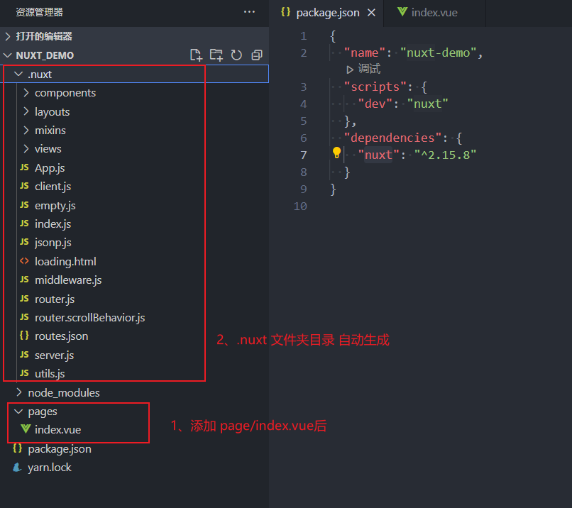

## 165. CSS 早期 Flexbox 属性

在现代 Flexbox 布局普及之前，存在一些旧版本的属性，如 `box-orient` 和 `box-flex`。它们的功能与现在的 `flex-direction` 和 `flex` 类似。

- `box-orient`: 定义子元素的排列方向（水平或垂直）。
- `box-flex`: 定义子元素如何分配空间。

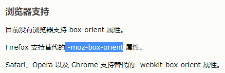

虽然现在已不推荐使用，但在维护旧项目或处理某些特定浏览器的兼容性问题时可能会遇到。

## 166. HTTP Content-Type 和 Content-Disposition

### Content-Type

`Content-Type` 请求头用于告知服务器客户端发送的数据格式。

- `application/json`: 常用于 POST 请求，表示请求体是 JSON 格式。
- `application/x-www-form-urlencoded`: 常用于 GET 请求或表单提交。
- `multipart/form-data`: 用于文件上传。

### Content-Disposition

`Content-Disposition` 响应头用于告知浏览器如何处理响应体。

- `inline`: 直接在浏览器中显示内容。
- `attachment; filename="xxx.jpg"`: 提示用户下载并保存为附件，可指定文件名。

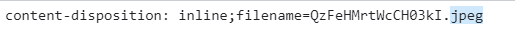

## 167. line-height 的数值用法

当 `line-height` 设置为一个没有单位的数值（如 `line-height: 2`）时，它的实际行高是根据元素自身的 `font-size` 计算的。例如，`font-size: 16px; line-height: 2;` 的计算行高就是 `16px * 2 = 32px`。

这种用法具有良好的继承性，子元素会继承这个比例因子，并根据自己的 `font-size` 计算行高。

## 168. Object.create(null)

`Object.create(null)` 用于创建一个“纯净”的对象，这个对象完全没有原型链，即它的 `__proto__` 是 `null`。

### 优点

- **避免原型链污染**：不会意外地访问到 `Object.prototype` 上的属性（如 `toString`, `hasOwnProperty`）。
- **用作纯粹的哈希表/字典**：可以安全地使用任何字符串作为键，不必担心与原型上的属性冲突。

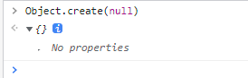

## 169. Symbol 数据类型

`Symbol` 是 ES6 引入的一种新的原始数据类型，表示独一无二的值。

- `Symbol()` 函数每次调用都会返回一个唯一的值。
- 主要用途是作为对象的唯一属性名，避免属性名冲突。

```javascript
const id = Symbol('description')
const obj = {
  [id]: 'This is a unique property'
}

console.log(obj[id]) // "This is a unique property"
```

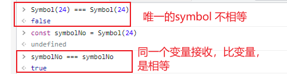

## 170. ES6 Map 与 WeakMap

### Map

`Map` 是一种键值对的集合，其键可以是任意类型的值。

- `new Map()`: 创建 Map。
- `map.set(key, value)`: 设置键值对。
- `map.get(key)`: 获取值。
- `map.has(key)`: 判断键是否存在。
- `map.delete(key)`: 删除键。
- `map.size`: 获取成员数量。

### WeakMap

`WeakMap` 是一种特殊的 Map，其键必须是对象，并且是“弱引用”。

- **弱引用**：如果一个对象只被 `WeakMap` 作为键引用，垃圾回收机制可以随时回收这个对象，从而避免内存泄漏。
- **用途**：常用于存储与 DOM 元素或其他对象相关的私有数据，或在实现深拷贝时处理循环引用。

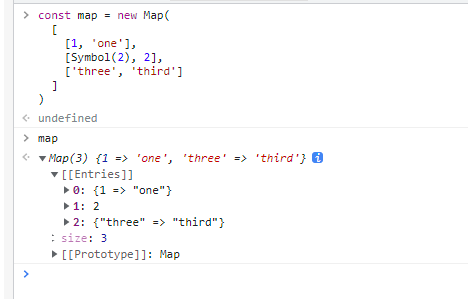

## 171. 扩展运算符与深浅拷贝

扩展运算符 (`...`) 在处理对象和数组拷贝时，行为是**浅拷贝**。

- **一层结构**：如果对象或数组只有一层，扩展运算符的效果类似于深拷贝。
- **多层结构**：对于嵌套的对象或数组，扩展运算符只会拷贝第��层的引用，内部的嵌套结构仍然共享同一个引用。

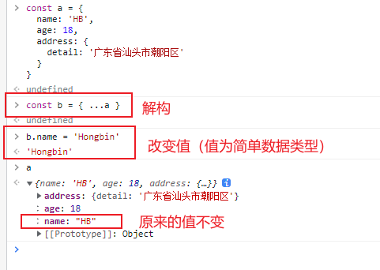

要实现真正的深拷贝，需要使用 `JSON.parse(JSON.stringify(obj))` (有局限性) 或递归函数等方法。

## 172. Object.keys() vs Object.getOwnPropertyNames()

- `Object.keys(obj)`: 返回一个由对象**自身可枚举属性**的属性名组成的数组。
- `Object.getOwnPropertyNames(obj)`: 返回一个由对象**自身所有属性**（包括不可枚举属性，但不包括 Symbol 属性）的属性名组成的数组。

`for...in` 循环和 `JSON.stringify()` 也只会处理可枚举属性。

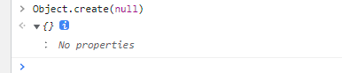

## 173. JavaScript 连续赋值

`var a = b = { n: 3 }` 这样的连续赋值语句，是从右到左执行的。

1.  `b = { n: 3 }`: `b` 指向对象 `{ n: 3 }`。
2.  `a = b`: `a` 也指向 `b` 所指向的同一个对象。

### 面试题解析

```javascript
let a = { n: 1 }
let b = a
a.x = a = { n: 2 }

console.log(a.x) // undefined
console.log(b.x) // { n: 2 }
```

**解析**：

1.  `a` 和 `b` 指向同一个对象 `{ n: 1 }`。
2.  `a.x = a = { n: 2 }` 这一行，先计算 `=` 右边的值，即 `{ n: 2 }`。
3.  然后执行赋值，`a.x` 的 `a` 此时仍然是旧对象 `{ n: 1 }`，所以 `b` 所指向的对象被添加了一个 `x` 属性，其值为 `{ n: 2 }`。
4.  最后，变量 `a` 的引用被修改，指向了新对象 `{ n: 2 }`。
5.  因此，新的 `a` 没有 `x` 属性，而旧的 `a` (即 `b`) 有了 `x` 属性。

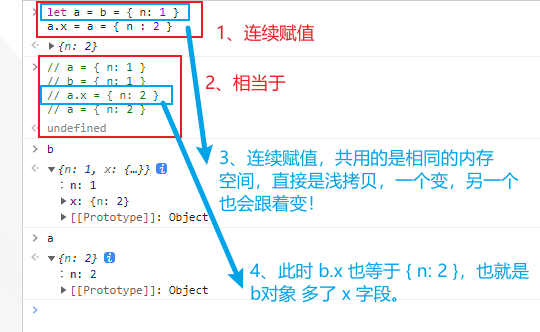

## 174. 小程序伪元素使用注意

在微信小程序中，伪元素 (`::before`, `::after`) 的兼容性最好的是 `view` 标签。如果将伪元素直接应用在自定义组件的标签上，可能会因为组件内部结构的原因导致定位、样式等出现问题。

**最佳实践**：在自定义组件外部包裹一层 `view` 标签，并将伪元素样式应用在这层 `view` 上。

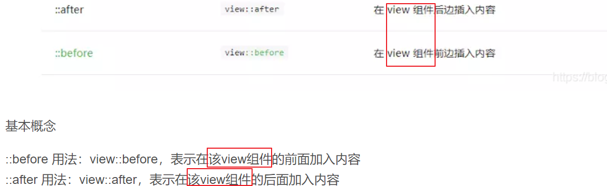

## 175. Git Cherry-pick

`git cherry-pick <commit-hash>` 命令用于将指定分支的单个或多个 commit “摘取”过来，合并到当前分支。

### 使用场景

- 当只需要合并某个分支的部分功能或修复，而不是整个分支时。
- 在不同分支间同步热修复补丁。

**操作步骤**：

1.  切换到目标分支：`git checkout main`
2.  执行 cherry-pick：`git cherry-pick abcdefg` (abcdefg 是源分支的 commit hash)

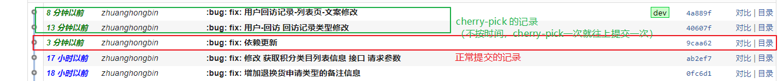

## 176. 缓存问题排查

当遇到“相同代码，不同执行结果”的诡异问题时（尤其是在多环境部署下），应首先怀疑是**缓存**导致的。

**排查步骤**：

1.  **强制刷新**：在浏览器中使用 `Ctrl + Shift + R` (或 `Cmd + Shift + R`) 清除缓存并刷新页面。
2.  **清除应用缓存**：如果是小程序或 App，尝试清除其缓存或重新安装。
3.  **检查构建产物**：确认部署的静态资源是否为最新版本。
4.  **CDN 缓存**：如果使用了 CDN，可能需要手动刷新 CDN 缓存。

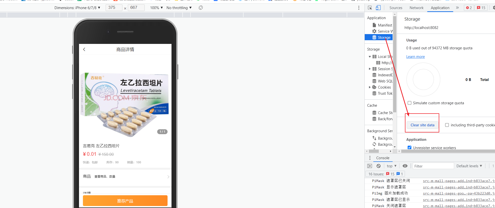

## 177. JavaScript 数据类型判断

判断 JavaScript 数据类型的常用方法：

1.  `typeof`: 能准确判断除 `null` 以外的原始类型，但对于所有引用类型（数组、对象等）都返回 `'object'`。
2.  `instanceof`: 判断一个对象是否在另一个对象的原型链上，适合判断自定义类实例，但对跨 `iframe` 的对象无效。
3.  `constructor`: `obj.constructor === Array`，可以被修改，不可靠。
4.  `Object.prototype.toString.call()`: **最可靠的方法**，能准确判断所有数据类型。
    ```javascript
    Object.prototype.toString.call([]) // "[object Array]"
    Object.prototype.toString.call({}) // "[object Object]"
    ```
5.  `Array.isArray()`: ES5+ 提供的判断数组的最佳方法。

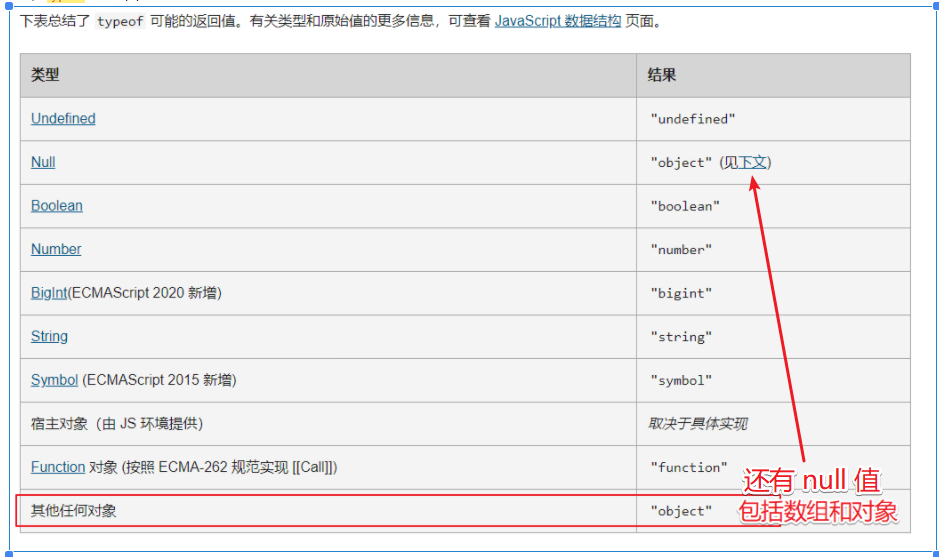

## 178. 管理后台列表查询缓存

在管理后台开发中，列表页的查询条件通常需要被缓存，以便用户在返回列表页时能看到之前的筛选结果。

### 实现方式

1.  **Vuex/Pinia**：将查询条件存储在全局状态管理中。离开页面时不清除，返回页面时从 store 中恢复。
2.  **Keep-alive**：使用 Vue 内置的 `<keep-alive>` 组件缓存整个列表页组件的实例。当组件被缓存时，会触发 `activated` 钩子，可以在此钩子中处理刷新逻辑。
3.  **路由参数**：将查询条件作为 URL 的查询参数。这是 RESTful 的做法，能让 URL 精确对应页面状态，便于分享和刷新。

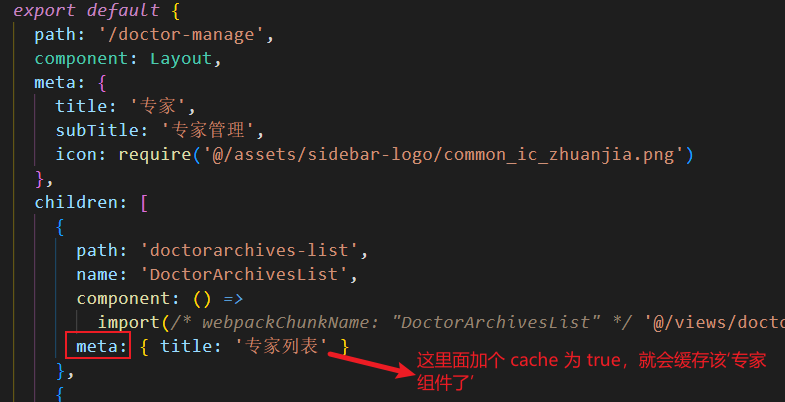

## 179. align-content vs align-items

这两个 Flexbox 属性都用于控制交叉轴上的对齐，但作用范围不同：

- `align-items`: 对齐**单行**内的项目。
- `align-content`: 对齐**多行**之间的间距。只有在 `flex-wrap: wrap;` 且容器内有多行项目时才生效。

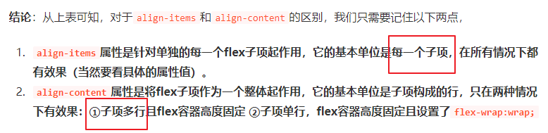

## 180. iframe vs web-view

- `<iframe>`: HTML 标签，用于在网页中嵌入另一个网页。
- `<web-view>`: 小程序或 App 中的一个**原生组件**，用于承载网页内容。它内置了一个高性能的 Webkit 内核浏览器。

主要区别在于运行环境和能力。`<web-view>` 作为原生组件，可以与 App/小程序进行更深度的交互（通过 JSBridge），而 `<iframe>` 只是一个纯粹的 Web 元素。

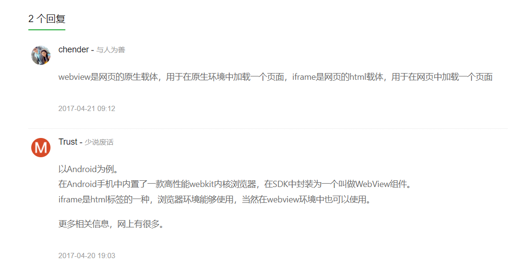

## 181. Node.js 版本管理

- **n 模块**：一个 npm 包，用于管理 Node.js 版本，但**不支持 Windows 系统**。
- **nvm (Node Version Manager)**：一个独立的软件包，是跨平台的 Node.js 版本管理工具，推荐使用。

### nvm 常用命令

- `nvm list`: 查看已安装的 Node.js 版本。
- `nvm install <version>`: 安装指定版本。
- `nvm use <version>`: 切换到指定版本。

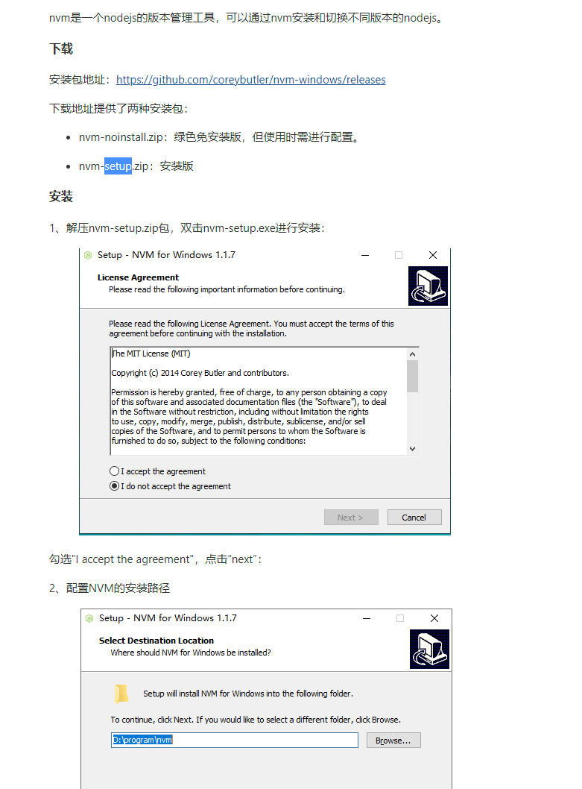

## 182. Git 工作流与代码回滚

### Git 三个区域

1.  **工作区 (Working Directory)**：你正在修改的文件。
2.  **暂存区 (Staging Area)**：通过 `git add` 添加，准备提交的文件。
3.  **本地仓库 (Local Repository)**：通过 `git commit` 提交后，文件快照永久保存的地方。

### 代码撤销/回滚

- **撤销工作区修改**：`git checkout -- <file>` 或 `git restore <file>`。
- **撤销暂存区修改**：`git reset HEAD <file>` 或 `git restore --staged <file>`。
- **回滚 commit**：
  - `git reset <commit-hash>`: 回退到指定 commit，之后的 commit 会被丢弃（危险）。
  - `git revert <commit-hash>`: 创建一个新的 commit，内容与指定 commit 相反，用于安全地撤销已发布的提交。

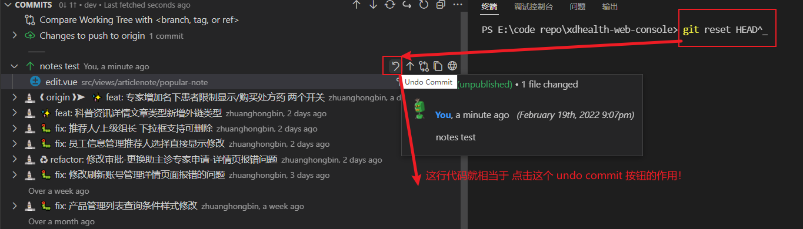

## 183. uniapp 调用原生能力

uniapp 通过 `plus` 对象来调用 HTML5+ 扩展规范，从而实现调用设备原生能力（如摄像头、文件系统、推送等）。

- `plus` 对象只在 **App 环境**下生效。
- 需要使用**条件编译**来包裹相关代码，确保在 H5 或小程序等非 App 环境下不会报错。

```javascript
// #ifdef APP-PLUS
plus.nativeUI.toast('这是一个原生 Toast')
// #endif
```

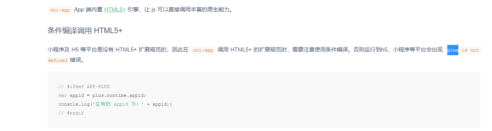
