## 184. const 定义的引用类型与基本类型

`const` 用于声明一个只读的常量。一旦声明，常量的值就不能改变。

- **基本数据类型**：值不可改变。
- **引用类型（如对象、数组）**：变量指向的内存地址（指针）不可改变，但该地址中存储的数据（即对象的属性）是可以改变的。

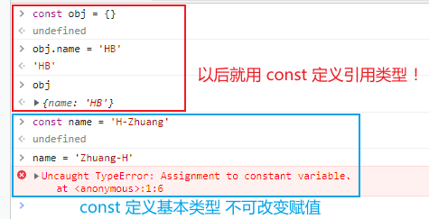

此外，`let` 和 `const` 都具有块级作用域，并禁止在同一作用域内重复声明。`const` 声明的变量必须在声明时初始化。

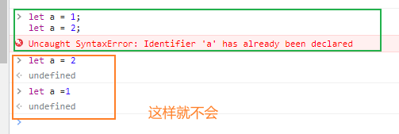
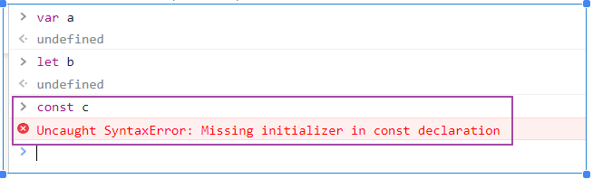

## 185. refs 与 document 获取 DOM 的区别

- **`ref`**：Vue 推荐的方式，用于给元素或子组件注册引用信息。
  - **优点**：作用域隔离，无命名冲突；性能更好，无需在运行时反复查询 DOM。
  - **注意**：在 `v-for` 循环中使用时，`$refs` 会成为一个包含对应 DOM 节点或组件实例的数组。

- **`document.getElementById` 等原生方法**：
  - **缺点**：全局查询，可能因命名冲突导致获取错误；在 Vue 的虚拟 DOM 更新机制下，直接操作原生 DOM 可能会导致状态不一致。

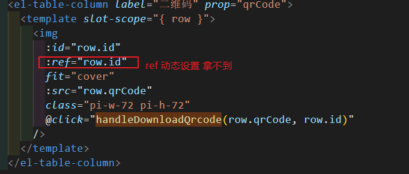

## 186. a 标签的高级用法

### `target` 属性实现窗口复用

通过将 `<a>` 标签的 `target` 属性设置为与 `href` 相同的值，可以实现：如果该链接已在浏览器中打开，则刷新该窗口；否则，在新窗口中打开。

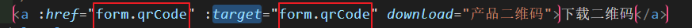

### `download` 属性实现文件下载

`download` 属性指示浏览器下载 URL 而不是导航到它。可以指定一个值作为下载文件的名称。

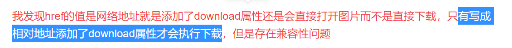

### 前端实现图片下载（处理跨域）

当图片资源存在跨域问题时，无法直接通过 `download` 属性下载。可以通过将图片转换为 Base64 或 Blob URL 来解决。

1.  **Canvas 方法**：将图片绘制到 `<canvas>` 上，然后使用 `canvas.toDataURL()` 导出 Base64 字符串。
2.  **Blob 和 FileReader**：通过 `fetch` 获取图片数据，转换为 Blob 对象，再使用 `URL.createObjectURL()` 生成一个临时的本地 URL。

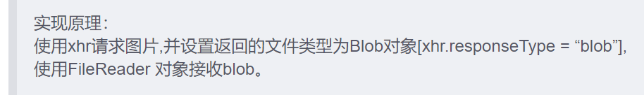

## 187. npm install 的 --save 与 --dev

- `-S` 或 `--save`：将依赖项添加到 `package.json` 的 `dependencies` 中。这些是生产环境运行所必需的包。
- `-D` 或 `--save-dev`：将依赖项添加到 `package.json` 的 `devDependencies` 中。这些是开发和构建过程中需要的包，如 Webpack、ESLint 等，不会被打包到生产代码中。

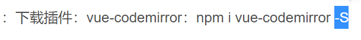

## 188. npm 依赖版本管理与包管理器

切换 Git 分支时，`node_modules` 目录不会随之改变，这可能导致因依赖版本不一致而产生的错误。

### 锁定依赖版本

- **版本号**：在 `package.json` 中移除 `^` 和 `~` 符号，使用精确的版本号。
- **lock 文件**：使用 `package-lock.json` (npm) 或 `yarn.lock` (Yarn) 来锁定整个依赖树的版本，确保团队成员和CI/CD环境安装完全相同的依赖。

### 包管理器对比

- **npm**: Node.js 官方包管理器。
- **Yarn**: 提供了更快的安装速度和离线模式。
- **pnpm**: 速度快，且通过软链接和硬链接高效利用磁盘空间，特别适合 Monorepo 项目。

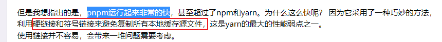

## 189. if...else if...else 优化

对于多重条件判断，可以使用 `Map` 或对象字面量来替代冗长的 `if...else` 结构，使代码更具可读性和可维护性。

- **单一条件**：
  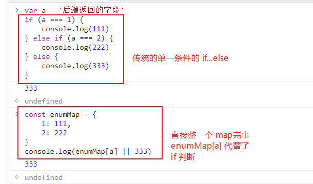

- **复合条件**：
  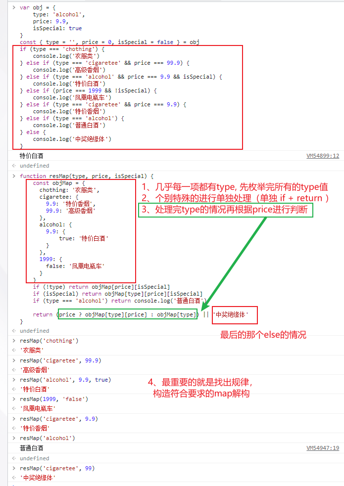

## 190. break, continue, return 的区别

在循环中：

- `break`: 立即**终止并跳出**整个循环。
- `continue`: **跳过当前迭代**的剩余部分，直接进入下一次迭代。
- `return`: **终止整个函数**的执行，并返回值。`return` 的作用范围大于 `break` 和 `continue`。

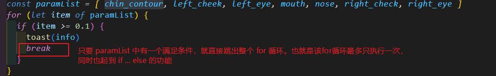

## 191. pre 标签

`<pre>` 标签用于定义预格式化的文本。被包围在 `<pre>` 标签中的文本通常会保留空格和换行符，并以等宽字体显示，非常适合用于展示代码块。

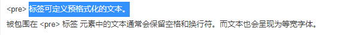

## 192. Vue CLI 与 Vite 对比

- **环境变量**：
  - **Vue CLI**: 通过 `.env` 文件和 `NODE_ENV` 访问，代码中通过 `process.env.VUE_APP_XXX` 获取。
  - **Vite**: 同样支持 `.env` 文件，代码中通过 `import.meta.env.VITE_XXX` 获取。
- **开发服务器**：
  - **Vue CLI**: 基于 Webpack，启动时需要打包所有模块，速度较慢。
  - **Vite**: 利用浏览器原生的 ES Module 支持，实现了极速的冷启动和热模块替换 (HMR)。

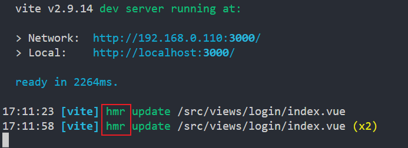

## 193. 数组扁平化实现

除了使用原生的 `arr.flat(Infinity)` 方法，也可以通过递归和 `reduce` 来手动实现数组扁平化。

```javascript
function flatten(arr) {
  return arr.reduce((prev, next) => {
    return prev.concat(Array.isArray(next) ? flatten(next) : next)
  }, [])
}

const nestedArray = [1, [2, [3, 4], 5]]
console.log(flatten(nestedArray)) // [1, 2, 3, 4, 5]
```

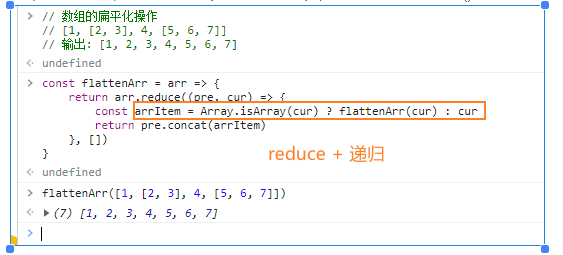

## 194. 浏览器设计/编辑模式

在浏览器控制台中执行以下命令，可以使整个网页内容变得可编辑，方便调试和预览样式修改。

- `document.designMode = 'on'`
- `document.body.contentEditable = true`

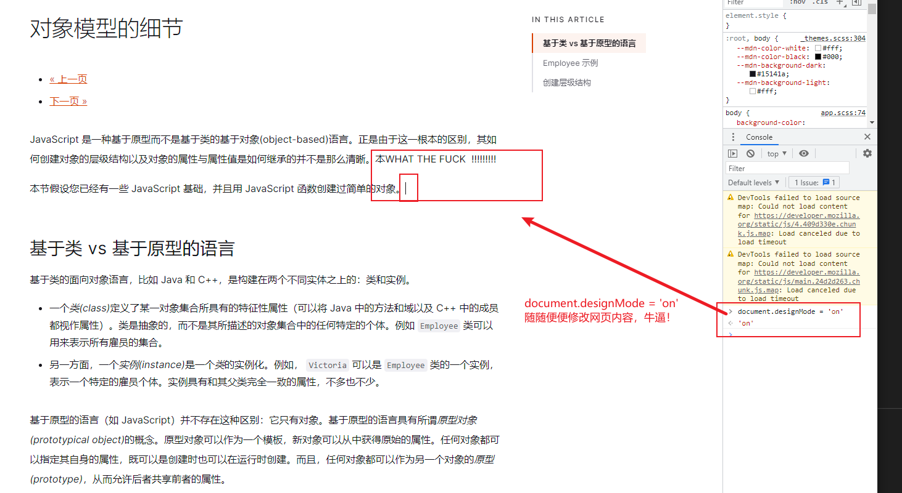

## 195. CSS 技巧

### `backface-visibility: hidden`

此属性定义当元素背面朝向观察者时是否可见。常用于 3D 变换和翻转动画中，以隐藏元素的背面。

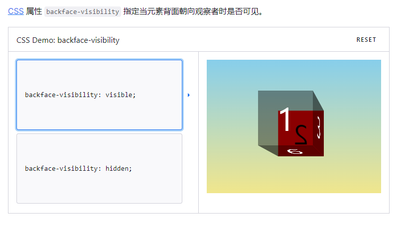

### 背景图片透明度

要单独设置背景图片的透明度而不影响其容器，可以使用伪元素。

1.  给容器设置 `position: relative`。
2.  创建一个 `::before` 或 `::after` 伪元素，设置 `position: absolute` 并铺满容器。
3.  将背景图片应用到伪元素上，并设置其 `opacity`。

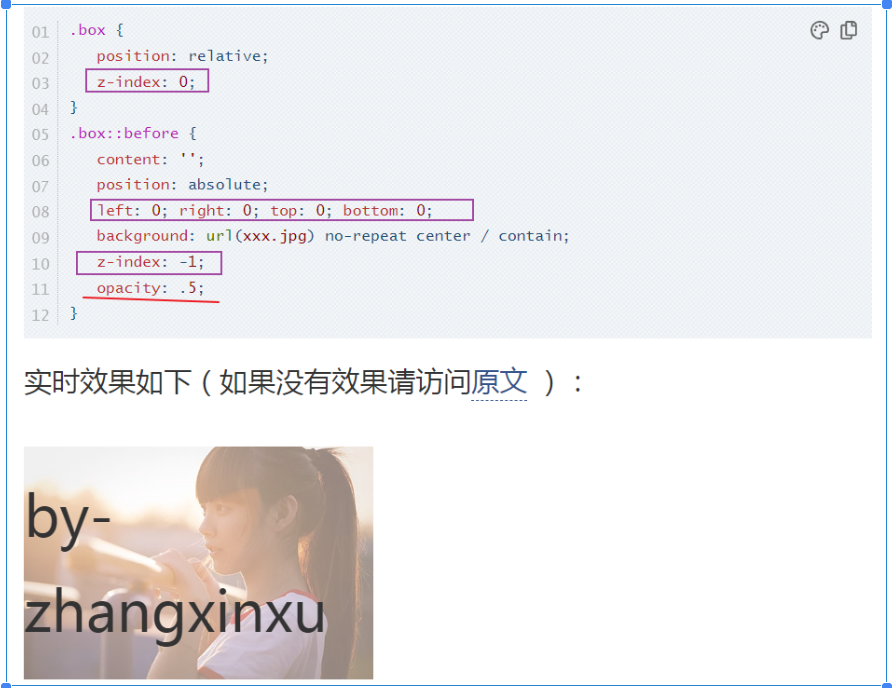

## 196. Vue 3 响应式 API

- `ref`: 用于包装基本数据类型（或对象），使其成为响应式。在 `<script setup>` 中访问其值需要 `.value`。
- `reactive`: 用于创建响应式对象。返回的是一个 Proxy 对象。
- `toRef`: 为源响应式对象上的一个属性创建一个 ref，它与源属性保持同步。
- `toRefs`: 将一个响应式对象转换为一个普通对象，其中每个属性都是指向源对象相应属性的 ref。常用于解构 `props` 或 `reactive` 对象而不失去响应性。

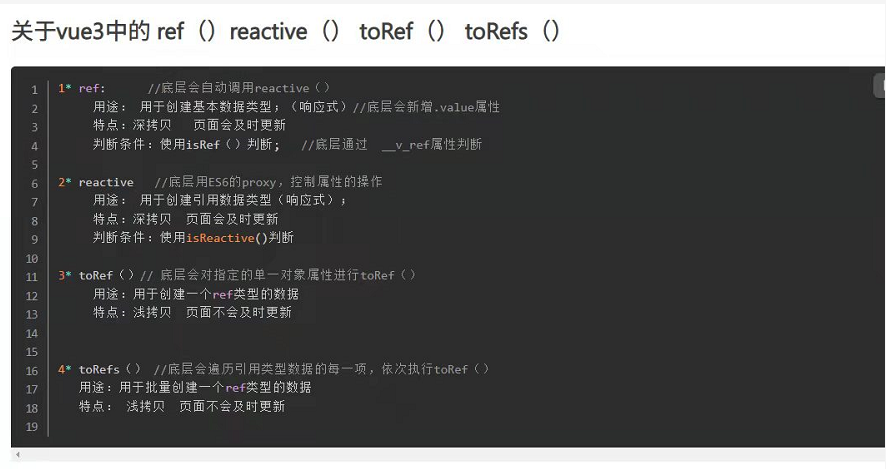

## 197. Vite 配置 HTTPS

在 `vite.config.js` 中可以轻松为开发服务器启用 HTTPS，这在需要测试安全相关的 API (如 Service Worker) 时非常有用。

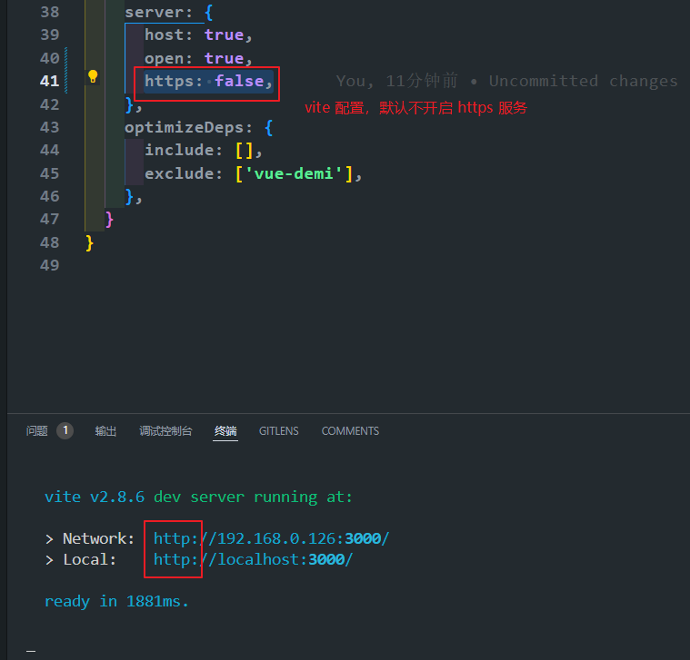

## 198. Vue 语法糖

- `:` 是 `v-bind:` 的缩写。
- `@` 是 `v-on:` 的缩写。
- `#` 是 `v-slot:` 的缩写。

`v-slot` 用于定义插槽内容，可以指定默认插槽、具名插槽和作用域插槽。

## 199. CSS 选择器 `:has()`

`:has()` 是一个强大的 CSS 伪类，被称为“父选择器”。它允许我们根据元素的后代元素来选择该元素。

**示例**：选择所有直接包含 `` 子元素的 `<a>` 标签。

```css
a:has(> img) {
  border: 2px solid blue;
}
```

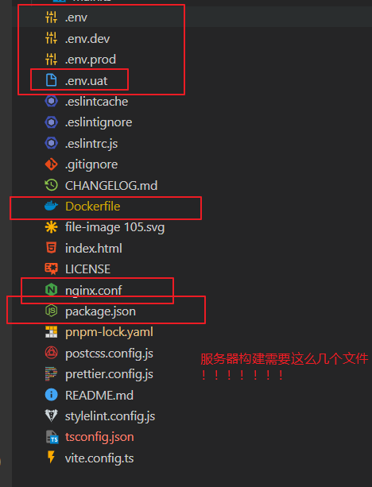

## 200. Vue v-model 在组件上的使用

在 Vue 3 中，组件上的 `v-model` 默认绑定的是 `modelValue` prop 和 `update:modelValue` 事件。

**父组件**

```html
<CustomInput v-model="searchText" />
```

**子组件 (`CustomInput.vue`)**

```html
<script setup>
  defineProps(['modelValue'])
  const emit = defineEmits(['update:modelValue'])
</script>

<template>
  <input :value="modelValue" @input="emit('update:modelValue', $event.target.value)" />
</template>
```

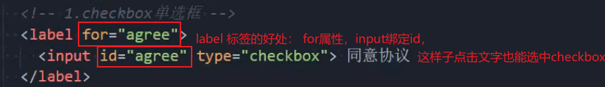
