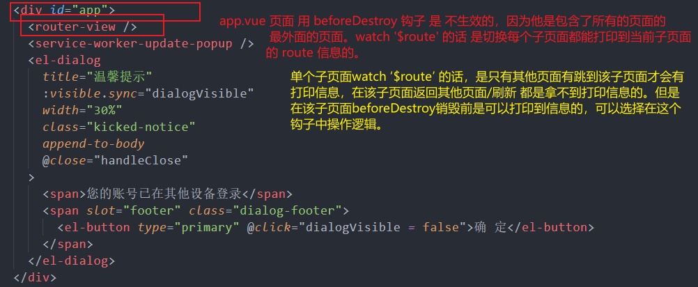
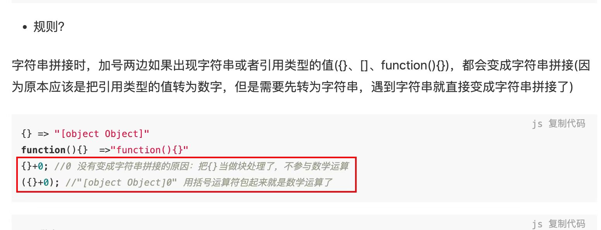
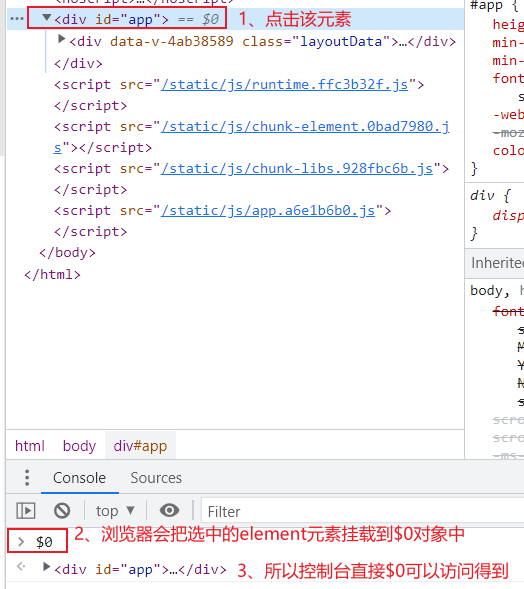
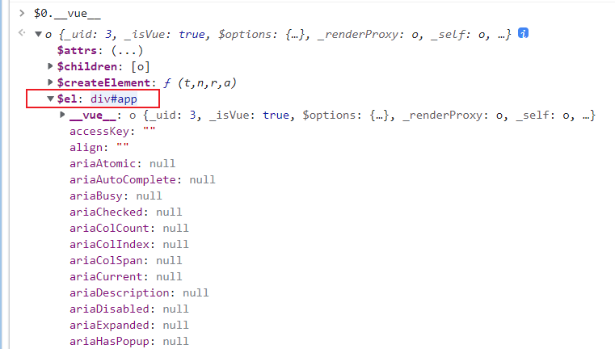
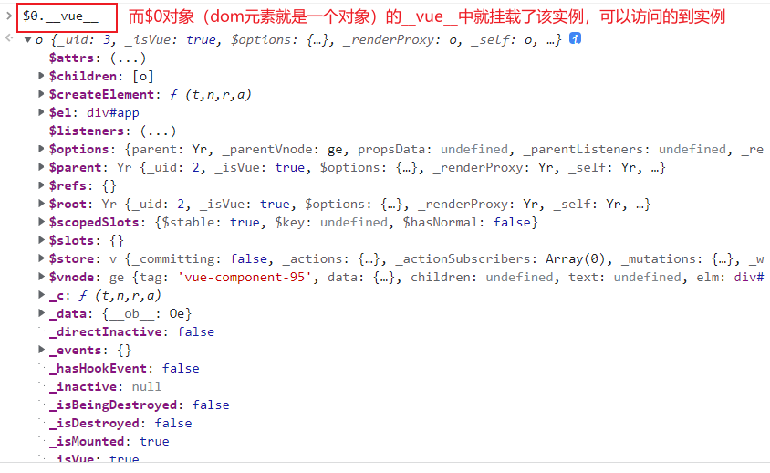
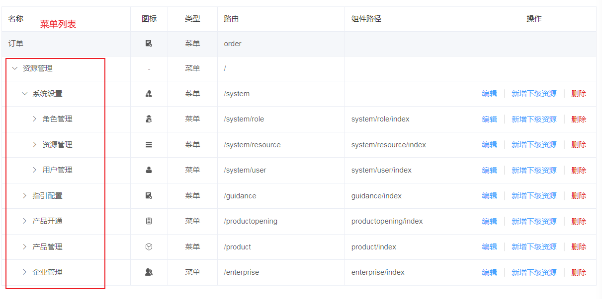
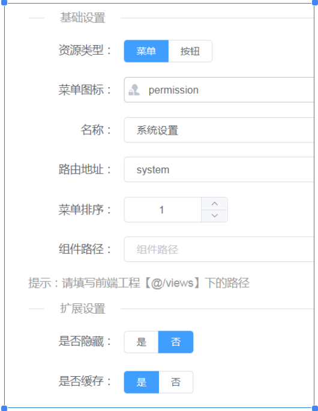
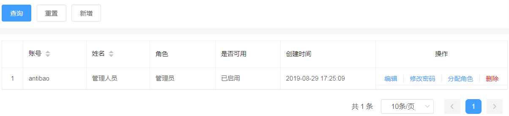

## 201. 前端页面校验的安全性问题

前端页面做了校验？？不好意思，我 直接 接口文档（swagger）、Postman 改（插入）数据，直接改数据库， 不用过你前端校验，爱输什么输什么。。。

## 202. git 改 https 为 git://

git config --global url."git://".insteadOf https://\*

## 203. undefined 和 null 区别

### (1)、默认情况下，两者使用没啥区别

```javascript
let a = null
let b
// 两者的作用基本一致

// 双等号判断也是 true
undefined == null // true
```

### (2)、具体区别

- **null** 表示 "没有对象"，即此处不应该有值，转数值为0，作为对象原型链的终点（`Object.getPrototypeOf(Object.prototype) === null`）
- **undefined** 表示"缺少值"，即此处应该有一个值，但是未定义，转数值为 NaN，函数无返回值为undefined

### typeof null === 'object' 怎么理解？

可以理解为是一个历史遗留的 Bug。

js的最初版本是使用的32位系统，（js为了节约性能）使用低位存储变量的类型信息；判断数据类型时，是根据机器码的低位表示进行判断的，而 null 的机器码标识和 对象的机器码标识一样都是000，没有事先做过滤，导致误判了 null 为 'object'。

**重要提醒**：js 中 变量没有类型，只有 值 才有 ！！！

## 204. npm run serve / dev / xxx

npm 脚本命令的执行，通过 package.json 中的 scripts 字段定义。


## 205. async-validator 的 rules 集合中的 type 默认类型

async-validator 的 rules集合中的每个对象的type默认是String类型的，做校验的时候可能会因为 number 和 string 来回切换 导致 校验不到。

## 206. 动态类名 - 鼠标点击增加样式（文字颜色改变）


**关键方法**：`classList.contains('active')` 判断是否有该类名，做样式切换的时候使用。

## 207. git commit emoji 和 git 大小写配置

### git commit emoji

**git config core.ignorecase false** 配置 vscode 修改文件大小写时，当创建新的文件。不会导致 修改大小写时 远程仓库没更新到。

这是 git 内部就支持的功能，不用额外装什么插件显示对应的图标就可以看到对应的提交图标。就提交的时候在提交信息前面加上对应的 :xxx: 语法就可以了（可以装提交选择图标的插件）

常用的 emoji 提交类型：

- :recycle: refactor: 重构
- :zap: perf: 优化
- :lipstick: style: 样式
- :memo: docs: 文档
- :art: chore: 配置修改
- :sparkles: feat: 新功能/特性
- :bug: fix: 修改bug
- :bookmark: carry: 不同仓库（项目）相同代码搬运 (自定义的)


## 208. Vue 模板执行顺序

vue 模板 执行顺序：

render => template => el

el ----> $refs.idName.$el （整个Vue实例的 DOM 对象）


## 209. websocket 与后端的通信

### 1）、与 http 比较

服务端可 主动 推送消息 到客户端，不用像登录扫二维码那样 不断的发送 http请求 轮询 接口，直到有返回数据才进行下一步的操作（页面跳转）

### 2）、大致使用

⚪ 首先要装一个依赖包 reconnecting-websocket，ws掉线自动重连

使用：

```javascript
const ws = new ReconnectingWebSocket('ws://....')
```

⚪ 然后初始化一个 ws

```javascript
import ReconnectingWebSocket from 'reconnecting-websocket'

initWebsocket(wsUrl, protocols) {
    const debug = process.env.NODE_ENV === 'development' // ws实例是否打印 debug 信息，默认是 false
    const options = {
        connectionTimeout: 1000, // 设置超时重连时间（没连上的时候一秒请求一次连接）
        maxRetries: 100, // 最多重连次数
        debug
    }

    return new ReconnectingWebSocket(wsUrl, protocols, options)
}
```

⚪ 在主布局页面 进行 ws 的连接


详细代码为：

```javascript
import store from 'store'
import expirePlugin from 'store/plugins/expire'
const storage = store.addPlugin(expirePlugin)

websocketConnect() {
    const url = process.env.VUE_APP_WB_URL || null  // ws 的请求 api
    const token = storage.get(ACCESS_TOKEN)

    // ...详细代码看下面
}
```

首先会发送一个 websocket 的请求， 请求与服务端建立连接，状态码 101 表示 升级协议

initWebsocket() 方法


连接服务器的ws地址


## 210. 判断字符串是否是yyyy-mm-dd的日期格式


### targetLength

当前字符串需要填充到的目标长度。如果这个数值小于当前字符串的长度，则返回当前字符串本身。

### padString 可选

填充字符串。如果字符串太长，使填充后的字符串长度超过了目标长度，则只保留最左侧的部分，其他部分会被截断。此参数的默认值为 " "（U+0020）。

```javascript
// 判断字符串是否是yyyy-mm-dd的日期格式 包括日期正确性校验
const judgeDate = (() => {
  function format(d) {
    return [
      d.getFullYear(),
      `${(d.getMonth() + 1)}`.padStart(2, '0'),
      `${(d.getDate())}`.padStart(2, '0'),
    ].join('-')
  }
  return s => format(new Date(s)) === s // 返回值是一个函数 而且这里没有其他代码有调用这个箭头函数 正所谓 函数不调用就不执行   而这里用了立即执行函数 所以就执行了  最终的返回值是这个箭头函数的返回值！！！
})()
```


### IEFF 立即执行函数


命名空间 - 闭包环境 ？ （里面可以访问外面，外面不能访问里面，不会造成命名冲突，变量污染）

闭包： 内层的函数可以使用外层函数的所有变量，即使外层函数已经执行完毕

## 211. 扩展运算符解构对象，单独定义相同字段

扩展运算符解构对象，单独定义相同字段，不影响原对象的该字段。


## 212. 前端利用 jsencript.js 进行 RSA 加密

必须有私钥才能对 对应的公钥进行解密 （有公钥是不可能拿得到私钥的，私钥应该可以获取对应的公钥的）

对称： 通信双方公用同一密钥

非对称： 公钥和私钥，公钥加密、私钥解密

**RSA 加密： 非对称加密算法**

**使用： 需要一对密钥，公钥和私钥 （一般公钥加密，私钥解密），终端跑命令生成**

**公钥和密钥： 一组数字，其二进制长度为1024位 / 2048位**

使用库进行加解密

```javascript
import JSEncrypt from 'jsencrypt/bin/jsencrypt'
// 密钥对生成 http://web.chacuo.net/netrsakeypair
const publicKey
  = 'MIGfMA0GCSqGSIb3DQEBAQUAA4GNADCBiQKBgQDBtToApvTzfpax/8OyYkVPKiCx0AFG5AXyZheW3CnL8LE0gQSKEpxghx8Odw306Ne1uOR5aNRMjaD4V9q5TDWtyiC28MgPALqOBZGVA3ZV7rx0xeuGu5IKJrtIQyICkRaKH4v+CRZnEAwGrBVxzjBPxUXlkC/TLpLFBSrtmrN99wIDAQAB'
const privateKey = ''
```

```javascript
// 加密
export function encrypt(txt) {
  const encryptor = new JSEncrypt()
  encryptor.setPublicKey(publicKey) // 设置公钥
  return encryptor.encrypt(txt) // 对需要加密的数据进行加密
}
```

```javascript
// 解密
export function decrypt(txt) {
  const encryptor = new JSEncrypt()
  encryptor.setPrivateKey(privateKey)
  return encryptor.decrypt(txt)
}
```

对登录密码进行加密：


### window.btoa 和 window.atob

#### 一、btoa()：字符串 → Base64 编码

- **全称**：Binary to ASCII
- **功能**：将二进制字符串（如普通文本、图片二进制数据等）转换为 Base64 编码的字符串
- **语法**：`const encoded = btoa(string)`
- **示例**：
  ```javascript
  const text = 'Hello World'
  const encoded = btoa(text)
  console.log(encoded) // 'SGVsbG8gV29ybGQ='
  ```

#### 二、atob()：Base64 编码 → 字符串

- **全称**：ASCII to Binary
- **功能**：将 Base64 编码的字符串解码为原始的二进制字符串
- **语法**：`const decoded = atob(encodedString)`
- **示例**：
  ```javascript
  const encoded = 'SGVsbG8gV29ybGQ='
  const decoded = atob(encoded)
  console.log(decoded) // 'Hello World'
  ```

#### 三、使用场景

- **简单加密**：对敏感信息进行简单的编码处理
- **数据传输**：Base64 编码兼容特殊字符，适合 ASCII 字符串传输
- **图片处理**：将图片转为 Base64 格式用于数据 URL

#### 四、注意事项

- 仅支持 ASCII 字符，中文需要先用 `encodeURIComponent()` 处理
- Base64 不是加密，只是编码，容易被解码
- 可使用 `js-base64` 库获得更好的兼容性


## 213. 根据不同的终端设备显示不同的页面

根据不同的终端设备显示不同的页面（非一套布局方案的响应式），是写两套的, PC + 移动端 mobile

1、首先，根据 navigator.userAgent 判断 当前终端是 PC还是移动端

2、然后在打包后的dist文件夹中的 index.html 中进行判断，引入不同的静态文件

vue打包过后生成dist文件,对比两套生成的dist文件，将共同的css，js写在一起，不同的通过

document.write 写到文档中，当然也可以用响应式的布局，但是响应式的布局加载慢，写法麻烦后期难以维护，小页面还好大的项目的不同点太多了，几乎跟写两套没什么区别

```javascript
function IsPC() {
  const userAgentInfo = navigator.userAgent
  const Agents = ['Android', 'iPhone', 'SymbianOS', 'Windows Phone', 'iPad', 'iPod']
  let flag = true
  for (let v = 0; v < Agents.length; v++) {
    if (userAgentInfo.indexOf(Agents[v]) > 0) {
      flag = false
      break
    }
  }
  return flag
}

const flag = IsPC() // true为PC端，false为手机端
if (flag) {
// pc端引入的link
  document.write(' <link href="css/app.fa43afb7.css" rel="preload" as="style"> <link href="js/app.ae6f97da.js" rel="preload" as="script"><link href="css/app.fa43afb7.css" rel="stylesheet">')
}
else {
  document.write('<link href="css/app.4646bd09.css" rel="preload" as="style"> <link href="js/app.0b91c116.js" rel="preload" as="script">  <link href="css/app.4646bd09.css" rel="stylesheet">')
}
```

引入js ，在这里要注意一个点，当写的是双标签的时候在结束标签的前面要加个转译字符

'\' 不然无效


## 214. 计算对象的层次（递归实现）

计算对象的层次 （递归实现）

## 215. IaaS、PaaS、SaaS

**IaaS** 底层应用 cpu / 网络 / 内存 等计算资源

**PaaS** 中间件 开发语言 和 开发环境

**SaaS** 软件即服务 直接使用开发好的应用软件，只注重运营。

## 216. git flow 工作流

为了更好的管理项目，针对版本发布周期进行的一套代码管理，把控项目，降低项目上线的风险和提高可操控度。

有一个命令行工具 git-flow，是对 git 命令的封装，简化各分支的繁琐操作。自动将release合到master并打tag和dev，并在本地和远程都删除release，再切换到dev分支。

### 五个分支：

1、 **master** 主分支 运行 / 演示 系统（生产环境）的分支，是确保代码没有Bug时（测试通过的）才可以合并到此分支上

2、**develop** 开发分支 测试环境的分支，主要用于日常的需求开发提交代码的分支，代码未经测试员测试，可能存在bug，及不稳定 基于master创建develop

3、**feature** 新特性 包括小版本迭代（2.1.x），一个版本迭代可以开一个feature 分支，基于 develop 分支 创建 feature，新特性开发完成会合并到 develop 分支，但是不会跟 master 打交道

4、**release** 发布分支 开发周期时间到了/ 完成了指定的版本任务开发 ，从 develop 创建 release 分支， 用于代码发布工作。除了 相关的 bug fix 之外，不允许在该分支增加其他功能的代码。最终会合到master分支，顺便会打标签（tag），备注对应的版本号在master上

5、**hotfix** 专门用于打补丁，修改bug。 从master创建hotfix，待 bug 修改完成后，可以合到其他的分支上，主要是为了不影响其他分支的正常工作，同时又能协同进行 生产环境中（master分支）bug 的修复工作

## 217. 文字左右边对齐

文字左右边对齐： text-align: justify;

## 218. CORB 警告

**CORB**: Cross-Origin Read Blocking 跨域读阻塞

为什么会有： 防止网络安全漏洞，出现的站点隔离（corb 实现策略之一）

什么时候会有：


## 219. rem 和自适应百分比

rem （font size of the root element） 和 自适应百分比 追求的是**比例 一致**

fontsize大小自适应 + font-size大小固定

**1rem = 根元素（html）的字体大小** （大部分情况下 **1rem = 100px**） （移动端下是 **1rem = 16px**）

设置 1rem = 100px，主要是：

(1)、方便计算（设置 100px，相当于 100%， 把 1 分成 100 分，把100当成一个系数而已， 好计算啊）

(2)、扩大基准值，适配部分限制最小字体的浏览器

       （chrome最小字体12px，华为个别型号浏览器最小字体8px,如果设置为1rem=10px,在12px最小浏览器中会被强制转换为12px，会导致基准不对比例计算出现问题）

(3)、常见分辨率下（375px / 700px / 320px ....）的 1rem 都是设置为 100px

但是更多时候， html 的 font-size 是动态计算的呀！！！！ （为了不同设备上显示的比例一致）

 <HTML>元素 的 font-size 计算公式为：**( 用户设备宽度 / 设计稿标准宽度 ) * 100**

设备像素比 device pixel ratio （DPR） = 物理像素 (设备像素) / 逻辑像素 (css像素)

## 220. 简历包装获得面试机会

简历 -- 包装 -- 获得面试机会


## 221. window.open / location.href 自动拼接域名

window.open / location.href 会自动拼接上域名url，只需要拼上路径 '/path' 就行

**document.domain** 获取 域名（不带端口）

**location.host** 获取主机名（域名）（带端口号，如果有端口号） / **location.origin** 获取完整的URL（带协议 比如： http://）


（1）、因为会自动拼接，所以要加上 ' // '，不然会拼在自己的域名下。


（2）、还有一种方法就是使用 路由的 resolve 方法，进行跳转。就不用判断哪个环境了。

```javascript
const openUrl = this.$router.resolve({name: 'xxx', query / params}).href
window.open(openUrl, '_blank')
```


其实直接 / （根路径）也是可以的，主要看你拼的参数能不能跳过去！


## 222. 关于路由一些比较悬的东西

关于路由 一些比较悬的东西




## 223. 技术的出现都是为了解决问题的

技术的出现都是为了解决问题的、而不是单纯地了解一堆API的

掌握一门技术，要知道其局限性/历史 和 本质

学习也是单纯地为了解决问题的，不是为了去记忆一堆API的。

软件： 计算机数据 + 指令

大前端： 移动端 （unpapp） 和 web端 （网站 / 后台管理系统 / 手机H5） 小程序端 桌面端 服务器开发

## 224. vuex-persistedstate Vuex的持久化插件

vuex-persistedstate Vuex的持久化插件（将本来存在state的数据映射到本地存储中，既做到了刷新不丢失又能保证数据还是响应式的）

## 225. js 完全搞不懂系列

js 完全搞不懂系列： = =

{} + '' 结果是转数字 -----> 0





## 226. 循环 push 字典覆盖问题

循环 push ，如果把 字典 dict 写在 循环外面, 会出现相同key 覆盖的问题, 解决方案是写在循环里面，确保每次都重新初始化，保证数据不给覆盖


**分析原因：**

可以发现每次 for 循环添加到字典中，都会覆盖掉上次添加的数据，并且内存地址都是相同的，所以就会影响到列表中已经存入的字典。

因为字典的增加方式dict['aaa] = bbb,这种形式如果字典里有对应的key就会覆盖掉，没有key就会添加到字典里。


## 227. 表单校验的动态绑定校验值

关于表单校验的动态绑定校验值 动态绑定 prop 值

关键点： template循环该数组（绑定在form中的） + prop取值（ 'prices.' + index + '.title' 组件识别这种写法 ）+ v-model 帮值 三者缺一不可


主要就是 循环 绑定 model 中的 form 的数组 + 自定义prop + 自定义rules + v-if 判断 其他的rules那个字段对应的校验函数 一样的写法的


## 228. vue路由跳转的方式

### （1）、 router-link 标签

（a标签跳转会重新渲染即刷新页面， router-link跟 this.$router.push 那几个方法就不会，会守卫点击事件，让浏览器不再重新加载页面 只会更新不一样的地方。 所以使用了keep-alive的话就不要用a标签了，会重新刷新页面，使缓存失效的）

router-link 是 只会更新变化的部分从而减少DOM性能消耗

a标签的rel="noopener"属性 即 no opener 的意思，就是在同时设置了target="\_blank"时打开的新页面中的window.opener值为null，安全起见，获取不到原有的window对象


### （2）、this.$router.push / replace / go /back /forward / 方法

router 的两种传参方式 ：

query: { id } 问号拼接


params: { id } 斜杠拼接


this.$router.push('/biz/production/edit' + id) params 拼在 url 上 （刷新页面有）

等价于

this.$router.push({ params 在 body 上 （刷新页面无）
name: 'productionEdit',
params: { id }
})

## 229. keep-alive 的使用

keep-alive 的 使用：

跳转的时候如果都是用的vue-router提供的方法（router-view或者$router.push等），那么这个keep-alive会自动帮你缓存，就你请求过的再次请求就不会再请求接口了，除非你手动再刷新页面。

浏览器的前进后退功能也是一样的不会刷新页面的，

那如果你是点击切换请求接口的话，那keep-alive就做不了了。每次都重新请求接口，就不会帮你缓存了 。

## 230. 算法

算法 计算/解决问题的步骤。

线性结构（数据对象一对一）： 数组、链表、栈、队列

非线性结构： 二维/多维数组、 广义表、树结构、图结构

## 231. 控制台获取element元素的dom对象

控制台获取element元素的dom对象



dom元素和组件实例的区别：


dom元素可以当做ref得到的实例对象中的$el属性



控制台获取element元素的dom实例



vue组件可以分3种

根组件： 最顶层 id="#app"

子组件： 根组件下面的组件（可以多层嵌套）

琉璃组件： 挂载的 全局 $xxx 属性

一个组件就是一个实例


## 232. 项目难点

项目难点：

（1）、公用组件的抽取（抽象功能，进行组件的封装 插槽 / prors / emit ），避免很多重复冗余的代码，同时也提高了开发效率。

（2）、框架的自定义配置 （递归显示菜单 menus 模块）

（3）、系统管理模块

（会员中心）用户（账号）管理 --- （管理中心/管理后台）人员（管理员） 管理

角色（权限）管理

资源（菜单）管理

（4）超时退出重新登录回到原先操作的页面

（ 点击确认退出按钮的时候 disptch 到 logout 接口，然后成功后的.then中 this.$router.push('/login?redirect_uri=' +  this.$route.fullPath) 保存当前操作页面路由，

       然后在登录页 this.$route.query 获取到 redirect_uri 直接 this.$router.push 过去就可以了，然后没有  redirect_uri 就默认跳到主页 ）

1、资源显示当前账号下拥有的所有资源（菜单）列表，超级管理员默认拥有显示系统全部菜单的权限（可以操作菜单，排序，显示隐藏，更换菜单图标/菜单排序，是否缓存，组件路径等...）





2、角色管理可以为系统创建角色（给用户分配角色），分配角色菜单


3、账号管理是登录系统用的账号名，可以新增 / 修改密码，分配角色，是否启用该账号，删除账号 等



## 233. input 的 type 为 number 时，设置的 maxlength 的写法

input 的 type 为 number 时，设置的 maxlength 的写法：

```html
<input type="number" oninput="if(value.length>5)value=value.slice(0,5)" />
```

## 234. ssh 安全外壳

ssh （secure shell）安全外壳 ，。 连接远程服务器用的一种 网络安全协议。 默认端口号是22

## 235. eslint 和 prettier 的区别

eslint 代码 **质量 / 风格** 检测工具 linting 检测？ （eslint 代码规范？ ts 类型规范？） （更强调 逻辑/命名 ？） 语法/变量/错误等 JavaScript代码检查工具

prettier 代码风格格式化工具 （更强调 缩进/格式化代码 ？） 缩进/换行/分号/引号 代码格式化工具

lint-staged 限制代码提交规范（提交 （git add） 的时候自动跑 lint 命令）


这样配置就可以了

## 236. QQ浏览器首页的视差滚动效果

QQ浏览器首页的**视差滚动效果**： background-attachment: fixed 和 js控制 background-position-y 产生位移

## 237. 判断对象是否为空

判断对象是否为空 ( 1. Object.keys().length 2. JSON.stringify({}) === '{}' 3. for ... in 判断 4. Object.getOwnPropertyNames({}).length === 0 )


## 238. 请求接口的方法

请求接口的方法：**form表单（action属性）提交**（会引起页面跳转） 、 XMLHttpRequest、 Ajax、Axios
