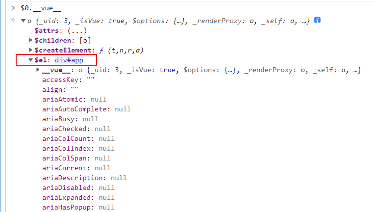
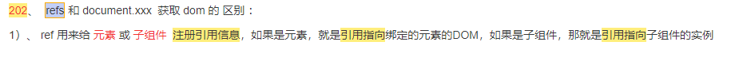
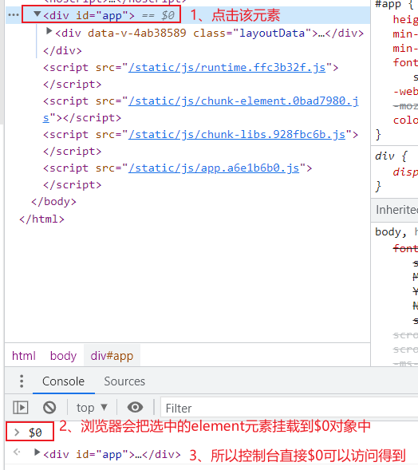
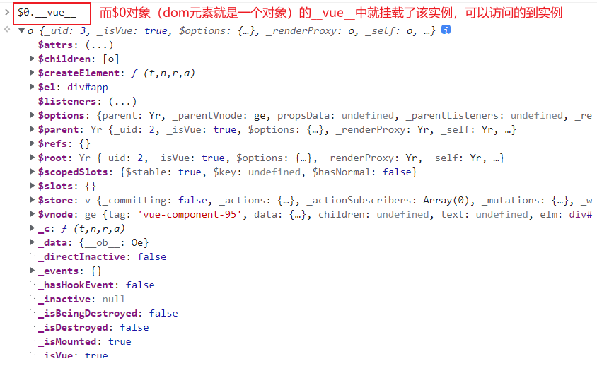
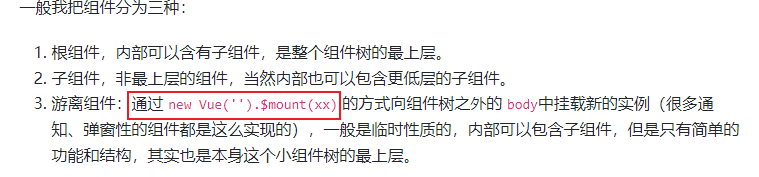
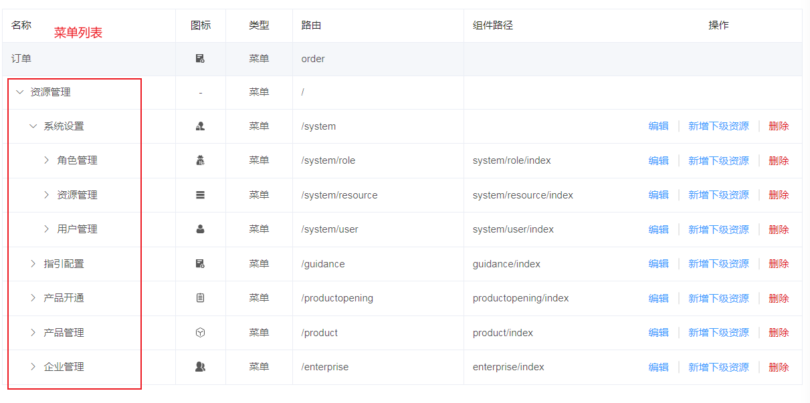
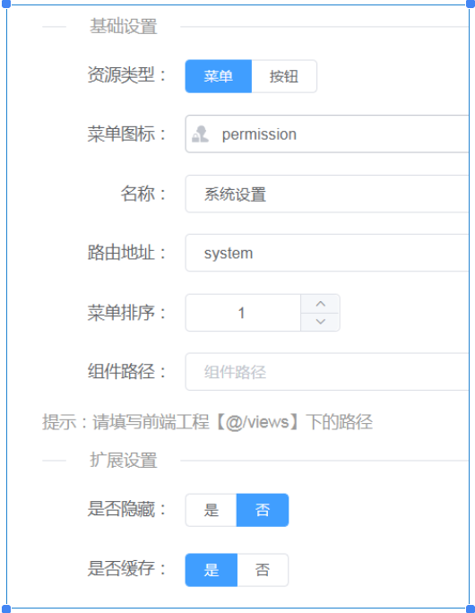
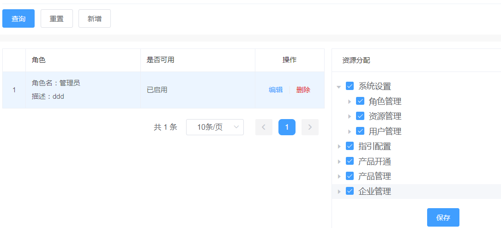
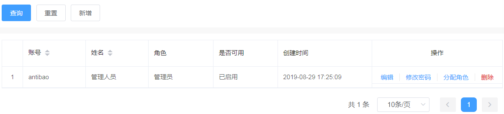

## 239. 请求接口的方法

请求接口的方法：**form表单（action属性）提交**（会引起页面跳转） 、 XMLHttpRequest、 Ajax、Axios

## 240. 代码提交规范

代码要每天都提交一次！不要按功能完成再提交，确保 服务器能备份到最新的代码，确保本地不会因为硬盘坏了而丢失代码（即使是万分之一的概率）。

## 241. 组件的 name 属性

组件的 name 属性 （用于 keep-alive 的 include / exclude 、递归组件、vue-devtools 调试工具显示的组件名称）

## 242. 组件的 inheritAttrs 属性

组件的 inheritAttrs 属性 （默认为 true，表示父组件传递的属性会自动添加到子组件的根元素上，设置为 false 可以避免这种行为）

## 243. 组件的 $attrs 和 $listeners

组件的 $attrs 和 $listeners （$attrs 包含父组件传递的所有属性，$listeners 包含父组件传递的所有事件监听器）

## 244. 组件的 functional 属性

组件的 functional 属性 （函数式组件，没有状态，没有实例，只接收 props 和 context，性能更好）

## 245. 组件的 abstract 属性

组件的 abstract 属性 （抽象组件，不会渲染到 DOM 中，如 keep-alive、transition 等）

## 246. 组件的 model 属性

组件的 model 属性 （自定义 v-model 的 prop 和 event）

## 247. 组件的 provide / inject

组件的 provide / inject （祖先组件向后代组件传递数据，不需要逐层传递 props）

## 248. 组件的 mixins

组件的 mixins （混入，将多个组件的公共逻辑抽取出来，可以复用）

## 249. 组件的 extends

组件的 extends （继承，基于一个组件创建另一个组件）

## 250. JS的对象遍历是无序的

JS的对象遍历是无序的（因为对象本身就没有存储顺序）。但是数组是有的，有index索引，记录每个元素的顺序。

## 251. 数组的 sort 方法

数组的 sort 方法 （默认按照字符串的 Unicode 码点进行排序，可以传入比较函数自定义排序规则）

## 252. 数组的 reduce 方法

数组的 reduce 方法 （对数组中的每个元素执行一个 reducer 函数，将其结果汇总为单个返回值）

## 253. 数组的 flat 方法

数组的 flat 方法 （将嵌套的数组"拉平"，变成一维数组，可以指定拉平的层数）

## 254. 数组的 flatMap 方法

数组的 flatMap 方法 （先对数组中每个元素执行 map 操作，然后对结果执行 flat 操作）

## 255. 数组的 includes 方法

数组的 includes 方法 （判断数组是否包含某个元素，返回布尔值）

## 256. 数组的 find 和 findIndex 方法

数组的 find 和 findIndex 方法 （find 返回第一个满足条件的元素，findIndex 返回第一个满足条件的元素的索引）

## 257. 数组的 some 和 every 方法

数组的 some 和 every 方法 （some 判断是否有元素满足条件，every 判断是否所有元素都满足条件）

## 258. 字符串的 padStart 和 padEnd 方法

字符串的 padStart 和 padEnd 方法 （在字符串的开头或结尾填充指定的字符，直到达到指定的长度）

## 259. 字符串的 repeat 方法

字符串的 repeat 方法 （将字符串重复指定的次数）

## 260. 字符串的 startsWith 和 endsWith 方法

字符串的 startsWith 和 endsWith 方法 （判断字符串是否以指定的字符串开头或结尾）

## 261. 字符串的 includes 方法

字符串的 includes 方法 （判断字符串是否包含指定的子字符串）

## 262. Object.assign 方法

Object.assign 方法 （将所有可枚举属性的值从一个或多个源对象复制到目标对象）

## 263. Object.keys、Object.values、Object.entries 方法

Object.keys、Object.values、Object.entries 方法 （分别返回对象的键、值、键值对数组）

## 264. Object.fromEntries 方法

Object.fromEntries 方法 （将键值对列表转换为对象）

## 265. Promise.all 和 Promise.race 方法

Promise.all 和 Promise.race 方法 （all 等待所有 Promise 完成，race 等待第一个 Promise 完成）

## 266. Promise.allSettled 方法

Promise.allSettled 方法 （等待所有 Promise 完成，无论成功还是失败）

## 267. async/await 语法

async/await 语法 （异步函数的语法糖，使异步代码看起来像同步代码）

## 268. 解构赋值

解构赋值 （从数组或对象中提取值，赋值给变量）

## 269. 扩展运算符

扩展运算符 （将数组或对象展开为独立的元素）

## 270. 模板字符串

模板字符串 （使用反引号包围的字符串，支持变量插值和多行字符串）

## 271. 箭头函数

箭头函数 （简洁的函数语法，没有自己的 this、arguments、super 或 new.target）

## 272. 默认参数

默认参数 （为函数参数设置默认值）

## 273. 剩余参数

剩余参数 （将多个参数收集到一个数组中）

## 274. Symbol 数据类型

Symbol 数据类型 （表示独一无二的值，主要用于对象属性的标识符）

## 275. Set 和 Map 数据结构

Set 和 Map 数据结构 （Set 是值的集合，Map 是键值对的集合）

## 276. WeakSet 和 WeakMap 数据结构

WeakSet 和 WeakMap 数据结构 （弱引用的 Set 和 Map，不会阻止垃圾回收）

## 277. Proxy 对象

Proxy 对象 （用于定义基本操作的自定义行为，如属性查找、赋值、枚举、函数调用等）

## 278. Reflect 对象

Reflect 对象 （提供拦截 JavaScript 操作的方法，与 Proxy 配合使用）

## 279. 浏览器调试技巧

浏览器调试技巧：

**console.table** / **console.dir** / **console.clear()** 代替 console.table / dir / **console.clear()**

**监听事件**：像 vue 一样 在方法中打印 当前元素的DOM对象事件 (e) / ($event) ? 使用 **monitorEvents** 这个 api

**monitor** 相当于 vue 中的 watch 了，对函数做监听？？ 取消就 unmonitor 了

## 280. 浏览器性能监控

浏览器性能监控：

**performance.now()** 获取高精度时间戳

**performance.mark()** 和 **performance.measure()** 标记和测量性能

## 281. 浏览器存储

浏览器存储：

**localStorage** 持久化存储，除非手动清除

**sessionStorage** 会话存储，关闭标签页就清除

**IndexedDB** 大容量客户端存储

**Cookie** 小容量存储，会自动发送到服务器

## 282. 浏览器事件循环

浏览器事件循环：

**宏任务**：setTimeout、setInterval、I/O、UI 渲染

**微任务**：Promise.then、MutationObserver、queueMicrotask

执行顺序：同步代码 → 微任务 → 宏任务

## 283. B站弹幕不遮挡人脸

B站弹幕不遮挡人脸？

AI生成图片，然后给图片设置 -webkit-mask-image: url(xxx) 属性，文字 绝对定位， 图片相对定位。

