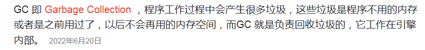
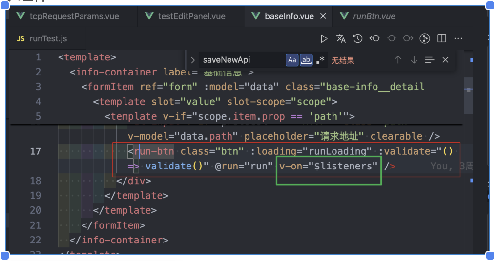
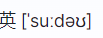
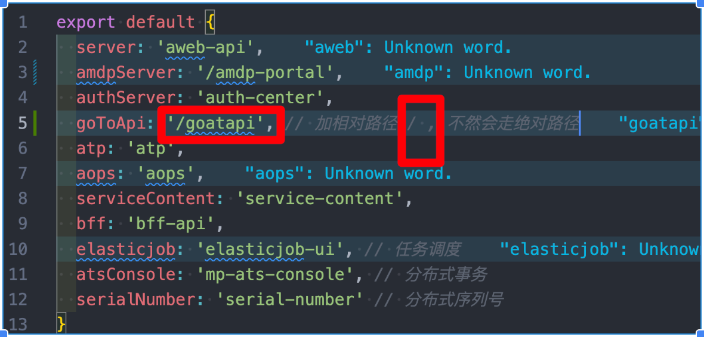
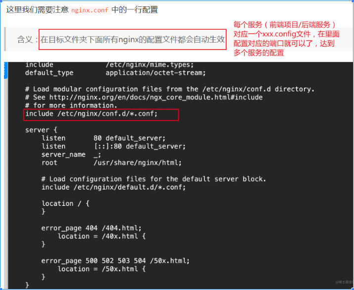
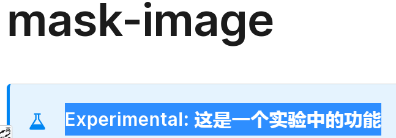

## 239. 代码提交规范

代码要每天都提交一次！不要按功能完成再提交，确保 服务器能备份到最新的代码，确保本地不会因为硬盘坏了而丢失代码（即使是万分之一的概率）。

提交的时候只要确保基本的编译不会出错就可以了，只是提交到你的 feature 分支，不会影响到 master 分支的完整性的。 到时候一个功能开发完成了再通过测试后

再合并到主分支就可以了。

参考 **devOps** 的操作流程。

CI / CD 持续集成 / 持续部署（交付） continuous integration

continuous deployment（delivery）

## 240. 命名规范

命名： 数组： menu**s** menu**List** Nodes records

对象： **data** menu**Info** menu**Dict**

Map: menu**Map**

Set: menu**Set**

## 241. img标签的 onerror 事件处理

用 img标签的 **onerror（@error）事件 **解决图片的src地址访问不到报错（或者图片裂开）的问题


原生：


VUE:


## 242. 可拖拽的视口


cursor: col-resize;

## 243. 获取外部样式的方法

window.getComputedStyle( ele ) 获取该元素的所有外部样式对象 （有width属性 ......） // 返回值是 整数

ele.getBoundingClientRect( ).top / bottom / left / right 返回一个矩形对象，包含那4个属性 // 返回值是 精确 的 带小数点的

ele.offsetWidth / offsetHeight / offsetLeft / offsetTop // 返回的是 整数


## 244. package.json 文件中的依赖类型区别

package.json 文件中的 dependencies（项目的依赖） 和 devDependencies（开发所需要的模块） 和 peerDependencies 的区别：

（1）、如果没有发布 npm 包， 那么依赖放在哪里没有区别；

（2）、为了规范，如果是一直使用的包（项目中会一直用，如 ant-design-vue、day.js等），放到 dependencies 中; （这里的依赖是一定会被下载的）

如果是开发时需要用到，上线后（线上环境）不会用到的，如 webpack、eslint、prettier、各种-loader、stylelint等...，放到 devDependencies 中

（3）、peerDependencies 解决核心库被下载多次，统一核心库的版本问题 （项目依赖了 vuex 和 vant 这两个子库，而这两个依赖又都同时依赖了 vue 这个框架。在字库中分别声明 peerDependencies 防止重复安装 vue）


（4）、peerDependenciesMeta 对 peerDependencies 的修饰， 增加一些可选项的配置

## 245. CSS 字体 font-weight 属性的跨平台差异

关于 css 字体 的一些学问 **font-weight** 属性在不同操作系统（常见win和mac）上的显示效果的不同

（0）、关于 win 和 mac 的默认字体 （不设置font-family属性，会自动读取操作系统的默认字体来显示的）


（1）、win上 ：600为分界线。600往前一个效果，600往后一个效果

      mac上：每一个值显示的效果都不一样


（2）、因为操作系统和浏览器的原因，字体在不同操作系统设备上显示的粗细会有所不同。这是 font-weight 这个属性存在的兼容性问题


（3）、使用 @font-face 引入自定义字体，font-family 使用该字体名称 （字体后缀名 .ttf .otf .fnt ）


## 246. Vue 中多个组件使用 window.onresize 的问题

vue 中 多个组件使用 window.onresize，只有一个生效，导致其他的给覆盖。


## 247. JavaScript 引擎和编译器

js引擎（spiderMonkey、V8 ...） （js解析器） 和 js编译器 （babel （es6 转 es5，转化 jsx 语法，兼容旧版浏览器，ts语法）、 tsc （typescript compiler）、 swc （speedy web compiler））


## 248. CommonJS 和 ES Module 的区别

commonJS （服务端 node） 和 ES Module 的区别：

(1)、require 和 import 的

(2)、CommonJS 的思路就是将函数当作模块

## 249. JS的对象遍历是无序的

JS的对象遍历是无序的（因为对象本身就没有存储顺序）。但是数组是有的，有index索引，记录每个元素的顺序。


## 250. JS（V8）垃圾回收机制

JS（V8）垃圾回收机制： GC -----> **Garbage Collecton** **垃圾回收** 垃圾收集器 （自动回收机制） （C / C++ 就没有）



标识无用变量方法（GC 跟踪每个变量是否有用，无用变量打上标记，回收其占用内存）： 标记清除 （V8） 和 引用计数

标记清除会导致内存空间分配不连续（内存碎片）、分配速度慢


标记整理：


引用计数（ 跟踪记录每个值被引用的次数。


）


上面 即 循环引用的 例子


回收

## 251. Vue 动态绑定属性名

vue 动态绑定属性名


## 252. Vue 中 v-for 支持的类型

vue 中 v-for 支持的类型 （比原生的 for 屌很多的） in / of 这两个都可以，作用完全一样（跟原生是不一样的）

1、遍历 数组（字符串）

2、遍历对象 value - key - index

             （键值对索引）


3、遍历数字

4、遍历 itarable（可迭代）对象

**key 属性 ** ）

### **Vue3.x 新增 自动生成唯一的 key 值**


### **Vue2.x 必须写key **


VNode 虚拟节点

template中的每一个标签元素 vue 都会转化成 一个个的 VNode

template -> VNode -> 真实DOM


虚拟DOM ？ 可以干嘛？

（1）、做 diff 算法 （绑定 v-for 的 key）

（2）、跨平台。vue 可以写 PC Web / 移动端 / H5 / 小程序 / 甚至 桌面端 / 安卓 / IOS ...... 靠的是 VDOM 的 转换


## 253. position: fixed 的定位特性

position: fixed; 一般都是相对于 屏幕视窗 （浏览器窗口） 来进行 定位 。（屏幕尺寸大小）

所以 设置 width 要动态计算 calc（）函数 除非


## 254. Vue 组件库相关

Vue 组件库 相关

（1）、直接用

```javascript
main.js 文件
// 组件库
import Element from 'element-ui'

Vue.use(Element) // 使用组件库的所有组件（全部加载，不管用没用到）
```

（2）、lazy-use ** 按需引入**

```javascript
main.js 文件
// 组件库
import './lazy_use' // use lazy load components

lazy_use.js 文件
import Vue from 'vue'
import { Input, List, Dropdown, Tooltip ... } from 'ant-design-vue' // 按需引入

Vue.use(Input)
Vue.use(List)
Vue.use(Dropdown)
Vue.use(Tooltip)
...
```

如果仅仅是完成上面的操作，还是不能实现真正的按需加载的。

需要下载 babel-plugin-component 插件 并且 在 babel.config.js 文件中进行对应的插件配置（按需引入的组件库和按需引入的样式）


以上，就可以做到按需引入了。

重写组件库样式：

1、建element-ui.scss文件在style文件夹中，在index.scss中@import引入，然后在 App.vue 文件的 style 中 @import 引入


2、建global.less文件重写 antdv 样式，在 main.js 中直接 import 该文件


这样就可以 了。

**element-ui 的 layout 布局 中的 响应式布局**

```xml
<el-col :lg="{span:'12-25'}"></el-col>
```

```xml
.el-col-lg-12-25 {
    width: 48%;
}
```

:lg="{span:'12-25'}" 和 .el-col-lg-12-25 =======> 即 el-col-lg-12-25 设置的 width 就是 :lg="{span:'12-25'}" 对应的宽度 （12-25 就是从第12列到第25列 的意思 ）


## 255. property 和 attribute 的区别

property 和 attribute 的 区别 （类似 $attr 和 $props）

1、 **property**（如 **style,className,childNodes,classList ...**）

**（1）、** 指的是操作 DOM 的属性 像获取到DOM后设置 xxx.style.color、xxx.className、xxx.childNodes、xxx.firstChild .......

（2）、值只能是字符串（操作JS）

（3）、长属性名是驼峰写法


2、 **attribute**（如 **id,class,src,title,alt ...**）

**（1）、** 指的是操作 HTML 的属性 像设置和获取DOM元素的属性 xxx.getAttribute('class')、xxx.setAttribute('title', 'cusTitle')

（2）、值可以是 数组/ 对象等（HTML）

（3）、属性名


e.g.


$listeners （vue3 deprecated）


v-bind="$attrs"  v-on="$listeners" $options ===> options API 整个 获取自定义属性

事件监听的具体使用：

父组件：


子组件：



这里的v-on="$listeners" 就相当于 继承了 父组件中的除了 @run 之外的所有事件监听了（也就是红框框出来的那些事件）

也相当于：


替代了 手动写$emit 事件 。

所以，这个 @run 在 父组件定义就行了。 在子组件这里再次定义的话就相当于 你执行了 两次 run 了。


## 256. Vue 的 install


## 257. flex 和 grid 布局

flex （一维 / 单行） grid （ 二(多)维 / 多行 ）

**让最后一行列表左对齐**

(1)、grid

```javascript
 display: grid;
 justify-content: space-around;
 grid-template-columns: repeat(auto-fill, 30%);
```


```javascript
// 子元素
width: 30%;
height: 100px;
background: pink;
margin: 12px;
```

(1)、flex

1. 粗暴点，直接给最后一个 margin-right

2. 在后面套两个 <div></div><div></div> (空元素占位)


## 258. JSON Schema

JSON Schema

JSON : [JavaScript Object Notation](https://developer.mozilla.org/zh-CN/docs/Web/JavaScript/Reference/Global_Objects/JSON#javascript_object_notation) js对象（万物皆对象）注释

**JSON** 是一种语法，用来**序列化**对象、数组、数值、字符串、布尔值和 [null](https://developer.mozilla.org/zh-CN/docs/Web/JavaScript/Reference/Operators/null) 。key 和 value 都是 字符串

**JSON Schema 是一套 JSON规范，用于校验JSON的工具。**(格式有点类似于AST？) 就是一份JSON文件的说明文档，叼一点，可以生成form表单（插件支持）和做数据（字段）校验

包含了「表单数据描述」和 「表单校验」功能。

基本格式：


json格式是不支持注释的，所以可以用 json schema 来定义json，在json文件里加个description字段就可以了。title是定义标题的。

field widget 组件

语法： 定义了一系列的规则（关键字） ajv: JSON Schema 的校验器

组成：

#### **1、schema：** **用于描述表单数据的 JSON Schema**


#### **2、ui-schema： （ui 也可直接配置在 schema 中）** **用于配置表单展示样式**


**3、error-schema ：用于配置表单校验错误文案信息**

.......

关键字：

1、$schema 关键字：声明了针对哪个版本的JSON Schema标准编写模式。

2、$id 属性：为JSON Schema实例声明一个唯一标识符；声明了一个解析$ref 的URI时的基础URI

3、$ref 属性：引用同一个JSON Schema文件或其他JSON Schema文件中的JSON Schema实例片段。这个属性的值通常是一个相对或者绝对URI，# 符号后面的部分是JSON指针

4、dependencies 关键字：属性依赖：如果JSON实例拥有对应的属性名name，则也必须有name对应的propertyset数组内的所有属性名

5、definitions 关键字：这个关键字可以在JSON Schema实例中定义一个可以在这个JSON Schema实例中被引用的JSON子模式。

## 259. position 和 flex 的冲突

同一个盒子同时使用 position 和 flex 会产生 冲突 （flex居中 和 子元素 position: absolute 之间产生的冲突）， 给盒子外面再套一层 div，相对 div 定位

## 260. 声明式编程

声明式编程 （**函数式编程** 是 其中一种） 与之对应的是 命令式编程


## 261. React

React

（1）、开发 web 页面

（2）、React Native 开发 移动端跨平台

（3）、React VR 开发 虚拟现实web应用

依赖包： react / react-dom（ 渲染到不同平台的依赖，比如 react web 和 react native ） / babel

vue只要数据更新,会自动进行render,视图上显示的是最新的数据。

而react默认不会自动执行render (可以是 html元素 或 组件--------类组件和函数式组件)的，要在数据更行后手动执行一下render拿到最新数据

script标签中加 type="text/babel" 为了能让 babel 解析 jsx 代码

函数的返回值默认是 undefined （没写 return 的话）

es6的 class 默认是 绑定的严格模式下的，所以 class 里的 this 如果原本是指向 window 的，会变成 undefined （使用 babel 转换的代码也是，默认都是开启严格模式）

## 262. 禁止移动端的触摸事件

禁止移动端的触摸事件（touch event），可以强制不显示浏览器的滚动条（比如 safari 会自动显示滚动条）

** touch-event: none;**

## 263. VUE_BASE_API 配置

VUE_BASE_API 在 .env等 配置文件 中 ：

（1）、完整的 url ： 那就是 **base_url **+ api文件 中的 ** request_url **


本地（开发）环境 和 测试环境 都是 这个的话，那访问的 api 就是


生产环境 的 api


（2）、单纯写 /api 这个是在 nginx.config 配置文件中进行 配置的。 （nginx是部署在服务器上面的，不是在后端代码中的。nginx 服务 配置项目）


1、如果是在 开发环境 中，那么访问的 baseUrl 就是 http://172.21.44.15:8080 + requestUrl 就是 /api/user/search

（如果没在vue.config.js文件中的devServer的proxy中设置 '/api' 代理的话，那就会报 404 not found 错误。要改VUE_BASE_API的）

2、如果是在 测试环境 中，那么访问的 baseUrl 就是 http://api-test.xd0760.com + requestUrl 就是 /api/user/search

3、如果是在 生产（正式）环境 中，那么访问的 baseUrl 就是 https://api.xd0760.com + requestUrl 就是 /api/user/search

同理，VUE_BASE_API_UPLOAD 也一样，设置 不同环境下的服务器存储文件（图片、视频等）的地址，如果是配置的 /uploads 的话，要注意对应环境，如果是测试环境 就会报错了


## 264. 随机生成颜色

随机生成颜色


const createRandomColor = () => `#${Math.random().toString(16).slice(-6)}`

## 265. 监听本地存储变化

原生方法 监听 本地存储 （localStorage）的变化：

window.addEventListener('storage', (event) => {

console.log('storage changed', event)

})


var orignalSetItem = localStorage.setItem

localStorage.setItem = function(key,newValue) {
var setItemEvent = new Event("setItemEvent")
setItemEvent.newValue = newValue
window.dispatchEvent(setItemEvent)
orignalSetItem.apply(this,arguments)
}

window.addEventListener("setItemEvent", function (e) {
alert(e.newValue)
})
localStorage.setItem("name","wang")

## 266. 修改 node_modules 代码

修改 node_modules 上的代码： 用 patch-package （依赖 git diff 实现的 patches 文件夹） 呀

注意: 要改动的包在 package.json 中必须声明确定的版本，不能有~或者^的前缀。

（1）、安装patch-package

```javascript
npm i patch-package --save-dev
```

（2）、修改完依赖后，运行patch-package创建patch文件 npx 执行 node_modules 文件夹 下面的 .bin 可执行文件

```javascript
npx patch-package 依赖名称
例子： npx patch-package element-ui
```

（3）、修改package.json的内容，在scripts中加入"postinstall": "patch-package"，这个是为了npm install的时候自动为依赖包打上我们改过的依赖

```javascript
 "scripts": {
　　...
　　"**postinstall**": "patch-package"
　　}
```

## 267. Vue 的各版本对比

vue 的 各版本 对比：

## 268. 编程英语

编程英语：

pseudo-element： 伪元素



locale： 特定语言环境的（当地的） 'zh-CN' 'en-US' （'ar-EG' 阿拉伯语言） to**Locale**String() to**Locale**LowerCase()

SDK： **software development kit **软件开发工具包

accessibility： 无障碍 （a11y） ----视 / 听 / 行动 / 理解

patch： 打补丁

bundler： 打包（工具）（webpack / browserify）

chunk： 块

bundle： 束

vendor： 供应商（第三方库）

我们直接写出来的是 module，webpack 处理时是 chunk，最后生成浏览器可以直接运行的 bundle。（不是多少个 chunk 就会对应生成多少个 bundle ， （虽然大部分情况下会是一一对应） ）

invoke： 调用 （函数调用等）

revoke： 撤销

implicit： 隐式的...

explicit： 显式的...

hoisting： 变量提升 (var关键字声明才会有)

indicate： 表明，显示

anonymous： 匿名的...

nested： 嵌套的..

polygon： 多边形

immutable： 不可变的 （immer 一直如此 immer.js）

coupon： 优惠券

trie：字典树

traverse： 遍历

linked list： 链表

expanse ： 花费 （消耗 expansive 贵的）

manifest： 清单文件（）

**fallback：** 兜底

estimate： 估算

diagnostics： 诊断

concurrent： 并发

shims： 垫片 shims.vue.ts

Polyfill： 填充器

**关于符号：（prettie）**

semi： 末尾加不加分号 （"false" "true"）一行的结束

semicolon： 分号

semi-spacing： 强制分号间隔；分号前后是否空格

brackets： 括号

**comma**： 逗号

**trailingComma**：多行输入尾部加不加逗号


单引号： singleQoute

双引号： doubleQoute

wrap： 换行 （nowrap --- 一行显示 white-space 只有一行文字的时候） wrapper： 包装器

## 269. 浏览器使用 export / import 语法

浏览器使用 export / import 语法： 异步方法

默认是在 webpack/cli、 babel 等 脚手架/编译 工具 中有集成 / 做了代码转换


（1）、使用 type="module" （静态引入）


（2）、动态引入


（3）、解构（async / await）


## 270. 前端模块化

前端模块化 （js 模块化规范） ---- UMD / CMD / AMD / ES Module （esm ） / CommomJS（cjs）

**一、 CommonJS**

用 module.exports 导出模块, 用 require 加载模块

CSS 模块化（防止 文件命名/样式 冲突）：

命名规范（BEM[ block__element--modifier ]、OOCSS [ 原子类 类似 tailwind 思想 ]、SMACSS、ITCSS...）、

CSS Modules（主要 react 在用）、


为 <style> 区块添加 module 属性即可开启 CSS Modules。


CSS-in-JS （styled-components react在用，相当于 vue 的 style scoped） 【 html-in-js： JSX 】 "all in js"


[emotion](https://link.juejin.cn/?target=https%3A%2F%2Femotion.sh%2Fdocs%2Fintroduction) 排名第二的维护者 Sam 所在公司弃用了 css-in-js 方案，使用css-modules的解决方案，**主要是出于性能考虑**。还有增加了包体积

## 271. Div+contenteditable 实现富文本输入框

**Div+contenteditable** 实现 **可插入自定义内容（标签）** 的输入框 （简单的富文本输入框）

## 272. jenkins 和 docker 的区别

jenkins 是 java开发，用于自动化构建（打包）和部署项目 --- 配置命令，自动跑

docker 是 go开发，是个虚拟机，是容器

## 273. 第三方统一登录SSO

第三方统一登录SSO

带参数跳转回调会自己项目中。

## 274. chrome devtools

[chrome devtools 开发者文档](https://developer.chrome.com/docs/devtools/overview/) 实用小技巧：

// **$\_** (获取控制台上一次的结果)

// **$ 1-4** (获取 $0 的 previous 元素)

// $(' 类名/id/属性名 ') **$('.main')\*\* === document.querySelector('.main') $ 就是 document.querySelector() 的别名（语法糖）

// :has() :contains()

// table / dir / **clear()** 代替 console.table / dir **console.clear()**

**// **监听事件 ？ 像 vue 一样 在方法中打印 当前元素的DOM对象事件 (e) / ($event) ? 使用 **monitorEvents** 这个 api 啊


// **monitor** 相当于 vue 中的 watch 了 ，对函数做监听 ？？ 取消就 unmonitor 了

// **:has()** 选择器 和 **:contains()** 选择器

1. 选中并删除所有带"关键字"的评论
   $('.reply-wrap**:contains(关键字)**').remove()

2. 选中并删除所有用户等级在三级以上的评论
   $('.reply-wrap**:has(.l3)**,.reply-wrap**:has(.l4)**,.replay-wrap**:has(.l5)**,reply-wrap**:has(.l6)**').remove()

## 275. hash 和 history 区别

（浏览器的 /# 重定向 问题）

（1）、如果是 带 #/ 的话，要编码一下的， 用 encodeURIComponent 转一下，再传过去，不然会报错。（可能接口做了处理，特殊字符（#、等）传过去可能不被正常接收 / 浏览器处理？）


history 可以配置 nginx 文件


（2）、加相对路径：




不然会这样


（3）、部署：


## 276. 地图定位

地图定位（ ip获取范围（省市区），再用 region城市 限制范围 调用获取搜索关键字提示 达到效果 ）

## 277. vue-cli 改造 nuxt

vue 中的 **全局变量**


## 278. 数据埋点 - 访问数据来源

【直接访问】：直接输入网站 url（网址） 进行访问

【搜索引擎】：关键字搜索跳转

【外部链接】：通过别人的网址跳转（带来源标识 from / source）


## 279. 跨域解决

浏览器会先发一个 option 预请求, 不行就报错了

（1）、jsonp 发起标签 script请求，利用script标签的src不受同源的限制

（2）、vue.config.js / webpack 配置文件 修改 devServer 的 proxy 的指向

（3）、（服务端 / node 端）nginx 的 配置文件修改

**nginx:－－－－－－－ 负载均衡 / 反向代理 / 动静分离 / http服务器** （高性能 / 轻量级）

负载均衡： nginx代理服务器 转发请求到各个服务器（每个服务器都有各自的端口号唯一识别），利用空闲的服务器协调工作，做到资源利用最大化


动静分离： nginx将 静态资源 和 动态资源 进行分离，给对应的服务器去解析，降低单个服务器的压力，加速解析


**模块配置：**


**配置文件 xxx.config**




**工程化 CI/CD**： **项目部署和自动化打包**

**流程：**

1、服务器安装 jenkins，然后配置一个项目


2、然后构建规则，轮询配置


3、然后构建，配置构建命令，然后ssh到服务器指定的目录中


4、接着服务器安装nginx，然后配置 location 的 root 为上面的 remote directory，然后完事。就能享受 jenkins 自动化部署，直接访问就能看到新的代码变化了。


## 280. v-html 的本质

v-html 的 本质就是 设置元素原生的innerHTML

dom 的 innerHTML ： 选所有子元素进行显示 （子元素包括标签在内的字符串形式） : -- 文本带标签的显示为带标签后的样式，普通字符串就显示普通字符串内容


dom 的 innerText ： 选所有子元素的**所有文字**进行显示 （字符串像是） : -- 文本是什么就显示什么（不认标签的）


## 281. markdown 语法中的锚点定位

markdown 语法 中的 **锚点定位**

**（1）、[ text content ... ](#myname) ------ <span id="myname">text content ...</span>**

**（2）、<a href="#anchor"> text content... </a> ----- <span id="anchor">the anchor target</span>**


**（3）、[[toc]] --- table of contents**


**showndown --- **用 JavaScript 编写的双向 Markdown 到 HTML 到 Markdown 转换器

**showndown-toc ---- [toc] 语法 生成 导航锚点定位**

1. 会把文章中所有的 heading 信息，通过闭包的形式传达到上层域

1. markdown 中写 [toc]，即可生成 toc 到 markdown 的相应位置中

一般的md编辑器（vue的 v-md-editor）就有集成了。使用的时候直接配置就行了。


## 282. B站弹幕不遮挡人脸

B站弹幕不遮挡人脸？

AI生成图片，然后给图片设置 -webkit-mask-image: url(xxx) 属性，文字 绝对定位， 图片相对定位。




**mask-image** CSS属性用于设置元素上遮罩层的图像。

## 283. 前端问题排查与调试技巧

### 常用排查方法

**排除法**：逐步注释代码块，缩小问题范围

**打印日志**：在关键节点添加调试信息

**猜测法**：根据经验猜测最可能出问题的地方

**debugger**：使用浏览器开发者工具断点调试

**插件调试法**：利用专业调试工具（Vue DevTools等）

**看缓存数据**：检查 storage / vuex 等存储状态

**看源码调试**：深入第三方库源码分析问题

### 重要提醒

有的时候代码没发现出问题，可能不是代码本身的问题 **（有可能受限于不同浏览器的各种策略，导致有的浏览器正常 有的设备上显示不正常）**

**换个思路，可能是载体做了限制 源码没问题**

或者是 api 不同浏览器做了限制，需要换种实现方法 来兼容 不同的设备 ！！

### 小程序生命周期

**onLoad** 只在页面加载的时候更新一次

**onShow** 每次页面更新的时候都会调用

### 代码优化技巧

**index > -1** （已经有if ... else ... 判断在了） 就相当于 **index > -1 ？ true : false**

简化写法：直接返回布尔值结果，避免冗余的条件判断
