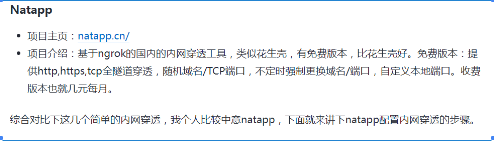

## 284. 文字对齐（中日韩文）

最后一列保持一样的样式：

```css
text-align: justify;
```

## 285. 字体图标加粗

使用 `-webkit-text-stroke` 属性：


```css
-webkit-text-stroke: 2px white;
```

注意：1px 就已经粗一大半了。

## 286. 浏览器的默认字体大小


## 287. 网站灰白效果

```css
html.gray-mode {
  filter: grayscale(1);
  -webkit-filter: grayscale(1);
}
```

移动端/app 设置了 fixed 等属性会失效。


**全局黑白后还要局部彩色？**

局部元素使用：`filter: none !important;`（当前元素）

如果是局部实现，可以设置一个类名：

```css
.gray_mode {
  filter: grayscale(100%);
  -webkit-filter: grayscale(100%);
  -moz-filter: grayscale(100%);
  -o-filter: grayscale(100%);
}
```

**实现类似移动端只有首屏黑白的效果：**

一个 100vh，100vw 的 div，覆盖在最上面，然后设置属性 `backdrop-filter`（元素背后的所有元素）`: grayscale(1);`

再设置下 `pointer-events` 允许点击穿透过去，就可以了。


## 288. column-count 多列布局

描述元素的列数：


## 289. 自定义 CSS 属性 --\*


## 290. clip-path 裁剪路径

画不规则多边形（polygon），可以画任何头像，你想要的。

相关属性：

- `mix-blend-mode`（混合模式）
- `filter` / `backdrop-filter`
- `background-blend-mode`（背景混合模式）
- `mask-image` / `mask-clip`
- `cross-fade()` 图像函数（设置透明度）


增加了 `background-blend-mode` 的效果：


## JavaScript 核心知识

## 291. JavaScript 中的 falsy 值

有且只有 8 个：

- `0`（+0）
- `-0`
- `null`
- `undefined`
- `false`
- `''`（`` / ""）
- `NaN`
- `0n`（读作零n，BigInt 类型）


**BigInt 类型**

BigInt 可以表示任意大的整数。

定义方式：

1. 在一个整数字面量后面加 n
2. 调用函数 BigInt()


## 292. JSON对象转树结构

**Map 解千愁啊... 万事皆可 Map！**

**递归是最消耗性能的**


## 293. 编程范型

常见的编程范型有：**函数式编程、指令式编程、过程式编程、面向对象编程**等等。

**函数式编程特点：**

- 拒绝副作用，拥抱纯函数（相同输入输出）
- 函数是"一等公民"（First-Class Function）
- 避免对状态的改变（不可变值）

**一等公民的三个条件：**

1. 函数是否可作为参数（形参实参）
2. 函数是否可作为返回值
3. 函数是否可赋值给变量

**副作用（side-effect）：** 除对输入产生预期的输出外，还对执行上下文/执行宿主等外部因素产生影响的。

## 294. Promise 使用要点

永远记住这三件事：

1. return 另一个 promise
2. return 一个同步的值（或者 undefined）
3. throw 一个同步异常

别忘了加 `.catch` 捕获异常


**永远都是往 `.then()` 中传递函数！**

参考：[Promise 深度好文](http://fex.baidu.com/blog/2015/07/we-have-a-problem-with-promises/)

## 295. 前端发送网络请求的方式

1. **ajax**（XMLHttpRequest）
2. **fetch API**
3. **axios**
4. **form 表单的 action**
5. **script 标签的 src**（类似 CDN / JSONP）
6. **img 标签的 src**（get 请求）
7. **iframe 标签的 src**
8. **navigator.sendBeacon(url, data)**（异步 post 请求，不能携带参数）
9. **CSS 请求外部资源**（link 标签的 href）
10. **webSocket、消息主动推送**
11. **web worker** 发辅线程，然后再合并到主线程

## 296. Cookie 和 Storage

**Cookie 特点：**

- 存储大小限制只有 4kb
- 会跟随每个请求发送到服务器
- 算 HTTP 协议一部分

**清除所有 cookie 函数：**

```javascript
function clearAllCookie() {
  let keys = document.cookie.match(/[^ =;]+(?==)/g)
  if (keys) {
    for (let i = keys.length; i--;)
      document.cookie = `${keys[i]}=0;expires=${new Date(0).toUTCString()}`
  }
}
```

**Storage 对象：**

- **sessionStorage**：当前标签页关闭就消失
- **localStorage**：不手动清除就不会消失
- 存储大小限制都为 5m+

## 297. 数组方法分类

**改变数组元素本身的方法：**
`shift`、`unshift`、`pop`、`push`、`reverse`、`sort`、`splice`、`fill`、`copyWithin`

**改变字符串本身的方法：**
`replace`（正则方法）

## Vue 框架相关

## 298. Vue 的 @click.stop.prevent 修饰符连用

## 299. 两个 watch 方法里，同时生效一个方法，只会执行一次


## 300. 横向排列盒子的 hover 效果

**纯 CSS 实现：** 给第一个盒子和 hover 一起设置样式，然后在 li 的父盒子 ul 中再设置 hover 对第一个 li 的 hover 做样式控制（取消第一个盒子的默认样式）


## 301. v-bind 跟单独定义的属性

单独定义的属性优先级更高，不关定义的先后顺序。


## 构建工具与性能优化

## 302. HTTP/2 优化

**HTTP/1.0 问题：**

- 每次请求都要重新建立连接，增加延时

**HTTP/1.1 问题：**

- **队头阻塞**（Head-of-Line Blocking）
- **连接无法复用**（keep-alive 复用一部分连接）
- **协议开销大**（Header 请求头携带内容大）
- **安全因素**（所有传输的内容都是明文）

**HTTP/2.0 优势：**

1. 二进制传输
2. 多路复用
3. Header 传输
4. Server Push

## 303. Webpack 配置优化

- **路径解析优化**
- **include / exclude**
- **resolve** -> alias / extensions / modules
- **uglify** -> terser
- **cssloader** -> mintsize -> cssnano
- **tree-shaking**
- **happypack** -> thread-loader 多线程管理

**配置 sourcemap：**

- **cheap**：只映射到行数，不精确到列，提升 sourcemap 生成速度
- **eval**：浏览器 devtool 支持通过 sourceURL 将 eval 函数的内容单独出来
- **module**：sourcemap 生成时会关联每一步 loader 生成的 sourcemap
- **nosources**：不生成 sourceContent 内容，减小 sourcemap 文件的大小
- **source-map**：生成 sourcemap 文件

**框架源码调试：** 一行代码开启 sourceMap

```javascript
// # sourceMappingURL=xxx (自定义的名字)
```

## 304. H5 白屏优化指标

**性能指标：**

- **FP**：First Paint（首次绘制）
- **FCP**：First Contentful Paint（首次内容绘制）
- **LCP**：Largest Contentful Paint（最大内容绘制）- 页面的**速度**指标
- **FID**：First Input Delay（首次输入延迟）- 页面的**交互体验**指标
- **CLS**：Cumulative Layout Shift（累积布局偏移）- 页面的**稳定**指标
- **TTI**：Time To Interactive（可交互时间）
- **TBT**：Total Blocking Time（总阻塞时长）

## 305. Vite vs Webpack

**Vite：**

- 开发环境用的 esbuild（底层 Go，快）
- 生产环境用的 rollup
- **不支持 require 语法**（在 .vue 文件里写 require 会报错）

**Webpack：**

- Vue2 是 webpack 打包，默认支持 require 语法

## 306. Vite 特殊配置

```javascript
// vite 中可以使用 process.env.NODE_ENV 变量
// 一般用的都是 import.meta.env 变量

// 在 vite.config.ts 文件中
defineConfig(({ command, mode, ssrBuild }) => {
  // 这几个内置变量
})
```

## 307. Nginx 代理部署

如果是部署到根目录下，就不用改项目的路径。
如果是部署到子路径下，就要改路径了。

**Vite：**


**Webpack：**


这样才能避免**访问**该**路径**的时候**项目白屏**！

## 开发工具与环境

## 308. 内网穿透

使用第三方工具进行配置，将你的本地 ip（127.0.0.1）映射到三方平台提供的网址中，然后其他电脑就可以通过这个三方平台暴露的地址直接访问你的本地服务了。



## 309. 时间相关知识

**1970-01-01** 这个时间是计算机的起始时间，纪念 **unix 操作系统** 的诞生。（北京东八区，时间早8个钟，所以是08:00:00）

标准时间是 GMT 格林威治时间（Greenwich Mean Time，简称G.M.T.）


`new Date()` 的值是取的 **运行环境** 的时间（浏览器的话就是本地电脑/手机的时间，这个是可以用户手动改变的，不准确，不安全。nodejs的话是服务器的时间）

## 310. DOM 元素直接访问

DOM 元素可以直接使用 id 名称来获取元素，会挂载到 window 的原型上。


## 311. console.dir

`console.dir` 输出函数 → 按文件目录结构输出


## 312. Web Component 三要素

创建封装功能的定制元素，无框架限制，极致的复用：

1. **custom element**（自定义元素）
2. **shadow dom**（影子 DOM）
3. **html template**（HTML 模板）

## 313. requestAnimationFrame

`window.requestAnimationFrame(callback)` 实现动画效果（**在浏览器下一次重绘时/下一帧执行一次**）

**优势：**

- 将回调函数的执行时间交由系统来决定
- 保证回调函数在屏幕的每次刷新间隔中只被执行一次
- 避免因随机丢帧而导致的卡顿现象


## 314. Web Worker 和 Service Worker

**运行在后台的 JavaScript，它是独立于浏览器的单独线程**

无法直接访问主线程的 DOM 或者全局变量。如果需要在 Worker 中使用这些资源，可以通过 `postMessage()` 方法将它们传递给 Worker。


- `postMessage()` 发送消息
- `onmessage` 监听接收消息


## 实用技巧与最佳实践

## 315. Promise.allSettled

要成功/失败都返回，用 `Promise.allSettled()`

两个参数：

- **status**：表示对应的 Promise 对象的状态（"fulfilled"、"rejected"、"pending"）
- **value 或 reason**：成功的值或失败的原因


**使用 Promise.all 进行 polyfill：**

```javascript
Promise.all(promises.map((promise) => {
  return promise.then(value => ({ status: 'fulfilled', value }))
    .catch(reason => ({ status: 'rejected', reason }))
}))
```

## 316. Git 代理设置

Git 默认走 SSH，是不走本地代理的。要改成 HTTP 的，才会走本地代理！

```bash
git remote set-url origin https://github.com/Hbin-Zhuang/custom-quill-editor.git
```

主要原因就是设置 `http.proxy` 和 `https.proxy` 这两个代理


**Git 设置和取消代理：**

```bash
# 设置代理
git config --global http.proxy http://127.0.0.1:1080
git config --global https.proxy http://127.0.0.1:1080

# 取消代理
git config --global --unset http.proxy
git config --global --unset https.proxy
```

## 317. IIFE 解决闭包内存泄漏

IIFE 解决闭包可能导致的内存泄漏，引用完成，会自动销毁 IIFE 里面的变量。

```javascript
function func() {
  let arr = Array.from({ length: 1000000 }).fill(1)
  return (function () {
    console.log(arr.length)
    // do something with arr
  })()
}
func() // 执行完毕后，arr变量被销毁，内存得到释放
```

## 318. 删除 node_modules 的方式

**Windows：**

```bash
rd /s /q node_modules
```

**Mac：**

```bash
rm -rf node_modules
```

**跨平台（npm 包）：**

```bash
npx rimraf node_modules
```

## 319. Git 克隆优化

克隆项目时，如果项目很大，可以使用 `--depth 1` 参数：

```bash
git clone --depth 1 <repository-url>
```

指定只下载最近一次提交的代码，忽略掉早期的历史记录，可以显著减少下载量。

## 320. Yarn 离线包

Yarn 有 `yarn --offline` 离线包版本，在没有网络环境时可以直接使用离线包进行下载。

**使用步骤：**

1. 设置"离线镜像"存储目录：

```bash
yarn config set yarn-offline-mirror ./yarn-offline
```

2. 生成离线文件：

```bash
rm -rf node_modules/ yarn.lock
yarn install
```

3. 离线安装：

```bash
yarn --offline
```


## 321. Nginx 代理配置

Nginx 代理有无后缀的区别，这里跟本地开发配置的 vue.config.js 中的配置类似。


需要整理下 nginx 的与 **/** 相关的几个代理：

- `location`
- `proxy_pass`
- `alias`
- `root`

这种配置是一个容器一个 nginx 的配置，子应用走本地路径，不用单独开 server 代理一个端口。


## 322. Vue 路由相关

**动态路由**本质上是根据你组件的 name 去查对应的组件的。所以名字要写对！


**认识几个路由参数：**

1. **router.matcher**
   Vue Router 的 router.matcher 是 Vue Router 的一个内部属性，主要用来存储和管理路由匹配规则。


2. **router.options.routes**


你可以使用这个 router.options.routes 来查看或修改你的路由配置。但是请注意，直接修改它并不会改变已经创建的 Vue Router 实例的行为。如果你希望动态修改路由，你应该使用 router.addRoutes 或其他 Vue Router 提供的方法。

3. **router.addRoutes**
   router.addRoutes 方法用于动态的添加更多的路由到已有的路由器实例中。


## 323. Package.json 版本锁定

直接在 package.json 里面写死某个依赖的版本（定义 resolutions 字段），这样就不会因为该依赖的最新版本与本地 node 版本不兼容而导致依赖安装不成功的报错。


## 324. 淘宝镜像更新

淘宝镜像证书过期了，现在用这个：[https://registry.npmmirror.com](https://registry.npmmirror.com)

## 325. Babel 配置问题

要是再有这个报错：


对应用到这个组件的子应用那里，加这个文件：


然后加多这个插件：主要就一个插件：`@vue/cli-plugin-babel`


报错 core-js 相关的错的话，就是这个 @vue/cli-plugin-babel 插件关联的，强制执行下升级 core-js 版本：

```bash
yarn add --dev core-js@3
```

⚠️ **注意**：这里的 babel.config.js 文件是在根目录下的，不是在 src 下的！不然是报错解析不到 babel 文件的！

## 326. 微前端解决方案

微前端常用解决方案：

0. **iframe**
1. **single-spa**
2. **阿里 qiankun**
3. **腾讯 无界**
4. **京东 micro-app**
5. **module-federation 模块联邦**
6. **Web Components**
7. **ESM**
8. **领域驱动的微前端设计（DDD思想指导下拆分粒度）**

## 327. 数组优化

数组修改自己本身的优化：


## 328. 服务器访问配置

访问服务器上的项目：


要是访问不了，那就是服务器需要设置防火墙，允许访问 8080 端口的：

```bash
sudo firewall-cmd --zone=public --add-port=8080/tcp --permanent
sudo firewall-cmd --reload
```

## 329. 浏览器打开本地应用

PC 端网页浏览器打开本地应用（客户端）：

一般的软件都会默认给你在注册表中插入对应的 URL Scheme，所以直接搜他的键就能在浏览器打开的。比如 VSCode，在安装的时候就会顺带在注册表中注入对应的 URL Scheme 信息。

**Windows 上的注册表：**


**macOS 的 Info.plist 配置文件：**


**手动配置 Windows：**

在注册表中配置，具体就是新建一个 txt 文档：


路径需要用双斜杆 // 而不是单斜杆 /，如果有双引号 "" 则需要使用转义符反斜杆 \ 进行转义。

**手动配置 macOS：**

URL Scheme 方式实现。修改 Info.plist 文件：主要是要加这个 CFBundleURLSchemes


前端实现点击按钮打开本地应用：

```javascript
window.location.href = 'vscode://open'
```

## 330. 观察者 API

- **IntersectionObserver**：交叉观察者
- **MutationObserver**：变化观察者

## 331. M1 芯片 Node 版本问题

M1 nvm 安装 node 低版本（14 及以下）报错问题：

低版本的 Node 并不是基于 arm64 架构的（基于 x86），所以不适配 M1 芯片。

**解决方案：** 2 条命令搞定

```bash
arch -x86_64 zsh
nvm install v14  # 默认安装最新版本 14.21.3
```


## 332. 字间距设置

`letter-spacing` 字间距设置：

**没设置前：**


**设置了字间距：**


## 333. JavaScript 生僻字处理

JavaScript 针对**生僻字**的处理：JS 默认采用 UTF-16 编码

**三种方法的区别：**

1. **charAt(index)**：返回指定索引的字符
   - 只能返回单个字符，无法处理复杂的 Unicode 字符（如表情符号）
   - 不涉及编码值，仅返回字符本身

2. **charCodeAt(index)**：返回指定索引位置字符的 UTF-16 编码值
   - 只能处理单个 UTF-16 代码单元
   - 对于非 BMP（基本多语言平面）之外的字符（如表情符号），只能返回代理对的第一个部分

3. **codePointAt(index)**：返回指定索引位置字符的完整 Unicode 编码值（包括非 BMP 字符）
   - 能够正确处理非 BMP 字符（如表情符号）
   - 返回的是完整的 Unicode 码点值，而不仅仅是 UTF-16 代码单元

## 334. Vue 自定义指令

**Vue.directive** 自定义指令：直接操作 DOM 元素

**特点：**

- **关注点分离**：指令的主要目的是封装 DOM 操作逻辑，将其与组件逻辑分离
- **可复用性**：定义好的指令可以在项目中的任何组件模板里方便地复用
- **底层访问**：提供了直接访问和操作 DOM 元素的能力

**生命周期方法：**

1. **bind(el, binding, vnode)**：只调用一次，在指令第一次绑定到元素时调用
2. **inserted(el, binding, vnode)**：在被绑定元素插入父节点时调用
3. **update(el, binding, vnode, oldVnode)**：所在组件的 VNode 更新时调用
4. **componentUpdated(el, binding, vnode, oldVnode)**：所在组件的 VNode 及其子 VNode 全部更新后调用
5. **unbind(el, binding, vnode)**：只调用一次，在指令与元素解绑时调用


## 335. Vite 模块联邦

**vite-plugin-federation** Vite 模块联邦

特点：

- **去中心化**
- **共享模块和代码**
- **无需重复构建打包**

## 336. Git 提交信息修改

使用 git-filter-repo 修改仓库提交信息（改提交人）—— 前提：自己仓库/有权限操作

**步骤：**

1. `pip install git-filter-repo`
2. `pip install pygit2`
3. 执行修改命令：

```bash
git filter-repo --commit-callback '
if commit.author_email == b"old@email.com":
    commit.author_name = b"New-Name"
    commit.author_email = b"new@email.com"
if commit.committer_email == b"old@email.com":
    commit.committer_name = b"New-Name"
    commit.committer_email = b"new@email.com"
' --force
```

4. `git push -u github main --force`

⚠️ **注意**：原来账号创建的分支还有打的标签等都会给删了，还是谨慎操作的好。


## 337. Astro SSR 问题

Astro 使用有个问题，就是默认使用的是 SSR（client:load 指令），服务端渲染默认返回的图片 logoSrc 是空串 ""，浏览器接收的时候自动补全了默认值。

客户端进行 hydration **水合** 的时候，Vue 更新了 logoSrc 的值，但是 DOM 的 src 已经被浏览器"固化"了。

**解决方案**：强制在客户端重新设置 src 属性。设置 img 的 src，而不是设置 logoSrc。


